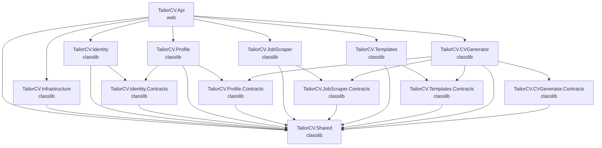

# Project Dependencies

## Project Reference Graph

## NuGet Packages Per Project

```mermaid
graph LR
    subgraph SHARED["TailorCV.Shared"]
        S1[Scrutor]
        S2[FluentValidation.DependencyInjectionExtensions]
        S3[WolverineFx]
    end

    subgraph INFRA["TailorCV.Infrastructure"]
        I1[Microsoft.EntityFrameworkCore]
        I2[Npgsql.EntityFrameworkCore.PostgreSQL]
        I3[EFCore.NamingConventions]
        I4[StackExchange.Redis]
        I5[Microsoft.Extensions.Caching.StackExchangeRedis]
        I6[AWSSDK.S3]
        I7[Serilog]
        I8[Serilog.AspNetCore]
        I9[Serilog.Sinks.Console]
        I10[Serilog.Sinks.OpenTelemetry]
        I11[OpenTelemetry]
        I12[OpenTelemetry.Exporter.OpenTelemetryProtocol]
        I13[OpenTelemetry.Extensions.Hosting]
        I14[OpenTelemetry.Instrumentation.AspNetCore]
        I15[OpenTelemetry.Instrumentation.EntityFrameworkCore]
        I16[OpenTelemetry.Instrumentation.GrpcNetClient]
        I17[OpenTelemetry.Instrumentation.Http]
        I18[OpenTelemetry.Instrumentation.StackExchangeRedis]
        I19[Microsoft.Extensions.Http.Polly]
        I20[AspNetCore.HealthChecks.NpgSql]
        I21[AspNetCore.HealthChecks.Rabbitmq]
        I22[AspNetCore.HealthChecks.Redis]
        I23[AspNetCore.HealthChecks.Uris]
        I24[Microsoft.Extensions.Diagnostics.HealthChecks]
    end

    subgraph API["TailorCV.Api"]
        A1[Microsoft.AspNetCore.Authentication.JwtBearer]
        A2[Serilog.AspNetCore]
        A3[WolverineFx]
        A4[WolverineFx.RabbitMQ]
        A5[Grpc.AspNetCore]
        A6[Hangfire.AspNetCore]
        A7[Hangfire.PostgreSql]
        A8[AspNetCore.HealthChecks.UI.Client]
        A9[Microsoft.AspNetCore.OpenApi]
        A10[Asp.Versioning.Http]
        A11[Microsoft.EntityFrameworkCore.Design]
        A13[Scalar.AspNetCore]
    end

    subgraph IDENTITY["TailorCV.Identity"]
        D1[Microsoft.EntityFrameworkCore]
        D2[Npgsql.EntityFrameworkCore.PostgreSQL]
        D3[EFCore.NamingConventions]
        D5[System.IdentityModel.Tokens.Jwt]
        D6[FluentValidation.DependencyInjectionExtensions]
    end

    subgraph PROFILE["TailorCV.Profile"]
        P1[Microsoft.EntityFrameworkCore]
        P2[Npgsql.EntityFrameworkCore.PostgreSQL]
        P3[EFCore.NamingConventions]
        P4[FluentValidation.DependencyInjectionExtensions]
        P5[Hangfire.AspNetCore]
        P6[PdfPig]
        P7[DocumentFormat.OpenXml]
        P8[OpenAI]
        P9[Grpc.Net.Client]
    end

    subgraph JOBS["TailorCV.JobScraper"]
        J1[Microsoft.EntityFrameworkCore]
        J2[Npgsql.EntityFrameworkCore.PostgreSQL]
        J3[EFCore.NamingConventions]
        J4[FluentValidation.DependencyInjectionExtensions]
        J5[Hangfire.AspNetCore]
        J6[Microsoft.Playwright]
        J7[OpenAI]
    end

    subgraph TMPL["TailorCV.Templates"]
        T1[Microsoft.EntityFrameworkCore]
        T2[Npgsql.EntityFrameworkCore.PostgreSQL]
        T3[EFCore.NamingConventions]
        T4[FluentValidation.DependencyInjectionExtensions]
    end

    subgraph CVGEN["TailorCV.CVGenerator"]
        C1[Microsoft.EntityFrameworkCore]
        C2[Npgsql.EntityFrameworkCore.PostgreSQL]
        C3[EFCore.NamingConventions]
        C4[FluentValidation.DependencyInjectionExtensions]
        C5[WolverineFx]
        C6[Grpc.Net.Client]
        C7[OpenAI]
        C8[PuppeteerSharp]
    end

    subgraph CONTRACTS["All Contracts Projects"]
        NONE[No NuGet packages<br/>Only reference Shared project]
    end
```

## Package Purpose Reference

| Package | Purpose | Used In |
|---------|---------|---------|
| Scrutor | Assembly scanning & decorator registration | Shared |
| FluentValidation.DependencyInjectionExtensions | FluentValidation DI integration | Shared, Identity, Profile, JobScraper, Templates, CVGenerator |
| WolverineFx | Message bus (event publishing/sagas) | Shared, Api, CVGenerator |
| WolverineFx.RabbitMQ | RabbitMQ transport for Wolverine | Api |
| Microsoft.EntityFrameworkCore | ORM | Infrastructure, Identity, Profile, JobScraper, Templates, CVGenerator |
| Npgsql.EntityFrameworkCore.PostgreSQL | PostgreSQL provider | Infrastructure, Identity, Profile, JobScraper, Templates, CVGenerator |
| EFCore.NamingConventions | Snake_case naming convention | Infrastructure, Identity, Profile, JobScraper, Templates, CVGenerator |
| StackExchange.Redis | Redis client | Infrastructure |
| Microsoft.Extensions.Caching.StackExchangeRedis | Redis caching integration | Infrastructure |
| AWSSDK.S3 | S3 presigned URLs (RustFS) | Infrastructure |
| Serilog | Structured logging | Infrastructure |
| Serilog.AspNetCore | Serilog ASP.NET Core integration | Infrastructure, Api |
| Serilog.Sinks.Console | Console logging sink | Infrastructure |
| Serilog.Sinks.OpenTelemetry | OpenTelemetry logging sink | Infrastructure |
| OpenTelemetry | Observability | Infrastructure |
| OpenTelemetry.Exporter.OpenTelemetryProtocol | OTLP export | Infrastructure |
| OpenTelemetry.Extensions.Hosting | Hosting integration | Infrastructure |
| OpenTelemetry.Instrumentation.AspNetCore | ASP.NET Core tracing | Infrastructure |
| OpenTelemetry.Instrumentation.EntityFrameworkCore | EF Core tracing | Infrastructure |
| OpenTelemetry.Instrumentation.GrpcNetClient | gRPC client tracing | Infrastructure |
| OpenTelemetry.Instrumentation.Http | HTTP client tracing | Infrastructure |
| OpenTelemetry.Instrumentation.StackExchangeRedis | Redis tracing | Infrastructure |
| Microsoft.Extensions.Http.Polly | HTTP resilience policies | Infrastructure |
| AspNetCore.HealthChecks.NpgSql | PostgreSQL health check | Infrastructure |
| AspNetCore.HealthChecks.Rabbitmq | RabbitMQ health check | Infrastructure |
| AspNetCore.HealthChecks.Redis | Redis health check | Infrastructure |
| AspNetCore.HealthChecks.Uris | URI health check | Infrastructure |
| Microsoft.Extensions.Diagnostics.HealthChecks | Health check abstractions | Infrastructure |
| Microsoft.AspNetCore.Authentication.JwtBearer | JWT authentication | Api |
| Grpc.AspNetCore | gRPC server | Api |
| Grpc.Net.Client | gRPC client | Profile, CVGenerator |
| Hangfire.AspNetCore | Background jobs | Api, Profile, JobScraper |
| Hangfire.PostgreSql | Hangfire PostgreSQL storage | Api |
| AspNetCore.HealthChecks.UI.Client | Health check UI response | Api |
| Microsoft.AspNetCore.OpenApi | OpenAPI document generation + Scalar UI | Api |
| Asp.Versioning.Http | API versioning | Api |
| Microsoft.EntityFrameworkCore.Design | EF Core tooling (migrations) | Api |
| Scalar.AspNetCore | API documentation UI (Scalar) | Api |
| System.IdentityModel.Tokens.Jwt | JWT token creation | Identity |
| PdfPig | PDF text extraction | Profile |
| DocumentFormat.OpenXml | DOCX text extraction | Profile |
| OpenAI | AI integration | Profile, JobScraper, CVGenerator |
| Microsoft.Playwright | Web scraping | JobScraper |
| PuppeteerSharp | HTML-to-PDF conversion | CVGenerator |
| SonarAnalyzer.CSharp | Static code analysis (global) | Directory.Build.props |

## Contracts Projects

All `.Contracts` projects contain **only** plain data types (event records, DTOs). They reference `TailorCV.Shared` for base types and have **no NuGet packages** of their own.

| Contracts Project | References | Contains |
|-------------------|-----------|----------|
| TailorCV.Identity.Contracts | Shared | (empty — no events yet) |
| TailorCV.Profile.Contracts | Shared | `ProfileUpdatedEvent` |
| TailorCV.JobScraper.Contracts | Shared | `JobDescriptionSavedEvent` |
| TailorCV.Templates.Contracts | Shared | (empty — no events yet) |
| TailorCV.CVGenerator.Contracts | Shared | (empty — not yet implemented) |
