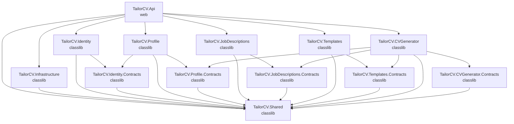

# Project Dependencies

## Project Reference Graph

## NuGet Packages Per Project

```mermaid
graph LR
    subgraph SHARED["TailorCV.Shared"]
        S1[Scrutor]
        S2[FluentValidation.DependencyInjectionExtensions]
        S3[Microsoft.EntityFrameworkCore]
        S4[Npgsql.EntityFrameworkCore.PostgreSQL]
        S5[EFCore.NamingConventions]
    end

    subgraph INFRA["TailorCV.Infrastructure"]
        I1[Microsoft.EntityFrameworkCore]
        I2[Npgsql.EntityFrameworkCore.PostgreSQL]
        I3[EFCore.NamingConventions]
        I4[StackExchange.Redis]
        I5[AWSSDK.S3]
        I6[Serilog]
        I7[Serilog.AspNetCore]
        I8[Serilog.Sinks.Console]
        I9[Serilog.Sinks.OpenTelemetry]
        I10[OpenTelemetry]
        I11[OpenTelemetry.Exporter.OpenTelemetryProtocol]
        I12[OpenTelemetry.Extensions.Hosting]
        I13[OpenTelemetry.Instrumentation.AspNetCore]
        I14[OpenTelemetry.Instrumentation.EntityFrameworkCore]
        I15[OpenTelemetry.Instrumentation.GrpcNetClient]
        I16[OpenTelemetry.Instrumentation.Http]
        I17[OpenTelemetry.Instrumentation.StackExchangeRedis]
        I18[AspNetCore.HealthChecks.NpgSql]
        I19[AspNetCore.HealthChecks.Rabbitmq]
        I20[AspNetCore.HealthChecks.Redis]
    end

    subgraph API["TailorCV.Api"]
        A1[Microsoft.AspNetCore.Authentication.JwtBearer]
        A2[Serilog.AspNetCore]
        A3[WolverineFx.RabbitMQ]
        A4[Grpc.AspNetCore]
        A5[Microsoft.AspNetCore.OpenApi]
        A6[Microsoft.EntityFrameworkCore.Design]
        A7[Scalar.AspNetCore]
    end

    subgraph IDENTITY["TailorCV.Identity"]
        D1[Microsoft.EntityFrameworkCore]
        D2[Npgsql.EntityFrameworkCore.PostgreSQL]
        D3[EFCore.NamingConventions]
        D4[System.IdentityModel.Tokens.Jwt]
        D5[FluentValidation.DependencyInjectionExtensions]
        D6[WolverineFx]
        D7[WolverineFx.RabbitMQ]
    end

    subgraph PROFILE["TailorCV.Profile"]
        P1[Microsoft.EntityFrameworkCore]
        P2[Npgsql.EntityFrameworkCore.PostgreSQL]
        P3[EFCore.NamingConventions]
        P4[FluentValidation.DependencyInjectionExtensions]
        P5[Grpc.AspNetCore]
        P6[Microsoft.EntityFrameworkCore.Design]
        P7[WolverineFx]
        P8[WolverineFx.RabbitMQ]
        P9[PdfPig]
        P10[DocumentFormat.OpenXml]
        P11[OpenAI]
    end

    subgraph JOBS["TailorCV.JobDescriptions"]
        J1[Microsoft.EntityFrameworkCore]
        J2[Npgsql.EntityFrameworkCore.PostgreSQL]
        J3[EFCore.NamingConventions]
        J4[FluentValidation.DependencyInjectionExtensions]
        J5[Microsoft.Playwright]
        J6[OpenAI]
        J7[Grpc.AspNetCore]
        J8[Microsoft.EntityFrameworkCore.Design]
        J9[WolverineFx]
        J10[WolverineFx.RabbitMQ]
    end

    subgraph TMPL["TailorCV.Templates"]
        T1[Microsoft.EntityFrameworkCore]
        T2[Npgsql.EntityFrameworkCore.PostgreSQL]
        T3[EFCore.NamingConventions]
        T4[FluentValidation.DependencyInjectionExtensions]
    end

    subgraph CVGEN["TailorCV.CVGenerator"]
        C1[Microsoft.EntityFrameworkCore]
        C2[Npgsql.EntityFrameworkCore.PostgreSQL]
        C3[EFCore.NamingConventions]
        C4[FluentValidation.DependencyInjectionExtensions]
        C5[Grpc.AspNetCore]
        C6[Microsoft.EntityFrameworkCore.Design]
        C7[WolverineFx]
        C8[WolverineFx.RabbitMQ]
        C9[Grpc.Net.Client]
        C10[OpenAI]
        C11[PuppeteerSharp]
    end

    subgraph CVGEN_W["TailorCV.CVGenerator.Worker"]
        CW1[PuppeteerSharp]
        CW2[Serilog.AspNetCore]
        CW3[WolverineFx]
        CW4[WolverineFx.RabbitMQ]
    end

    subgraph JOBS_W["TailorCV.JobDescriptions.Worker"]
        JW1[Microsoft.Playwright]
        JW2[Serilog.AspNetCore]
        JW3[WolverineFx]
        JW4[WolverineFx.RabbitMQ]
    end

    subgraph PR_W["TailorCV.Profile.Worker"]
        PW1[Serilog.AspNetCore]
        PW2[WolverineFx]
        PW3[WolverineFx.RabbitMQ]
    end

    subgraph CONTRACTS["All Contracts Projects"]
        NONE[No NuGet packages<br/>Only reference Shared project]
    end
```

## Package Purpose Reference

| Package | Purpose | Used In |
|---------|---------|---------|
| Scrutor | Assembly scanning & decorator registration | Shared |
| FluentValidation.DependencyInjectionExtensions | FluentValidation DI integration | Shared, Identity, Profile, JobDescriptions, Templates, CVGenerator |
| WolverineFx | Message bus (event publishing/sagas) | Api, Identity, Profile, JobDescriptions, CVGenerator, all Workers |
| WolverineFx.RabbitMQ | RabbitMQ transport for Wolverine | Api, Identity, Profile, JobDescriptions, CVGenerator, all Workers |
| Microsoft.EntityFrameworkCore | ORM | Infrastructure, Identity, Profile, JobDescriptions, Templates, CVGenerator |
| Npgsql.EntityFrameworkCore.PostgreSQL | PostgreSQL provider | Infrastructure, Identity, Profile, JobDescriptions, Templates, CVGenerator |
| EFCore.NamingConventions | Snake_case naming convention | Infrastructure, Identity, Profile, JobDescriptions, Templates, CVGenerator |
| StackExchange.Redis | Redis client | Infrastructure |
| AWSSDK.S3 | S3 presigned URLs (RustFS) | Infrastructure |
| Serilog | Structured logging | Infrastructure |
| Serilog.AspNetCore | Serilog ASP.NET Core integration | Infrastructure, Api, all Workers |
| Serilog.Sinks.Console | Console logging sink | Infrastructure |
| Serilog.Sinks.OpenTelemetry | OpenTelemetry logging sink | Infrastructure |
| OpenTelemetry | Observability | Infrastructure |
| OpenTelemetry.Exporter.OpenTelemetryProtocol | OTLP export | Infrastructure |
| OpenTelemetry.Extensions.Hosting | Hosting integration | Infrastructure |
| OpenTelemetry.Instrumentation.AspNetCore | ASP.NET Core tracing | Infrastructure |
| OpenTelemetry.Instrumentation.EntityFrameworkCore | EF Core tracing | Infrastructure |
| OpenTelemetry.Instrumentation.GrpcNetClient | gRPC client tracing | Infrastructure |
| OpenTelemetry.Instrumentation.Http | HTTP client tracing | Infrastructure |
| OpenTelemetry.Instrumentation.StackExchangeRedis | Redis tracing | Infrastructure |
| AspNetCore.HealthChecks.NpgSql | PostgreSQL health check | Infrastructure |
| AspNetCore.HealthChecks.Rabbitmq | RabbitMQ health check | Infrastructure |
| AspNetCore.HealthChecks.Redis | Redis health check | Infrastructure |
| Microsoft.AspNetCore.Authentication.JwtBearer | JWT authentication | Api |
| Grpc.AspNetCore | gRPC server | Api |
| Grpc.Net.Client | gRPC client | CVGenerator |
| Microsoft.AspNetCore.OpenApi | OpenAPI document generation + Scalar UI | Api |
| Microsoft.EntityFrameworkCore.Design | EF Core tooling (migrations) | Api, Identity, Profile, JobDescriptions, CVGenerator |
| Scalar.AspNetCore | API documentation UI (Scalar) | Api |
| System.IdentityModel.Tokens.Jwt | JWT token creation | Identity |
| PdfPig | PDF text extraction | Profile |
| DocumentFormat.OpenXml | DOCX text extraction | Profile |
| OpenAI | AI integration | Profile, JobDescriptions, CVGenerator |
| Microsoft.Playwright | Web scraping | JobDescriptions, JobDescriptions.Worker |
| PuppeteerSharp | HTML-to-PDF conversion | CVGenerator, CVGenerator.Worker |
| SonarAnalyzer.CSharp | Static code analysis (global) | Directory.Build.props |

## Contracts Projects

All `.Contracts` projects contain **only** plain data types (event records, DTOs). They reference `TailorCV.Shared` for base types and have **no NuGet packages** of their own.

| Contracts Project | References | Contains |
|-------------------|-----------|----------|
| TailorCV.Identity.Contracts | Shared | `UserRegistered`, `UserNameUpdated` |
| TailorCV.Profile.Contracts | Shared | `ProfileUpdated`, `ResumeParsingCompleted`, `ResumeParsingFailed` |
| TailorCV.JobDescriptions.Contracts | Shared, Google.Protobuf, Grpc.AspNetCore, Grpc.Tools, Grpc.Net.Client | `JobParsingCompleted`, `JobParsingFailed` |
| TailorCV.Templates.Contracts | Shared, Google.Protobuf, Grpc.AspNetCore, Grpc.Tools, Grpc.Net.Client | (empty — Templates doesn't publish events) |
| TailorCV.CVGenerator.Contracts | Shared | `CVTailoringCompleted`, `CVTailoringFailed`, `CoverLetterCompleted`, `CoverLetterFailed`, `CvPdfExportCompleted`, `CvPdfExportFailed` |
