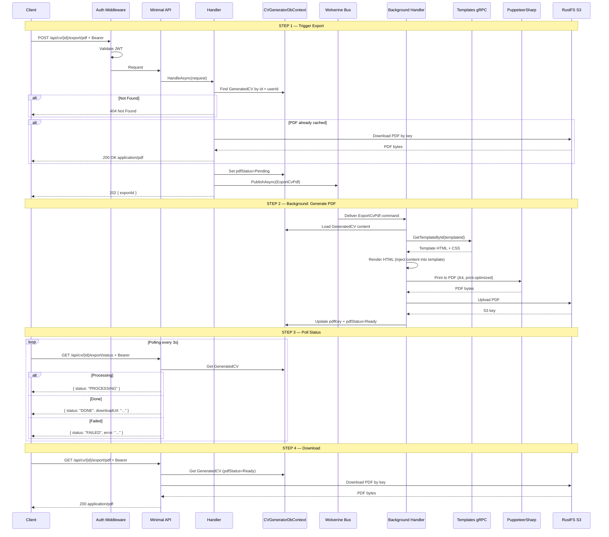
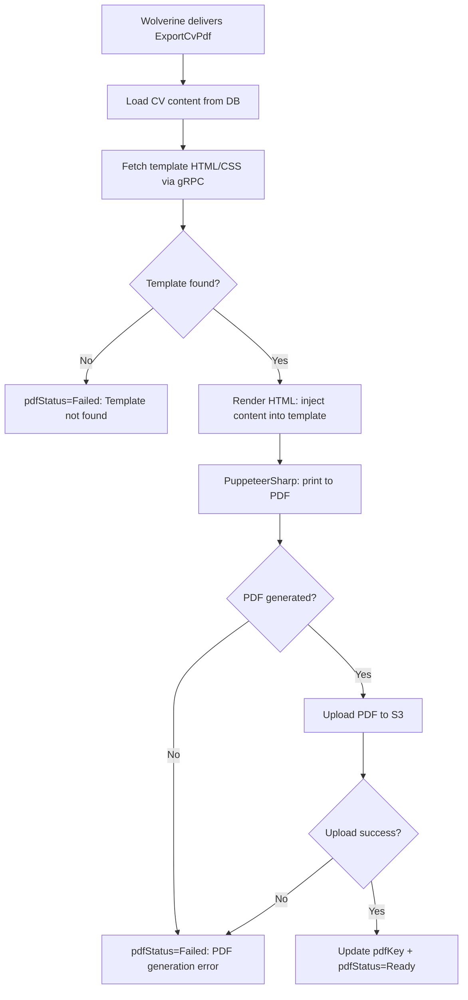

# ExportPdf

## Summary

User exports a generated CV as a PDF. The backend renders the CV content using the template's HTML/CSS via PuppeteerSharp, then uploads the PDF to S3 (RustFS). Async operation — client triggers export then polls for status. Cached PDF is served on subsequent requests until content is edited.

## Actor

Authenticated user (CV owner)

## Infrastructure

- **Wolverine** — async message processing (in-process)
- **PuppeteerSharp** — HTML → PDF conversion
- **RustFS (S3)** — PDF file storage
- **gRPC** — fetch template HTML/CSS for rendering

## Endpoints

### Trigger PDF Export

```
POST /api/cv/{id}/export/pdf
Authorization: Bearer {accessToken}
```

**202 Accepted**

```json
{
  "exportId": "guid"
}
```

If PDF is already cached (`pdfStatus=Ready`), returns **200 OK** immediately with the PDF (no re-generation).

### Poll Export Status

```
GET /api/cv/{id}/export/status
Authorization: Bearer {accessToken}
```

**200 OK — Processing**

```json
{
  "status": "PROCESSING"
}
```

**200 OK — Done**

```json
{
  "status": "DONE",
  "downloadUrl": "/api/cv/{id}/export/pdf"
}
```

**200 OK — Failed**

```json
{
  "status": "FAILED",
  "error": "Failed to generate PDF. Please try again."
}
```

### Download PDF

```
GET /api/cv/{id}/export/pdf
Authorization: Bearer {accessToken}
```

**200 OK**

```
Content-Type: application/pdf
Content-Disposition: attachment; filename="Jane_Smith_Senior_Software_Engineer_2026-05-03.pdf"
```

(Binary PDF content)

**404 Not Found**

```json
{
  "code": "NOT_FOUND",
  "message": "PDF not ready yet"
}
```

## Business Rules

- Only works on CVs with status=Done and non-null Content
- **PDF caching:** If `pdfStatus=Ready`, `POST` returns 200 with existing PDF immediately (no Puppeteer run)
- **Cache invalidation:** Content edits (`PUT /api/cv/{id}/content`) set `pdfStatus=None` — forces re-export
- File naming: `{firstName}_{lastName}_{jobTitle}_{date}.pdf` — derived from ProfileSnapshot and JobSnapshot
- S3 key: `cvs/{userId}/{yyyy}/{MM}/{dd}/{guid}.pdf`
- PDF rendered server-side with PuppeteerSharp (A4, print-optimized, no margins for full-bleed templates)
- Only the CV owner can export/download

## Flow

1. Client sends `POST /api/cv/{id}/export/pdf`
2. **Auth middleware** validates JWT
3. **Handler** executes:
   - Get `UserId` from `ICurrentUserService`
   - Find GeneratedCV by id and userId → 404 if not found
   - Check status=Done and Content not null → 409 if not ready
   - If `pdfStatus=Ready` → return 200 with existing PDF (early exit)
   - Set `pdfStatus=Pending`
   - Publish `ExportCvPdf` command via Wolverine
   - Return 202 with exportId
4. **Wolverine background handler** processes:
   - Load GeneratedCV Content
   - Fetch template HTML/CSS via gRPC (`TemplatesService.GetTemplateById`)
   - Render HTML: inject CV content into template HTML
   - PuppeteerSharp: open HTML in headless Chromium → print to PDF (A4)
   - Upload PDF to S3 (RustFS)
   - Update `pdfKey` + `pdfStatus=Ready`
   - On failure → set `pdfStatus=Failed`
5. Client polls `GET /api/cv/{id}/export/status` until DONE or FAILED
6. Client downloads via `GET /api/cv/{id}/export/pdf`

## Inter-module Interactions

**gRPC call** during background processing:

| Call | Module | Purpose |
|------|--------|---------|
| `GetTemplateById` | Templates | Fetch template HTML/CSS for rendering |

### External Dependencies

| Service | Purpose | Resilience |
|---------|---------|------------|
| Templates gRPC | Fetch template for rendering | Built-in gRPC retry |
| PuppeteerSharp | HTML → PDF conversion | Single attempt (Chromium process) |
| RustFS (S3) | Store generated PDF | AWS SDK built-in retry |

## Diagrams

### Full Flow — Sequence Diagram



### Background Processing — Flowchart



## Error Codes

| Code | HTTP Status | When |
|------|-------------|------|
| `UNAUTHORIZED` | 401 | Missing or invalid JWT |
| `NOT_FOUND` | 404 | CV not found, or PDF not ready for download |
| `CONFLICT` | 409 | CV generation still in progress or content is null |
| — | 202 | PDF export triggered |
| — | 200 | PDF served from cache |
| — | Polling | `FAILED` status with error from background handler |

## Security Considerations

- Only CV owner can trigger export and download
- PDF stored in user-scoped S3 prefix: `cvs/{userId}/...`
- Presigned download URLs have short expiry (5 minutes)
- Template HTML sanitized before Puppeteer rendering (no script injection)
