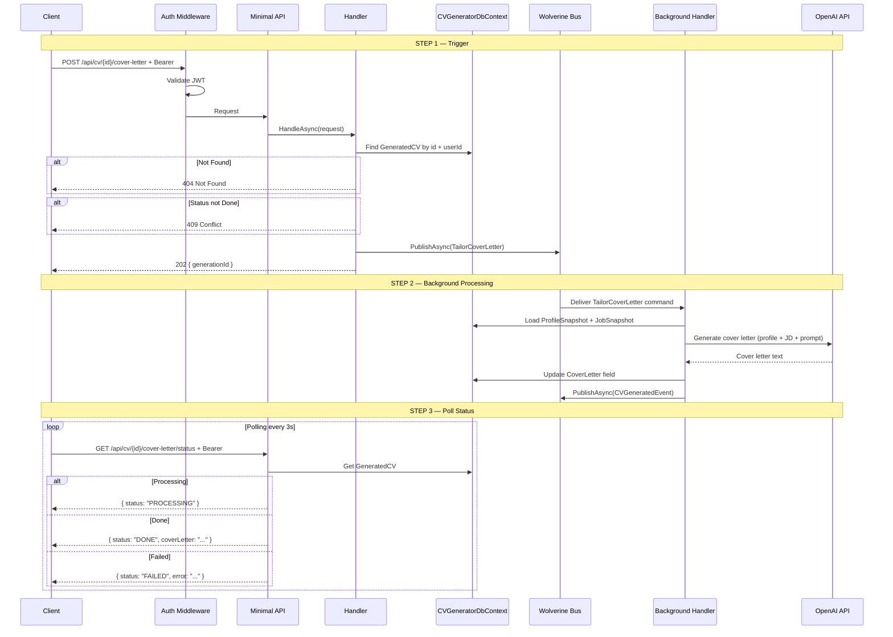
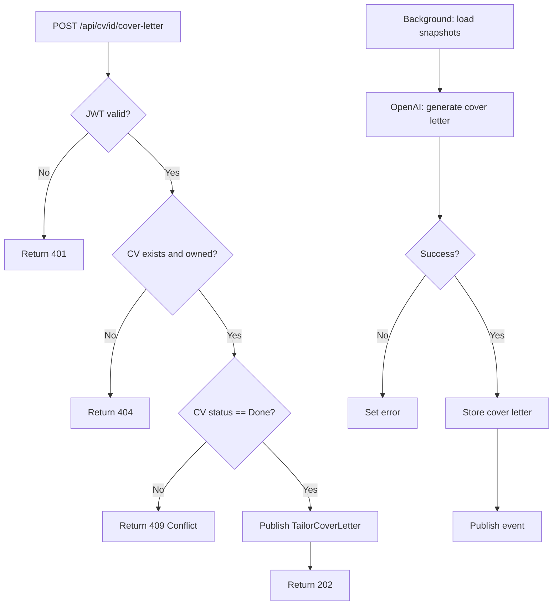

# GenerateCoverLetter

## Summary

User generates a cover letter for an existing generated CV. Uses the CV's profile and JD snapshots, so no re-fetching from other modules. Async operation — client triggers then polls for status.

## Actor

Authenticated user (CV owner)

## Infrastructure

- **Wolverine** — async message processing (in-process)
- **OpenAI API** — cover letter generation

## Endpoints

### Trigger Cover Letter Generation

```
POST /api/cv/{id}/cover-letter
Authorization: Bearer {accessToken}
```

**202 Accepted**

```json
{
  "generationId": "guid"
}
```

The `{id}` is an existing GeneratedCV ID. The cover letter will be stored on this record (fills the nullable `CoverLetter` field). Publishes a `TailorCoverLetter` command via Wolverine.

### Poll Status

```
GET /api/cv/{id}/cover-letter/status
Authorization: Bearer {accessToken}
```

**200 OK — Processing**

```json
{
  "status": "PROCESSING"
}
```

**200 OK — Done**

```json
{
  "status": "DONE",
  "coverLetter": "Dear Hiring Manager,\n\nI am writing to express my interest in the Senior Software Engineer position at Google. With 8+ years of experience in building scalable distributed systems using C# and Azure..."
}
```

**200 OK — Failed**

```json
{
  "status": "FAILED",
  "error": "Failed to generate cover letter. Please try again."
}
```

**401 Unauthorized**

```json
{
  "code": "UNAUTHORIZED",
  "message": "Not authenticated"
}
```

**404 Not Found**

```json
{
  "code": "NOT_FOUND",
  "message": "Generated CV not found"
}
```

**409 Conflict**

```json
{
  "code": "CONFLICT",
  "message": "CV generation is still in progress"
}
```

## Business Rules

- Only works on CVs with status=Done (CV content must be generated first)
- Uses the existing ProfileSnapshot and JobSnapshot — no gRPC calls needed
- If the CV already has a cover letter, it is **overwritten** (idempotent re-generation)
- Cover letter is plain text (no HTML rendering — not template-based)
- Only the CV owner can trigger cover letter generation
- Cover letter is generated with the same `tailoringPrompt` from the original CV generation (if provided)

## Flow

1. Client sends `POST /api/cv/{id}/cover-letter`
2. **Auth middleware** validates JWT
3. **Handler** executes:
   - Get `UserId` from `ICurrentUserService`
   - Find GeneratedCV by id and userId → 404 if not found
   - Check status=Done → 409 if still processing
   - Publish `TailorCoverLetter` command via Wolverine
   - Return 202 with generationId
4. **Wolverine background handler** processes:
   - Load ProfileSnapshot + JobSnapshot from the GeneratedCV record
   - Call OpenAI (`CoverLetterService`) with profile data + JD data + tailoringPrompt
   - Update `CoverLetter` field, set `UpdatedAt`
   - Publish `CVGeneratedEvent` (cover letter variant)
   - On failure → set cover letter error

## Inter-module Interactions

**None.** Self-contained within CVGenerator module. Uses pre-existing snapshots — no gRPC calls.

### External Dependencies

| Service | Purpose | Resilience |
|---------|---------|------------|
| OpenAI API | Cover letter generation | Polly: 3 retries, exponential backoff |

## Diagrams

### Full Flow — Sequence Diagram



### Flowchart



## Error Codes

| Code | HTTP Status | When |
|------|-------------|------|
| `UNAUTHORIZED` | 401 | Missing or invalid JWT |
| `NOT_FOUND` | 404 | Generated CV not found |
| `CONFLICT` | 409 | CV generation still in progress |
| — | 202 | Cover letter generation triggered |
| — | Polling | `FAILED` status with error from background handler |
