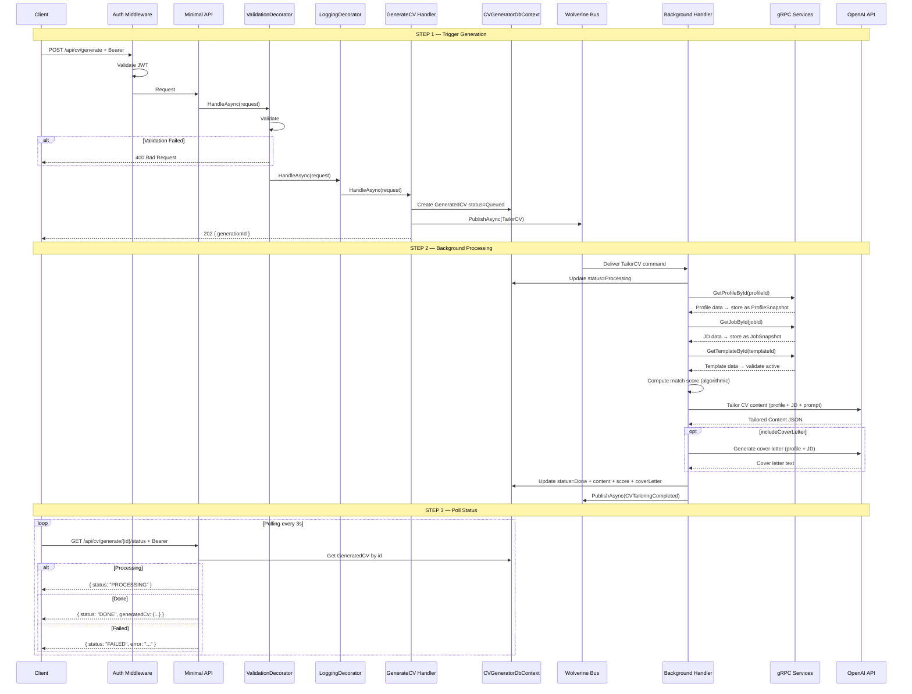
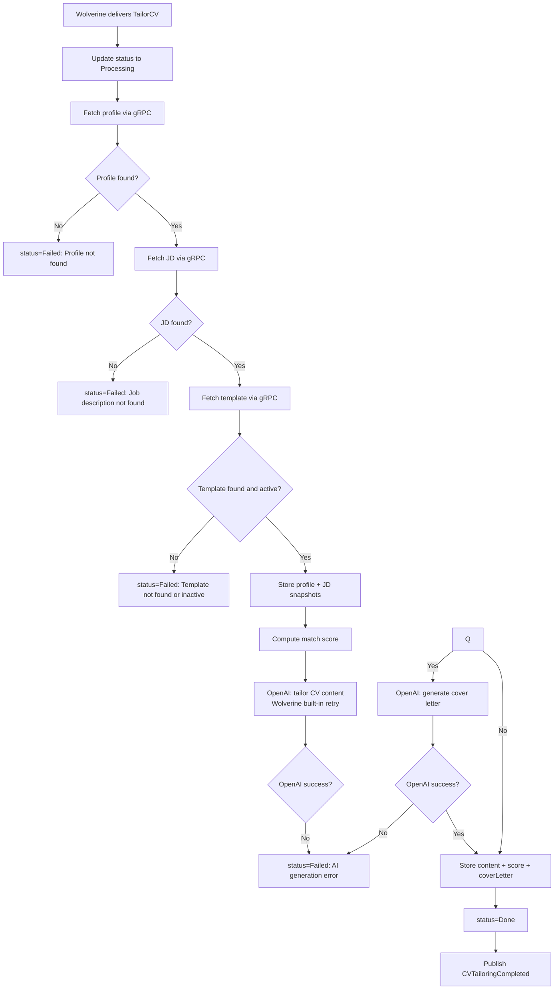
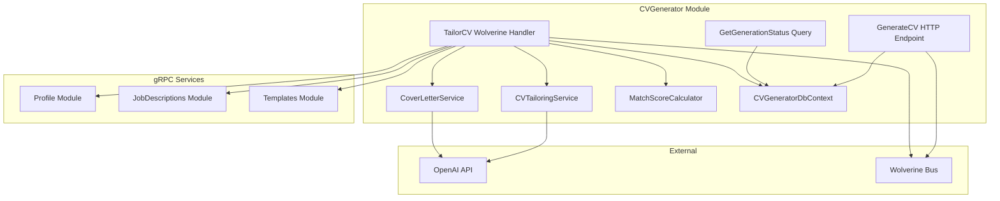

# GenerateCV

## Summary

User generates a tailored CV by combining their profile, a job description, and a template. AI tailors the content to match the JD. Async operation — client triggers generation then polls for status. Match score is included in the result. Optionally generates a cover letter alongside the CV.

## Actor

Authenticated user

## Infrastructure

- **Wolverine** — async message processing (in-process)
- **gRPC** — fetch profile, JD, and template from other modules
- **OpenAI API** — CV content tailoring + optional cover letter
- **RustFS (S3)** — PDF storage for later export

## Endpoints

### Trigger Generation

```
POST /api/cv/generate
Authorization: Bearer {accessToken}
Content-Type: application/json

{
  "profileId": "guid",
  "jobId": "guid",
  "templateId": "guid",
  "includeCoverLetter": false,
  "tailoringPrompt": "Emphasize leadership experience. Make the tone more formal."
}
```

**202 Accepted**

```json
{
  "generationId": "guid"
}
```

Creates a `GeneratedCV` record (status=Queued) and publishes a `TailorCV` command via **Wolverine**. A background handler picks it up and processes the full generation pipeline.

### Poll Status

```
GET /api/cv/generate/{generationId}/status
Authorization: Bearer {accessToken}
```

**200 OK — Processing**

```json
{
  "status": "PROCESSING"
}
```

**200 OK — Done**

```json
{
  "status": "DONE",
  "generatedCv": {
    "id": "guid",
    "matchScore": {
      "percentage": 82,
      "matchingSkills": ["C#", "Azure", "SQL", "Docker"],
      "missingSkills": ["Kubernetes", "Terraform"]
    },
    "coverLetter": null,
    "createdAt": "2026-05-03T10:00:00Z"
  }
}
```

**200 OK — Done (with cover letter)**

```json
{
  "status": "DONE",
  "generatedCv": {
    "id": "guid",
    "matchScore": {
      "percentage": 82,
      "matchingSkills": ["C#", "Azure", "SQL", "Docker"],
      "missingSkills": ["Kubernetes", "Terraform"]
    },
    "coverLetter": "Dear Hiring Manager,\n\nI am writing to express my interest in...",
    "createdAt": "2026-05-03T10:00:00Z"
  }
}
```

**200 OK — Failed**

```json
{
  "status": "FAILED",
  "error": "Failed to generate CV content. Please try again."
}
```

**401 Unauthorized**

```json
{
  "code": "UNAUTHORIZED",
  "message": "Not authenticated"
}
```

**404 Not Found**

```json
{
  "code": "NOT_FOUND",
  "message": "Generation not found"
}
```

## Validation Rules

| Field | Rules |
|-------|-------|
| ProfileId | Required, valid GUID |
| JobId | Required, valid GUID |
| TemplateId | Required, valid GUID |
| IncludeCoverLetter | Optional, boolean (default false) |
| TailoringPrompt | Optional, max 2000 chars |

## Business Rules

- User must own the specified profile and job description
- Template must be active (checked during generation, not at trigger time)
- Profile and JD existence checked during generation — if not found, status is set to Failed
- `tailoringPrompt` is passed to OpenAI as additional instructions for content tailoring (optional steering)
- Match score is calculated algorithmically (skills overlap, seniority match) — no OpenAI call for scoring
- Cover letter generation uses a separate OpenAI call with profile + JD context
- Profile and JD data is **snapshotted** (JSONB) at generation time — later changes to profile/JD do not affect this CV
- Publishes `CVTailoringCompleted` via Wolverine after successful generation
- Only the owner can poll their generation status

## Tailoring Prompt

The `tailoringPrompt` field lets users steer the AI with natural language:

- **Tone:** "Make it more formal/casual/enthusiastic"
- **Emphasis:** "Highlight my leadership experience over technical skills"
- **Omissions:** "Don't include the 2018 internship"
- **Formatting:** "Keep descriptions concise, max 2 lines each"
- **Focus:** "Emphasize Azure and cloud experience specifically"

If omitted, standard tailoring applies (match JD requirements, reorder by relevance, generate tailored summary).

## Flow

1. Client sends `POST /api/cv/generate` with profileId, jobId, templateId, optional prompt
2. **Auth middleware** validates JWT
3. **ValidationDecorator** runs FluentValidation
4. **Handler** executes:
   - Get `UserId` from `ICurrentUserService`
   - Create `GeneratedCV` record (status=Queued, userId, templateId)
   - Publish `TailorCV` command via Wolverine
   - Return 202 with generationId
5. **Wolverine background handler** processes:
   - Set status=Processing
   - Fetch profile via gRPC (`ProfileService.GetProfileById`) → store as ProfileSnapshot
   - Fetch JD via gRPC (`JobDescriptionsService.GetJobById`) → store as JobSnapshot
   - Fetch template via gRPC (`TemplatesService.GetTemplateById`) → validate active
   - Compute match score (algorithmic: skills overlap %, seniority comparison)
   - Call OpenAI (`CVTailoringService`) with profile + JD + template + tailoringPrompt → get tailored Content
   - If `includeCoverLetter` → call OpenAI (`CoverLetterService`) with profile + JD → get cover letter
   - Store Content + MatchScore + CoverLetter, set status=Done
   - Publish `CVTailoringCompleted`
   - On any failure → set status=Failed with error message

## Inter-module Interactions

**gRPC calls** during background processing:

| Call | Module | Purpose |
|------|--------|---------|
| `GetProfileById` | Profile | Fetch full profile data for snapshot + tailoring |
| `GetJobById` | JobDescriptions | Fetch full JD data for snapshot + tailoring |
| `GetTemplateById` | Templates | Fetch template for validation + later rendering |

**Event published** after success:

```csharp
public record CVTailoringCompleted(Guid UserId, Guid GenerationId, string JobTitle, int MatchScorePercentage);
```

Published via **Wolverine**. Subscribers (future):

| Module | Reaction |
|--------|----------|
| Dashboard | Update recent activity, average match score (planned) |

### External Dependencies

| Service | Purpose | Resilience |
|---------|---------|------------|
| Profile gRPC | Fetch profile data | Built-in gRPC retry |
| JD gRPC | Fetch job description data | Built-in gRPC retry |
| Template gRPC | Fetch template data | Built-in gRPC retry |
| OpenAI API | CV content tailoring + cover letter | Wolverine built-in retry |

## Diagrams

### Full Flow — Sequence Diagram



### Background Processing — Flowchart



### Component Diagram



## Error Codes

| Code | HTTP Status | When |
|------|-------------|------|
| `VALIDATION` | 400 | Invalid/missing profileId, jobId, templateId |
| `UNAUTHORIZED` | 401 | Missing or invalid JWT |
| `NOT_FOUND` | 404 | generationId not found during polling |
| — | 202 | Generation triggered successfully |
| — | Polling | `FAILED` status with error from background handler |

## Security Considerations

- User can only trigger generation for their own profiles and JDs (ownership check)
- gRPC calls use internal service-to-service auth (no user context forwarded)
- OpenAI API key stored in secrets, never logged
- Tailoring prompt sanitized before sending to OpenAI (max 2000 chars, no injection)
- Profile/JD snapshots contain personal data — protected by owner-only access

## Database Table

### generated_cvs (in cvgenerator schema)

```
generated_cvs
├── id (guid, PK)
├── user_id (guid)
├── profile_snapshot (JSONB)
├── job_snapshot (JSONB)
├── template_id (guid)
├── content (JSONB, nullable until Done)
├── match_score (JSONB, nullable until Done)
├── cover_letter (text, nullable)
├── generation_type (enum: FullCV, CoverLetterOnly)
├── tailoring_prompt (text, nullable)
├── status (enum: Queued, Processing, Done, Failed)
├── error (string, nullable)
├── pdf_key (string, nullable)
├── pdf_status (enum: None, Pending, Ready, Failed)
├── created_at (datetime)
├── updated_at (datetime)
```
