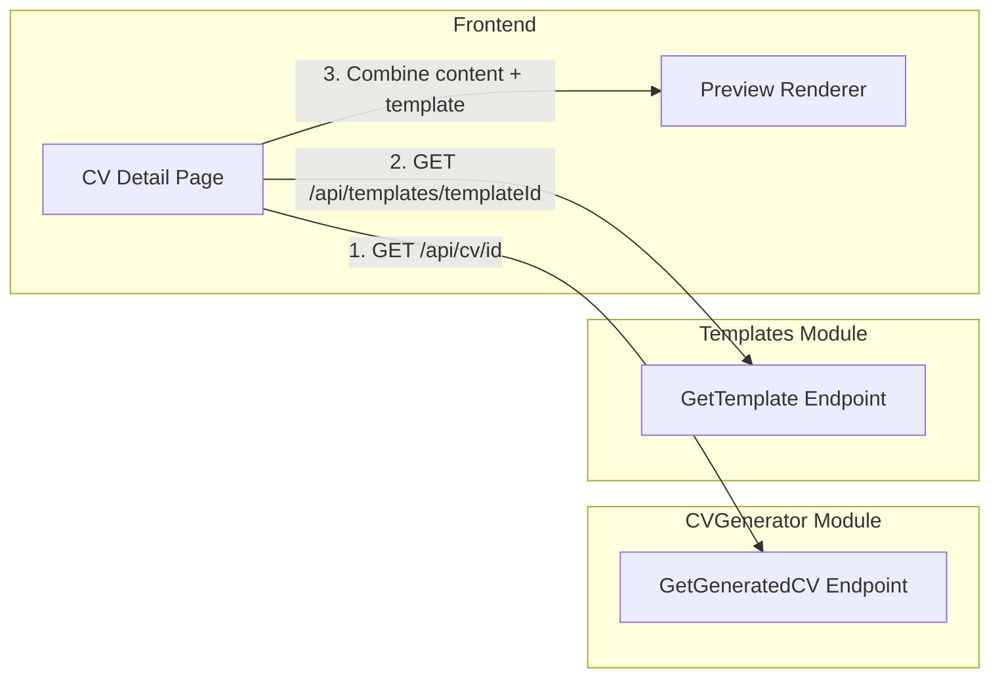
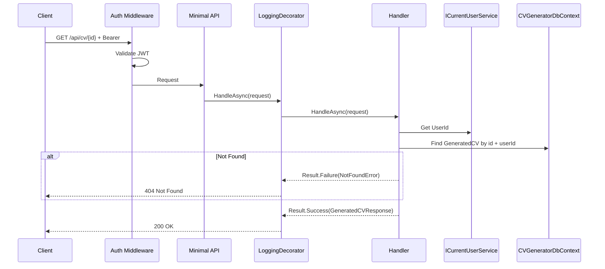
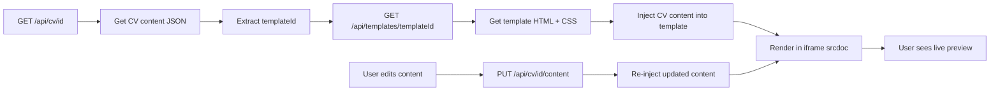

# GetGeneratedCV

## Summary

Get full details of a single generated CV, including all content, match score, cover letter, snapshots, and PDF status. This endpoint also serves as the data source for **client-side preview rendering** — the frontend combines the CV content from this response with template HTML/CSS from `GET /api/templates/{id}` to render a live preview.

## Actor

Authenticated user (CV owner)

## Request

```
GET /api/cv/{id}
Authorization: Bearer {accessToken}
```

## Response

**200 OK**

```json
{
  "id": "guid",
  "generationType": "FullCV",
  "status": "Done",
  "profileSnapshot": {
    "headline": "Senior Software Engineer",
    "summary": "10 years of experience in...",
    "firstName": "Jane",
    "lastName": "Smith",
    "sections": [...]
  },
  "jobSnapshot": {
    "title": "Senior Software Engineer",
    "company": "Google",
    "location": "Mountain View, CA",
    "requiredSkills": ["C#", "Azure", "SQL", "Docker"],
    "responsibilities": [...],
    "seniorityLevel": "Senior"
  },
  "templateId": "guid",
  "content": {
    "summary": "Results-driven senior engineer with 8+ years building scalable systems...",
    "sections": [
      {
        "type": "Experience",
        "title": "Relevant Experience",
        "items": [
          {
            "company": "Google",
            "role": "Senior Engineer",
            "description": "Led microservices architecture migration...",
            "startDate": "2020-01",
            "endDate": null,
            "isCurrent": true
          }
        ]
      },
      {
        "type": "Skill",
        "title": "Key Skills",
        "items": ["C#", "Azure", "SQL", "Docker"]
      }
    ]
  },
  "matchScore": {
    "percentage": 82,
    "matchingSkills": ["C#", "Azure", "SQL", "Docker"],
    "missingSkills": ["Kubernetes", "Terraform"]
  },
  "coverLetter": null,
  "tailoringPrompt": "Emphasize leadership experience",
  "pdfStatus": "Ready",
  "createdAt": "2026-05-03T10:00:00Z",
  "updatedAt": "2026-05-03T10:05:00Z"
}
```

**404 Not Found**

```json
{
  "code": "NOT_FOUND",
  "message": "Generated CV not found"
}
```

**401 Unauthorized**

```json
{
  "code": "UNAUTHORIZED",
  "message": "Not authenticated"
}
```

## Business Rules

- Only the CV owner can access their generated CVs
- Returns full content including all sections, match score, and cover letter
- `profileSnapshot` and `jobSnapshot` are the frozen data from generation time
- If status is Queued/Processing, `content` and `matchScore` are null
- If status is Failed, `error` field is included

## Client-Side Preview

The frontend renders CV previews client-side by combining data from two endpoints:

1. **`GET /api/cv/{id}`** (this endpoint) — returns CV content JSON
2. **`GET /api/templates/{templateId}`** — returns template HTML + CSS

The frontend injects the CV content into the template's HTML structure and renders it in a sandboxed iframe using `srcdoc`:

```
┌─────────────────────────────────────────┐
│ Browser (iframe srcdoc)                 │
│                                         │
│  Template HTML + CSS                    │
│  ┌───────────────────────────────────┐  │
│  │ {summary}                         │  │
│  │ {experience sections}             │  │
│  │ {skills}                          │  │
│  │ {education}                       │  │
│  └───────────────────────────────────┘  │
│                                         │
└─────────────────────────────────────────┘
```

This provides:
- **Instant preview updates** when user edits content (no server round-trip)
- **No dedicated backend preview endpoint** needed
- **Template IP is still protected** — template HTML is only served to authenticated users

## Flow

1. Client sends `GET /api/cv/{id}`
2. **Auth middleware** validates JWT
3. **LoggingDecorator** logs entry
4. **Handler** executes:
   - Get `UserId` from `ICurrentUserService`
   - Find GeneratedCV by id and userId → 404 if not found or not owner
   - Return full CV details
5. **LoggingDecorator** logs result

## Inter-module Interactions

**None directly from this endpoint.** The CV data is fully self-contained (uses stored snapshots).

The client-side preview rendering calls `GET /api/templates/{templateId}` from the Templates module, but this is a frontend-initiated call, not a backend inter-module interaction.



## Diagrams

### Sequence Diagram



### Client-Side Preview — Flowchart



## Error Codes

| Code | HTTP Status | When |
|------|-------------|------|
| `UNAUTHORIZED` | 401 | Missing or invalid JWT |
| `NOT_FOUND` | 404 | Generated CV not found or not owner |
