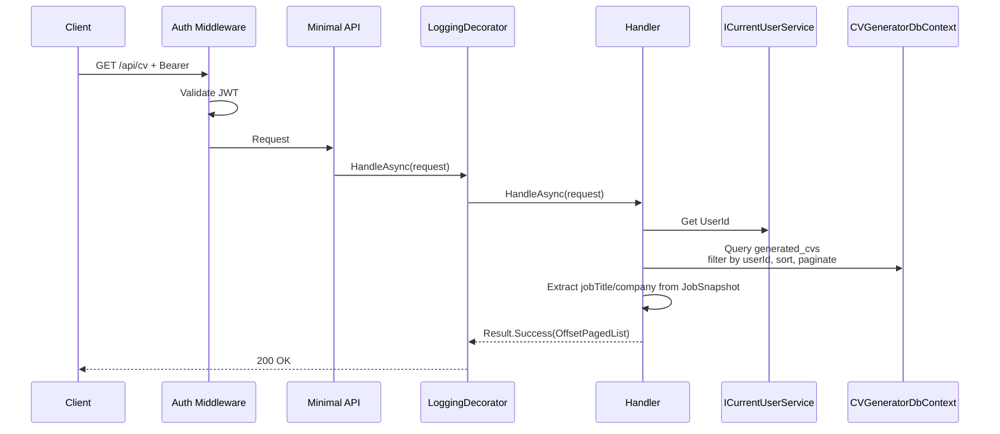

# ListHistory

## Summary

Paginated list of user's generated CVs, ordered by creation date. Returns summary metadata for each CV including job title, company, template info, match score, and PDF availability.

## Actor

Authenticated user

## Request

```
GET /api/cv?page=1&pageSize=10&sortBy=date&sortOrder=desc
Authorization: Bearer {accessToken}
```

## Response

**200 OK**

```json
{
  "items": [
    {
      "id": "guid",
      "generationType": "FullCV",
      "jobTitle": "Senior Software Engineer",
      "company": "Google",
      "templateId": "guid",
      "templateCategory": "minimal",
      "matchScore": 82,
      "hasCoverLetter": true,
      "pdfStatus": "Ready",
      "status": "Done",
      "createdAt": "2026-05-03T10:00:00Z"
    },
    {
      "id": "guid",
      "generationType": "FullCV",
      "jobTitle": "Full Stack Developer",
      "company": "Meta",
      "templateId": "guid",
      "templateCategory": "professional",
      "matchScore": 71,
      "hasCoverLetter": false,
      "pdfStatus": "None",
      "status": "Done",
      "createdAt": "2026-05-02T14:30:00Z"
    }
  ],
  "pagingInfo": {
    "hasNext": true,
    "hasPrevious": false,
    "page": 1,
    "pageSize": 10,
    "total": 15
  }
}
```

**401 Unauthorized**

```json
{
  "code": "UNAUTHORIZED",
  "message": "Not authenticated"
}
```

## Query Parameters

| Parameter | Default | Options |
|-----------|---------|---------|
| page | 1 | Positive integer |
| pageSize | 10 | 1-50 |
| sortBy | date | date, score |
| sortOrder | desc | asc, desc |

## Business Rules

- Only returns CVs belonging to the authenticated user
- Includes both FullCV and CoverLetterOnly generation types
- `jobTitle` and `company` extracted from JobSnapshot JSONB
- `templateCategory` extracted from template data (or null if template was deleted/disabled)
- `matchScore` is the percentage value from the stored MatchScore JSONB
- Failed generations are included in the list (status=Failed)
- Queued/Processing entries shown with status for in-progress tracking
- Default sort: newest first (sortBy=date, sortOrder=desc)

## Flow

1. Client sends `GET /api/cv` with query params
2. **Auth middleware** validates JWT
3. **LoggingDecorator** logs entry
4. **Handler** executes:
   - Get `UserId` from `ICurrentUserService`
   - Query `generated_cvs` filtered by userId
   - Apply sorting
   - Paginate results
   - Extract jobTitle/company from JobSnapshot for each item
   - Return paged response
5. **LoggingDecorator** logs result

## Inter-module Interactions

**None.** Self-contained within CVGenerator module. Job/title/company data comes from the stored JobSnapshot, not a live gRPC call.

## Diagrams

### Sequence Diagram



## Error Codes

| Code | HTTP Status | When |
|------|-------------|------|
| `UNAUTHORIZED` | 401 | Missing or invalid JWT |
