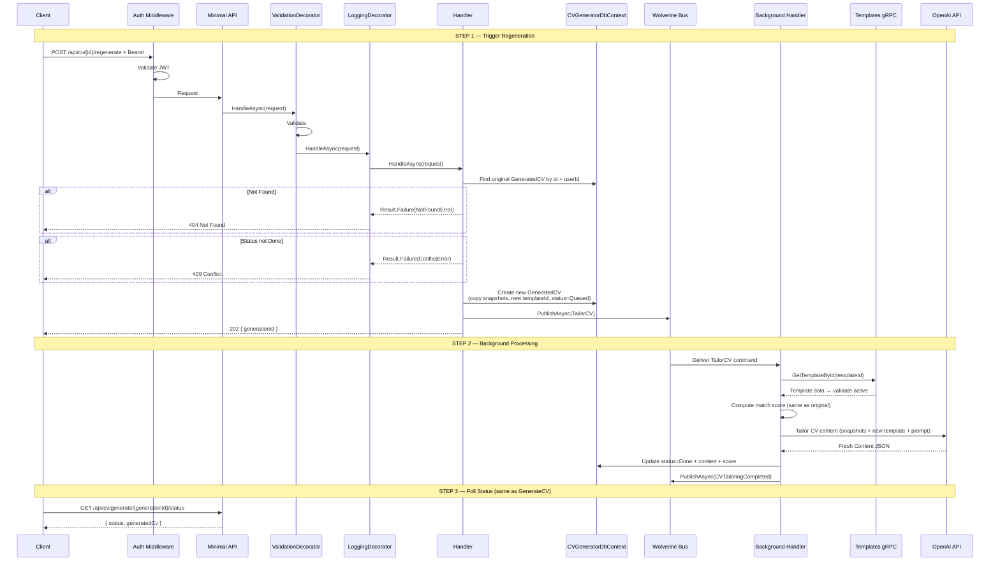
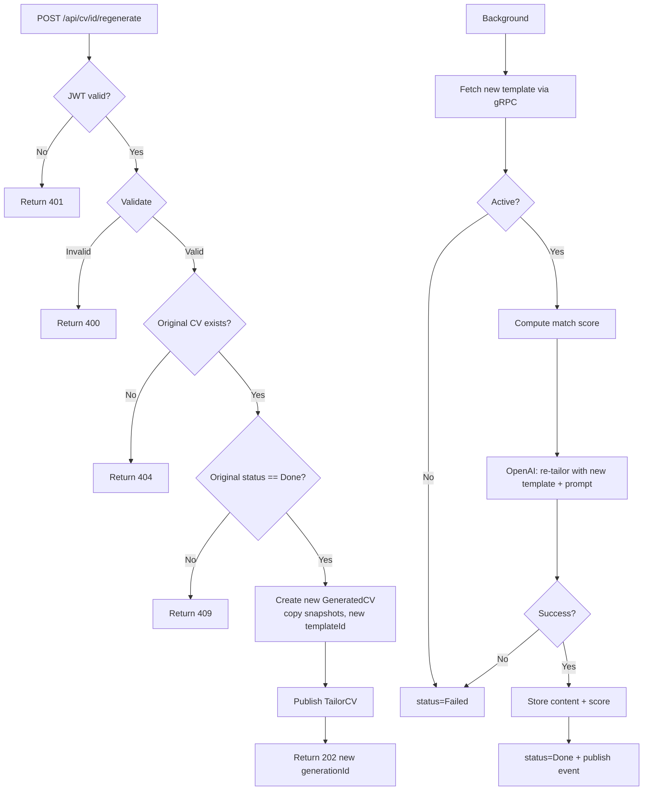

# RegenerateCV

## Summary

User regenerates a CV with a different template (or the same template with a different tailoring prompt). Creates a **new** GeneratedCV record with fresh AI-tailored content while preserving the original CV in history. Uses the original profile and JD snapshots — no re-fetching from other modules.

## Actor

Authenticated user (CV owner)

## Infrastructure

- **Wolverine** — async message processing (in-process)
- **gRPC** — fetch new template
- **OpenAI API** — CV content re-tailoring

## Endpoints

### Trigger Regeneration

```
POST /api/cv/{id}/regenerate
Authorization: Bearer {accessToken}
Content-Type: application/json

{
  "templateId": "guid",
  "tailoringPrompt": "Make it more concise. Focus on cloud experience."
}
```

**202 Accepted**

```json
{
  "generationId": "guid"
}
```

Creates a **new** `GeneratedCV` record (new ID) using the original's profile/JD snapshots. Publishes a `TailorCV` command via Wolverine.

### Poll Status

Same as GenerateCV:

```
GET /api/cv/generate/{generationId}/status
Authorization: Bearer {accessToken}
```

Returns the same status response as [generate-cv.md](./generate-cv.md#poll-status).

## Validation Rules

| Field | Rules |
|-------|-------|
| TemplateId | Required, valid GUID |
| TailoringPrompt | Optional, max 2000 chars |

## Business Rules

- Original CV must have status=Done
- Creates a **new** GeneratedCV record (new ID) — original CV stays untouched in history
- Reuses the original's ProfileSnapshot and JobSnapshot (same profile + JD data)
- Fresh AI tailoring with new template + optional new prompt
- Match score is recalculated (same algorithm, same profile + JD → same score as original)
- Only the CV owner can regenerate
- The new generation follows the exact same background pipeline as GenerateCV

## Relationship to Original

```
History:
├── Original CV (id: aaa, template: minimal, prompt: null, content: {...})
│   └── User manually edited content
├── Regenerated CV (id: bbb, template: professional, prompt: "more concise", content: {...})
│   └── Fresh AI output, no manual edits
└── Regenerated CV (id: ccc, template: creative, prompt: null, content: {...})
    └── Fresh AI output
```

- Each regeneration is independent
- Original CV with manual edits is preserved
- User can compare versions and pick the best one

## Flow

1. Client sends `POST /api/cv/{id}/regenerate` with templateId + optional prompt
2. **Auth middleware** validates JWT
3. **ValidationDecorator** runs FluentValidation
4. **Handler** executes:
   - Get `UserId` from `ICurrentUserService`
   - Find original GeneratedCV by id and userId → 404 if not found
   - Check status=Done → 409 if still processing
   - Create new GeneratedCV record (new ID, copy userId + ProfileSnapshot + JobSnapshot, new templateId, new tailoringPrompt, status=Queued)
   - Publish `TailorCV` command via Wolverine
   - Return 202 with new generationId
5. **Wolverine background handler** processes (same as GenerateCV):
   - Fetch new template via gRPC → validate active
   - Compute match score (same result — same profile + JD)
   - Call OpenAI with profile + JD + new template context + tailoringPrompt → fresh Content
   - Store Content + MatchScore, set status=Done
   - Publish `CVTailoringCompleted`
6. Client polls `GET /api/cv/generate/{generationId}/status`

## Inter-module Interactions

**gRPC call** during background processing:

| Call | Module | Purpose |
|------|--------|---------|
| `GetTemplateById` | Templates | Fetch new template (validate active) |

No profile/JD gRPC needed — uses existing snapshots.

### External Dependencies

| Service | Purpose | Resilience |
|---------|---------|------------|
| Templates gRPC | Fetch new template | Built-in gRPC retry |
| OpenAI API | CV content re-tailoring | Wolverine built-in retry |

## Diagrams

### Full Flow — Sequence Diagram



### Flowchart



## Error Codes

| Code | HTTP Status | When |
|------|-------------|------|
| `VALIDATION` | 400 | Invalid/missing templateId |
| `UNAUTHORIZED` | 401 | Missing or invalid JWT |
| `NOT_FOUND` | 404 | Original CV not found |
| `CONFLICT` | 409 | Original CV still processing |
| — | 202 | Regeneration triggered |

## History Preservation

Regeneration never modifies or deletes existing CVs. Each generation (original or regenerated) is a separate record in history. The user's manual edits on any version are preserved until they explicitly delete the CV (future feature).
