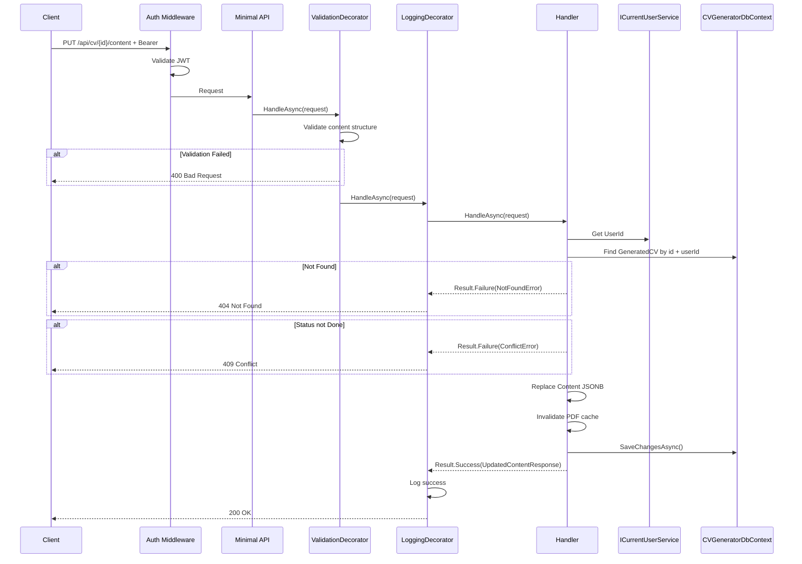
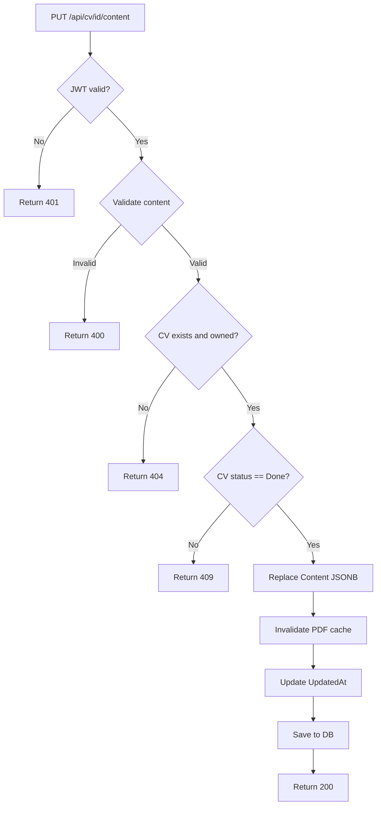

# UpdateCVContent

## Summary

User edits the AI-generated CV content (summary, section descriptions, skills, etc.) before exporting. This is the manual refinement step after AI generation — users can fix what the AI got wrong, reorder sections, or adjust wording. Content edits invalidate any cached PDF.

## Actor

Authenticated user (CV owner)

## Request

```
PUT /api/cv/{id}/content
Authorization: Bearer {accessToken}
Content-Type: application/json

{
  "summary": "Results-driven senior engineer with 8+ years building scalable systems...",
  "sections": [
    {
      "type": "Experience",
      "title": "Relevant Experience",
      "items": [
        {
          "company": "Google",
          "role": "Senior Engineer",
          "description": "Led microservices architecture migration serving 10M+ users...",
          "startDate": "2020-01",
          "endDate": null,
          "isCurrent": true
        }
      ]
    },
    {
      "type": "Skill",
      "title": "Key Skills",
      "items": ["C#", "Azure", "SQL", "Docker"]
    },
    {
      "type": "Education",
      "title": "Education",
      "items": [
        {
          "institution": "University of Technology",
          "degree": "B.Sc. Computer Science",
          "startDate": "2012-09",
          "endDate": "2016-06"
        }
      ]
    }
  ]
}
```

## Response

**200 OK**

```json
{
  "id": "guid",
  "content": {
    "summary": "Results-driven senior engineer with 8+ years...",
    "sections": [...]
  },
  "matchScore": {
    "percentage": 82,
    "matchingSkills": ["C#", "Azure", "SQL", "Docker"],
    "missingSkills": ["Kubernetes", "Terraform"]
  },
  "pdfStatus": "None",
  "updatedAt": "2026-05-03T10:05:00Z"
}
```

**400 Bad Request**

```json
{
  "code": "VALIDATION",
  "message": "Summary is required; At least one section is required"
}
```

**401 Unauthorized**

```json
{
  "code": "UNAUTHORIZED",
  "message": "Not authenticated"
}
```

**404 Not Found**

```json
{
  "code": "NOT_FOUND",
  "message": "Generated CV not found"
}
```

**409 Conflict**

```json
{
  "code": "CONFLICT",
  "message": "CV generation is still in progress"
}
```

## Validation Rules

| Field | Rules |
|-------|-------|
| Summary | Required, max 2000 chars |
| Sections | Required, min 1 item, max 15 items |
| Section.Type | Required, one of: Experience, Project, Skill, Education, Certification, Language, Custom |
| Section.Title | Required, max 200 chars |
| Section.Items | Required, array (structure varies by type) |

## Business Rules

- Only works on CVs with status=Done → 409 if still processing
- **Replaces the entire Content** (full update, not partial/patch)
- Content must conform to the same JSONB structure returned by AI generation
- **Invalidates cached PDF** — sets `pdfStatus=None`, `pdfKey=null` (user must re-export after editing)
- `UpdatedAt` is refreshed
- Only the CV owner can edit content

## Flow

1. Client sends `PUT /api/cv/{id}/content` with full edited content
2. **Auth middleware** validates JWT
3. **ValidationDecorator** runs FluentValidation (content structure validation)
4. **Handler** executes:
   - Get `UserId` from `ICurrentUserService`
   - Find GeneratedCV by id and userId → 404 if not found or not owner
   - Check status=Done → 409 if still processing
   - Replace Content JSONB
   - Invalidate PDF cache (pdfStatus=None, pdfKey=null)
   - Update `UpdatedAt`
   - Save to `cvgenerator.generated_cvs`
   - Return updated content + match score + pdf status
5. **LoggingDecorator** logs result

## Inter-module Interactions

**None.** Self-contained within CVGenerator module.

## Diagrams

### Sequence Diagram



### Flowchart



## Error Codes

| Code | HTTP Status | When |
|------|-------------|------|
| `VALIDATION` | 400 | Invalid content structure, missing required fields |
| `UNAUTHORIZED` | 401 | Missing or invalid JWT |
| `NOT_FOUND` | 404 | Generated CV not found |
| `CONFLICT` | 409 | CV generation still in progress |
