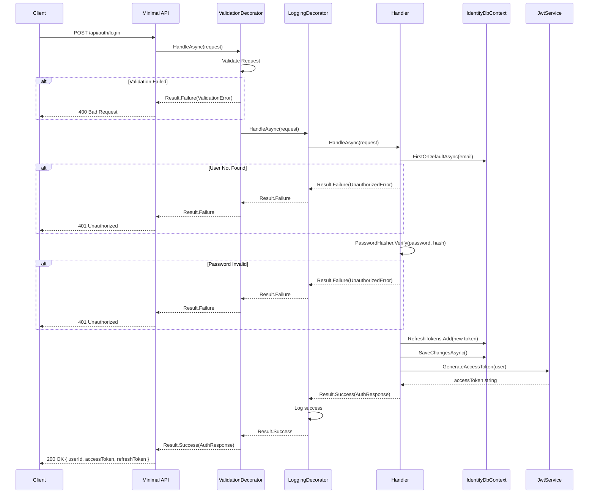
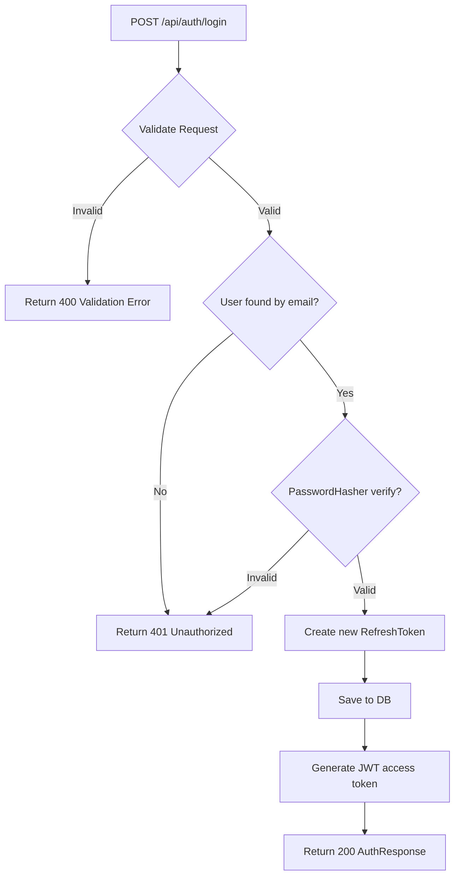

# Login

## Summary

Registered user authenticates with email + password → gets new JWT access token + refresh token.

## Actor

Registered user (no auth required for this endpoint)

## Request

```
POST /api/auth/login
Content-Type: application/json

{
  "email": "string",
  "password": "string"
}
```

## Response

**200 OK**

```json
{
  "userId": "guid",
  "accessToken": "string (JWT)",
  "refreshToken": "string"
}
```

**401 Unauthorized**

```json
{
  "code": "INVALID_CREDENTIALS",
  "message": "Invalid email or password"
}
```

> Note: Same error message for both wrong email and wrong password (prevents email enumeration).

## Validation Rules

| Field | Rules |
|-------|-------|
| Email | Required, valid email format |
| Password | Required |

## Business Rules

- Email lookup is case-insensitive
- Password verified via PBKDF2 (PasswordHasher.Verify)
- On successful login, a **new** `RefreshToken` is created (old ones remain valid until expired — no revocation in Phase 1)
- Access token expiry: 15 minutes
- Refresh token expiry: 7 days
- Same error response for wrong email and wrong password (security best practice)

## Flow

1. Client sends `POST /api/auth/login`
2. **ValidationDecorator** runs FluentValidation rules
3. **Handler** executes:
   - Look up user by email (case-insensitive)
   - If not found → return same error as wrong password (no email enumeration)
   - Verify password with PasswordHasher.Verify
   - If invalid → return unauthorized error
   - Create new `RefreshToken` entity (userId, token=GUID, expiresAt=now+7days)
   - Save refresh token to `identity.refresh_tokens`
   - Generate JWT access token via `JwtService`
   - Return `AuthResponse`
4. **LoggingDecorator** logs result (no sensitive data)

## Inter-module Interactions

**None.** Login is fully self-contained within the Identity module.

## Diagrams

### Sequence Diagram



### Flowchart



## Error Codes

| Code | HTTP Status | When |
|------|-------------|------|
| `VALIDATION` | 400 | Missing/invalid email or password format |
| `INVALID_CREDENTIALS` | 401 | Wrong email or wrong password |

## Security Considerations

- Same error message for wrong email and wrong password (prevents email enumeration)
- Password never logged
- Rate limiting on this endpoint (prevent brute-force login)
- Failed login attempts logged with email (for monitoring, not returned to client)
