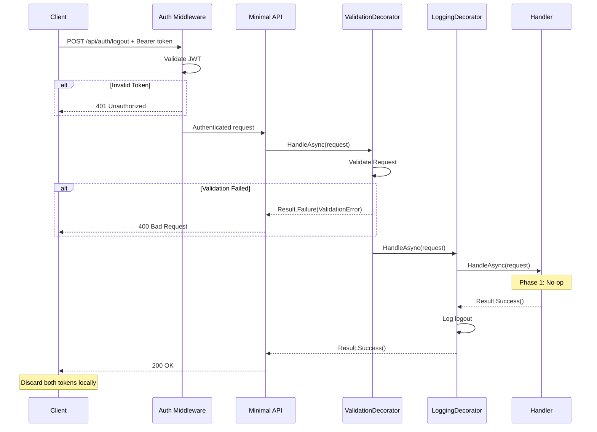
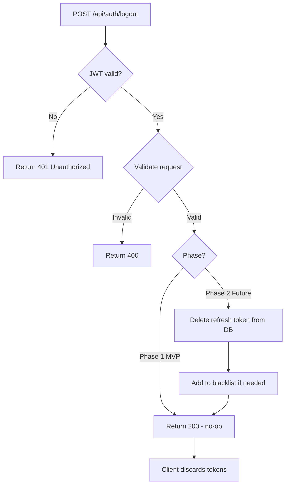

# Logout

## Summary

User logs out. In Phase 1, this is client-side only — the client discards both tokens. The endpoint exists for API completeness and future server-side revocation.

## Actor

Authenticated user

## Request

```
POST /api/auth/logout
Authorization: Bearer {accessToken}
Content-Type: application/json

{
  "refreshToken": "string"
}
```

## Response

**200 OK**

```
(Empty response body)
```

**401 Unauthorized**

```json
{
  "code": "UNAUTHORIZED",
  "message": "Not authenticated"
}
```

## Validation Rules

| Field | Rules |
|-------|-------|
| RefreshToken | Required, non-empty string |

## Business Rules

- **Phase 1 (MVP):** Client discards tokens. Endpoint is a no-op on the server — just returns 200.
- **Future:** Server-side refresh token revocation/blacklist will be added. The endpoint signature stays the same — only the handler logic changes.
- Requires valid JWT access token (authenticated)

## Flow

1. Client sends `POST /api/auth/logout` with refresh token
2. **Auth middleware** validates JWT → 401 if invalid
3. **ValidationDecorator** runs FluentValidation rules
4. **Handler** executes (Phase 1):
   - No-op: return success immediately
5. Client discards both `accessToken` and `refreshToken` locally
6. **LoggingDecorator** logs logout event

## Inter-module Interactions

**None.** Self-contained within Identity module.

## Diagrams

### Sequence Diagram



### Flowchart — Phase 1 vs Future



## Error Codes

| Code | HTTP Status | When |
|------|-------------|------|
| `VALIDATION` | 400 | Missing or empty refresh token |
| `UNAUTHORIZED` | 401 | Invalid or missing access token |

## Design Note

The endpoint exists now so the API contract is stable. When server-side revocation is implemented in Phase 2, only the handler body changes — no endpoint or client changes needed.
