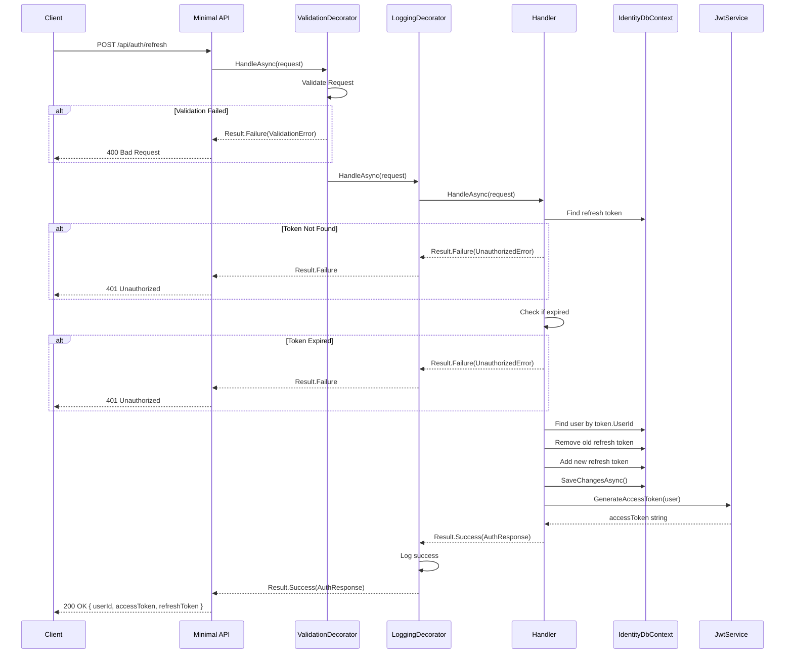
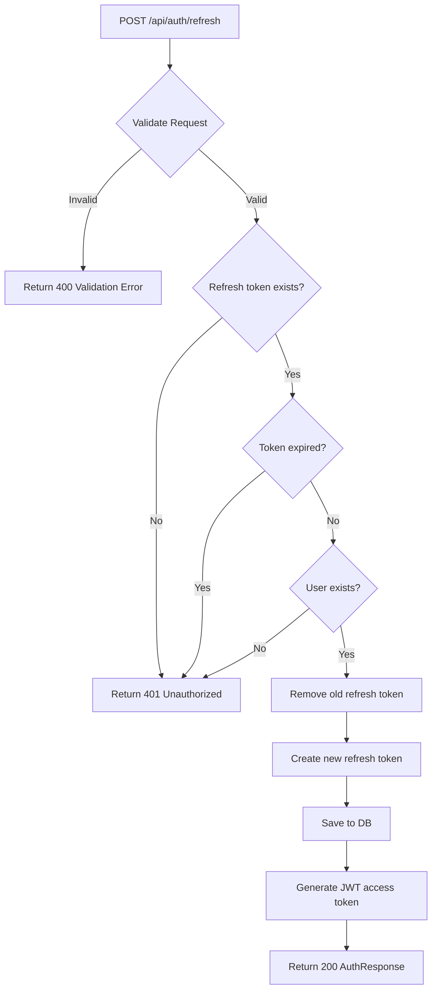
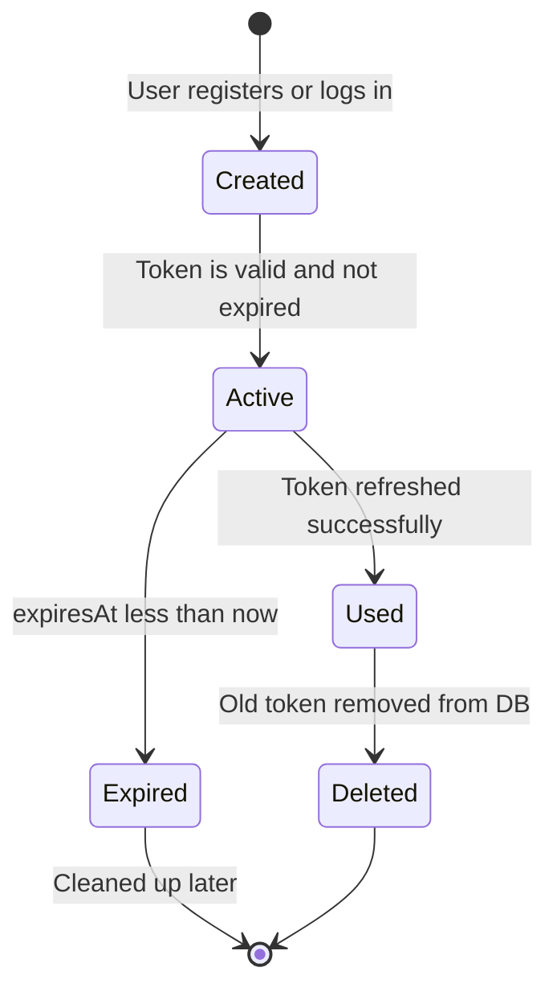

# RefreshToken

## Summary

User sends a valid refresh token → gets a new JWT access token + new refresh token pair (simple rotation).

## Actor

Authenticated user (has a valid refresh token)

## Request

```
POST /api/auth/refresh
Content-Type: application/json

{
  "refreshTokenValue": "string"
}
```

## Response

**200 OK**

```json
{
  "userId": "guid",
  "accessToken": "string (JWT)",
  "refreshToken": "string"
}
```

**401 Unauthorized**

```json
{
  "code": "REFRESH_TOKEN_NOT_FOUND",
  "message": "Invalid or expired refresh token"
}
```

> Expired tokens return `REFRESH_TOKEN_EXPIRED` (401). Deleted users return `USER_DELETED` (401).

## Validation Rules

| Field | Rules |
|-------|-------|
| RefreshTokenValue | Required, non-empty string |

## Business Rules

- Look up refresh token in DB
- If token not found → 401
- If token is expired (`expiresAt < now`) → 401
- On success: create a **new** refresh token, **delete** the old one (simple rotation — not revocation/blacklist)
- Generate new JWT access token
- No revocation/blacklist mechanism in Phase 1 — if a refresh token is valid and not expired, it works

## Flow

1. Client sends `POST /api/auth/refresh`
2. **ValidationDecorator** runs FluentValidation rules
3. **Handler** executes:
   - Look up refresh token in `identity.refresh_tokens`
   - If not found → return 401
   - If expired → return 401
   - Look up associated user
   - If user not found → return 401 (edge case: user deleted)
   - Delete old refresh token
   - Create new `RefreshToken` entity (new GUID, new expiry)
   - Save changes
   - Generate new JWT access token via `JwtService`
   - Return `AuthResponse`
4. **LoggingDecorator** logs result

## Inter-module Interactions

**None.** Self-contained within Identity module.

## Diagrams

### Sequence Diagram



### Flowchart



### State Diagram — Refresh Token Lifecycle



## Error Codes

| Code | HTTP Status | When |
|------|-------------|------|
| `VALIDATION` | 400 | Missing or empty refresh token value |
| `REFRESH_TOKEN_NOT_FOUND` | 404 | Token not found in database |
| `REFRESH_TOKEN_EXPIRED` | 401 | Token has expired |
| `USER_DELETED` | 401 | Associated user no longer exists |

## Security Considerations

- Old refresh token is deleted on rotation (prevents replay)
- No blacklist needed in Phase 1 — rotation + expiry is sufficient
- Rate limiting on this endpoint
- Refresh tokens are single-use by design (old one deleted)
