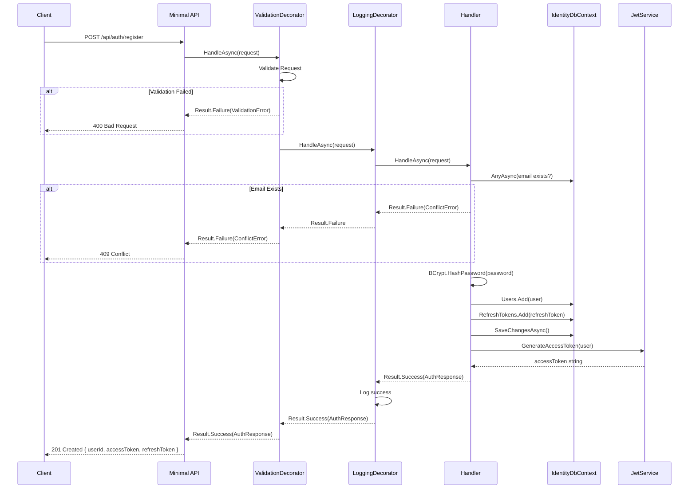
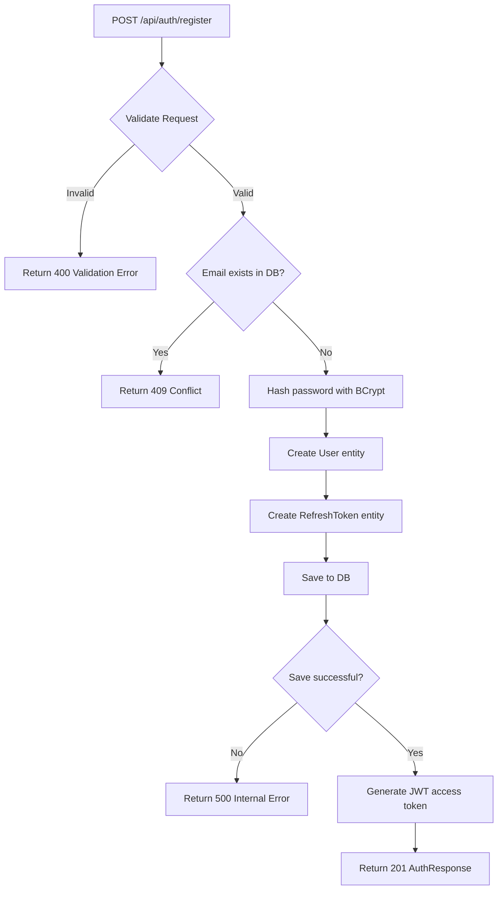
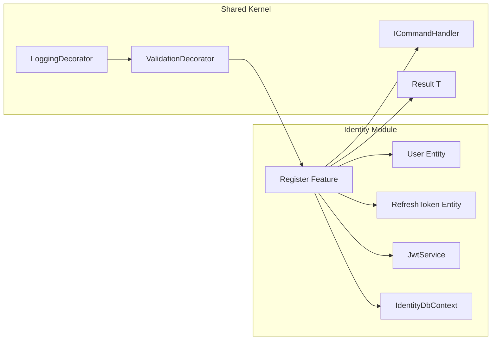

# Register

## Summary

Visitor registers with email, password, first name, last name → gets JWT access token + refresh token.

## Actor

Anonymous visitor (no auth required)

## Request

```
POST /api/auth/register
Content-Type: application/json

{
  "email": "string",
  "password": "string",
  "firstName": "string",
  "lastName": "string"
}
```

## Response

**201 Created**

```json
{
  "userId": "guid",
  "accessToken": "string (JWT)",
  "refreshToken": "string"
}
```

**400 Bad Request**

```json
{
  "code": "VALIDATION",
  "message": "Email is invalid; Password must contain..."
}
```

**409 Conflict**

```json
{
  "code": "CONFLICT",
  "message": "A user with this email already exists"
}
```

## Validation Rules

| Field | Rules |
|-------|-------|
| Email | Required, valid email format, max 256 chars |
| Password | Required, min 8 chars, at least 1 uppercase, 1 lowercase, 1 digit, 1 special char |
| FirstName | Required, max 100 chars |
| LastName | Required, max 100 chars |

## Business Rules

- Email must be unique (case-insensitive)
- Password stored as BCrypt hash (never plaintext)
- User role defaults to `User` (not Admin)
- On registration, a `RefreshToken` is automatically created
- Access token expiry: 15 minutes
- Refresh token expiry: 7 days

## Flow

1. Client sends `POST /api/auth/register`
2. **ValidationDecorator** runs FluentValidation rules
3. **Handler** executes:
   - Check if email exists in DB → return 409 if duplicate
   - Hash password with BCrypt
   - Create `User` entity (email, hash, firstName, lastName, role=User, createdAt)
   - Create `RefreshToken` entity (userId, token=GUID, expiresAt=now+7days)
   - Save both to `identity.users` and `identity.refresh_tokens`
   - Generate JWT access token via `JwtService`
   - Return `AuthResponse`
4. **LoggingDecorator** logs result

## Inter-module Interactions

**None.** Register is fully self-contained within the Identity module.

## Diagrams

### Sequence Diagram



### Flowchart



### Component Diagram



## Error Codes

| Code | HTTP Status | When |
|------|-------------|------|
| `VALIDATION` | 400 | Invalid email, weak password, empty names |
| `CONFLICT` | 409 | Email already registered |

## Security Considerations

- Password never logged or returned in response
- BCrypt work factor: 12 (adjustable)
- Rate limiting on this endpoint (prevent brute-force registration)
- Email normalization (trim + lowercase) before uniqueness check
