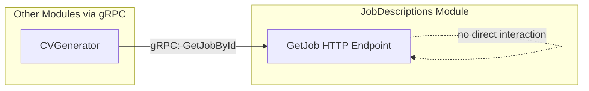
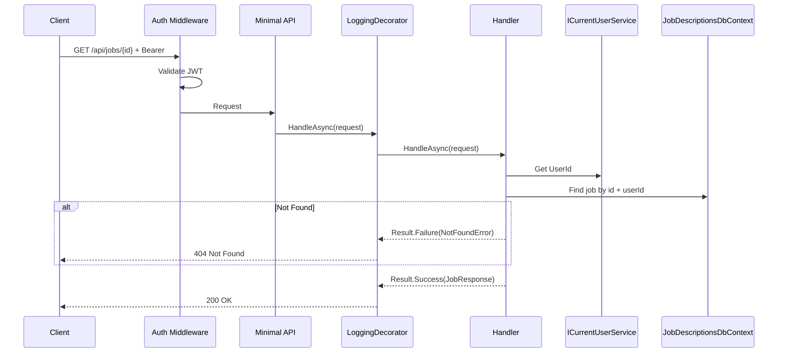

# GetJob

## Summary

Get full details of a saved job description.

## Actor

Authenticated user (job owner)

## Request

```
GET /api/jobs/{id}
Authorization: Bearer {accessToken}
```

## Response

**200 OK**

```json
{
  "id": "guid",
  "title": "Senior Software Engineer",
  "company": "Google",
  "location": "Mountain View, CA",
  "requiredSkills": ["C#", "Azure", "SQL", "Docker"],
  "responsibilities": ["Design and implement scalable systems", "Lead a team of engineers"],
  "qualifications": ["Bachelor's degree in CS", "5+ years experience"],
  "seniorityLevel": "Senior",
  "sourceUrl": "https://linkedin.com/jobs/view/123456",
  "label": "Google SWE Application",
  "rawText": "We are looking for a Senior Software Engineer...",
  "createdAt": "2026-04-17T10:00:00Z",
  "updatedAt": "2026-04-17T10:00:00Z"
}
```

**404 Not Found**

```json
{
  "code": "NOT_FOUND",
  "message": "Job description not found"
}
```

**401 Unauthorized**

```json
{
  "code": "UNAUTHORIZED",
  "message": "Not authenticated"
}
```

## Business Rules

- Only the owner can access their job descriptions
- Returns all fields including arrays (responsibilities, qualifications, skills)
- Includes `rawText` for reference

## Flow

1. Client sends `GET /api/jobs/{id}`
2. **Auth middleware** validates JWT
3. **LoggingDecorator** logs entry
4. **Handler** executes:
   - Get `UserId` from `ICurrentUserService`
   - Find job description by id and userId → 404 if not found or not owner
   - Return full job details
5. **LoggingDecorator** logs result

## Inter-module Interactions

**None.** Self-contained within JobDescriptions module.

Other modules access job data via **gRPC** (`JobDescriptionsService.GetJobById`).



## Diagrams

### Sequence Diagram



## Error Codes

| Code | HTTP Status | When |
|------|-------------|------|
| `UNAUTHORIZED` | 401 | Missing or invalid JWT |
| `NOT_FOUND` | 404 | Job not found or not owner |
