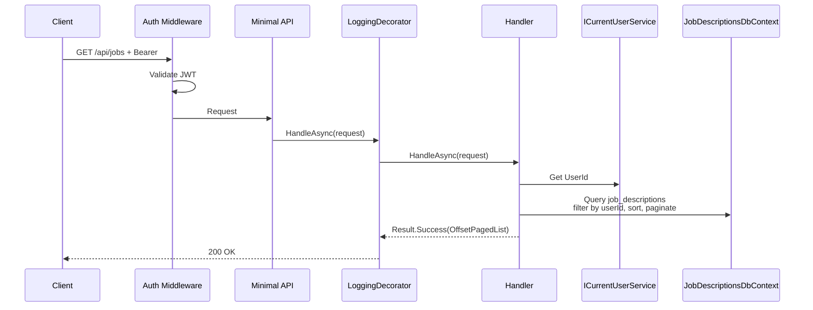

# ListJobs

## Summary

Paginated list of user's saved job descriptions.

## Actor

Authenticated user

## Request

```
GET /api/jobs?page=1&pageSize=10&sortBy=date&sortOrder=desc
Authorization: Bearer {accessToken}
```

## Response

**200 OK**

```json
{
  "items": [
    {
      "id": "guid",
      "title": "Senior Software Engineer",
      "company": "Google",
      "location": "Mountain View, CA",
      "label": "Google SWE Application",
      "seniorityLevel": "Senior",
      "createdAt": "2026-04-17T10:00:00Z"
    }
  ],
  "pagingInfo": {
    "hasNext": true,
    "hasPrevious": false,
    "page": 1,
    "pageSize": 10,
    "total": 25
  }
}
```

**401 Unauthorized**

```json
{
  "code": "UNAUTHORIZED",
  "message": "Not authenticated"
}
```

## Query Parameters

| Parameter | Default | Options |
|-----------|---------|---------|
| page | 1 | Positive integer |
| pageSize | 10 | 1-50 |
| sortBy | date | date, title, company |
| sortOrder | desc | asc, desc |

## Business Rules

- Only returns jobs belonging to the authenticated user
- Results sorted by specified field and order
- Default: newest first (sortBy=date, sortOrder=desc)
- Summary view only (no responsibilities/qualifications arrays in list)

## Flow

1. Client sends `GET /api/jobs` with query params
2. **Auth middleware** validates JWT
3. **LoggingDecorator** logs entry
4. **Handler** executes:
   - Get `UserId` from `ICurrentUserService`
   - Query `job_descriptions` filtered by userId
   - Apply sorting
   - Paginate results
   - Return paged response
5. **LoggingDecorator** logs result

## Inter-module Interactions

**None.** Self-contained within JobDescriptions module.

## Diagrams

### Sequence Diagram



## Error Codes

| Code | HTTP Status | When |
|------|-------------|------|
| `UNAUTHORIZED` | 401 | Missing or invalid JWT |
