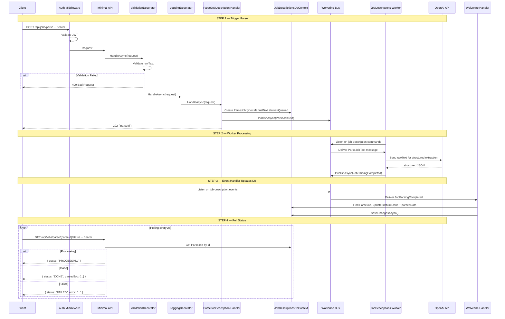
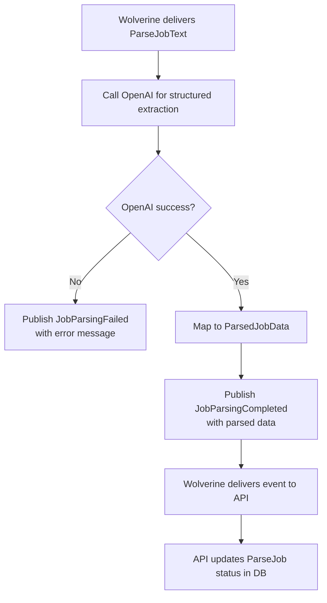

# ParseJobDescription

## Summary

User pastes job description text. Backend processes it asynchronously via OpenAI through the JobDescriptions Worker. Client polls for status until result is ready. Not saved — user must explicitly save via SaveJobDescription.

## Actor

Authenticated user

## Endpoints

### Trigger Parse

```
POST /api/jobs/parse
Authorization: Bearer {accessToken}
Content-Type: application/json

{
  "rawText": "We are looking for a Senior Software Engineer with 5+ years of experience in C#..."
}
```

**202 Accepted**

```json
{
  "parseId": "guid"
}
```

Creates a `ParseJob` (status=Queued) and publishes `ParseJobText` command via **Wolverine + RabbitMQ**. The JobDescriptions Worker picks it up from the `job-description.commands` queue, calls OpenAI, and publishes the result back as an event.

### Poll Status

```
GET /api/jobs/parse/{parseId}/status
Authorization: Bearer {accessToken}
```

**200 OK — Processing**

```json
{
  "status": "PROCESSING"
}
```

**200 OK — Done**

```json
{
  "status": "DONE",
  "parsedJob": {
    "title": "Senior Software Engineer",
    "company": "Google",
    "location": "Mountain View, CA",
    "requiredSkills": ["C#", "Azure", "SQL", "Docker"],
    "responsibilities": ["Design and implement scalable systems", "Lead a team of engineers"],
    "qualifications": ["Bachelor's degree in CS", "5+ years experience"],
    "seniorityLevel": "Senior"
  }
}
```

**200 OK — Failed**

```json
{
  "status": "FAILED",
  "error": "Could not parse job description. Please try again."
}
```

**404 Not Found**

```json
{
  "code": "NOT_FOUND",
  "message": "Parse job not found"
}
```

## Validation Rules

| Field | Rules |
|-------|-------|
| RawText | Required, min 50 chars, max 10,000 chars |

## Business Rules

- Parsed result is **not saved** — user must explicitly save via `SaveJobDescription`
- Parse is idempotent — user can trigger multiple parses (each gets new parseId)
- ParseJob stored in `jobdescriptions.parse_jobs` with `type = ManualText`
- Only the owner can poll their parse jobs

## Flow

1. Client sends `POST /api/jobs/parse` with rawText
2. **Auth middleware** validates JWT
3. **ValidationDecorator** validates rawText length
4. **Handler** creates `ParseJob` (status=Queued) + publishes `ParseJobText` via Wolverine → returns parseId (202)
5. **JobDescriptions Worker** (separate process):
   - Consumes `ParseJobText` from `job-description.commands` queue
   - Calls OpenAI for structured extraction
   - Publishes `JobParsingCompleted` or `JobParsingFailed` to `job-description.events` queue
6. **API Wolverine handler** (`JobParsingCompletedHandler` / `JobParsingFailedHandler`):
   - Receives event from queue
   - Updates `ParseJob` status in DB (Done with parsedData, or Failed with error)
7. Client polls `GET /api/jobs/parse/{parseId}/status` until DONE or FAILED

## Inter-module Interactions

**None.** Only external dependency is OpenAI API via the Worker process.

## Diagrams

### Full Flow — Sequence Diagram



### Background Job — Flowchart



## Error Codes

| Code | HTTP Status | When |
|------|-------------|------|
| `VALIDATION` | 400 | rawText empty, too short (<50), or too long (>10000) |
| `UNAUTHORIZED` | 401 | Missing or invalid JWT |
| `NOT_FOUND` | 404 | parseId not found |

## Database Table

### parse_jobs (in jobdescriptions schema)

```
parse_jobs
├── id (guid, PK)
├── user_id (guid)
├── type (enum: ManualText, UrlScrape)
├── raw_text (text — rawText or URL)
├── status (enum: Queued, Processing, Done, Failed)
├── parsed_data (JSONB, null until Done)
├── error (string, null unless Failed)
├── source_url (uri, nullable)
├── created_at (datetime)
├── completed_at (datetime, null until Done/Failed)
```

Shared with ScrapeJobDescription — differentiated by `type` field.
