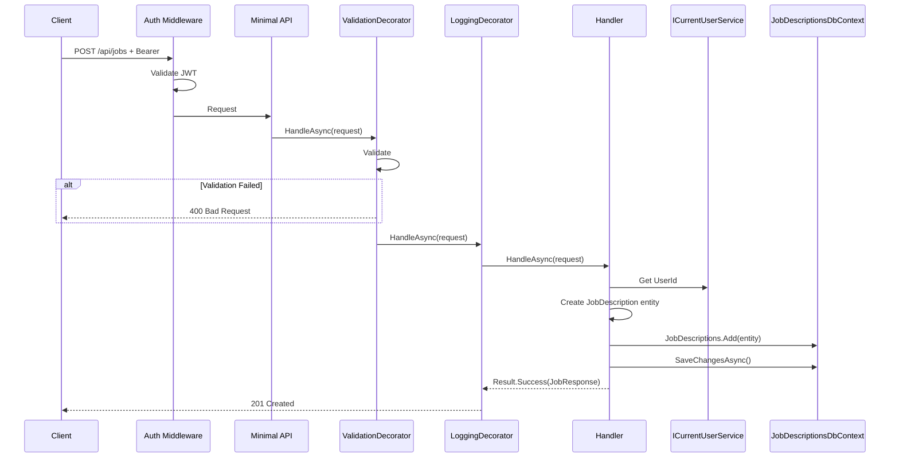
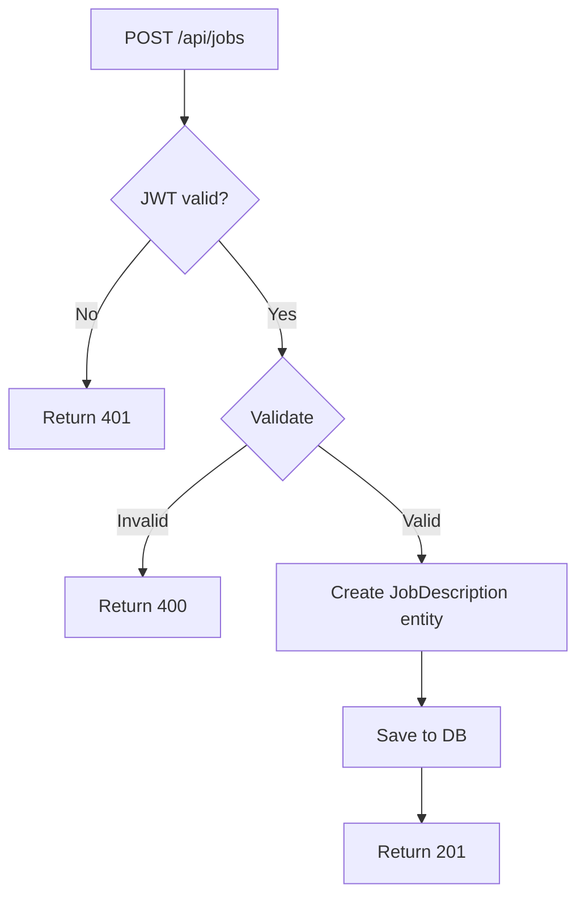

# SaveJobDescription

## Summary

User saves a parsed job description (from manual parse or URL scrape) for later reuse. User can edit parsed fields before saving.

## Actor

Authenticated user

## Request

```
POST /api/jobs
Authorization: Bearer {accessToken}
Content-Type: application/json

{
  "title": "Senior Software Engineer",
  "company": "Google",
  "location": "Mountain View, CA",
  "requiredSkills": ["C#", "Azure", "SQL", "Docker"],
  "responsibilities": ["Design and implement scalable systems", "Lead a team of engineers"],
  "qualifications": ["Bachelor's degree in CS", "5+ years experience"],
  "seniorityLevel": "Senior",
  "sourceUrl": "https://linkedin.com/jobs/view/123456",
  "label": "Google SWE Application",
  "rawText": "We are looking for a Senior Software Engineer..."
}
```

## Response

**201 Created**

```json
{
  "id": "guid",
  "title": "Senior Software Engineer",
  "company": "Google",
  "location": "Mountain View, CA",
  "requiredSkills": ["C#", "Azure", "SQL", "Docker"],
  "responsibilities": ["Design and implement scalable systems", "Lead a team of engineers"],
  "qualifications": ["Bachelor's degree in CS", "5+ years experience"],
  "seniorityLevel": "Senior",
  "sourceUrl": "https://linkedin.com/jobs/view/123456",
  "label": "Google SWE Application",
  "createdAt": "2026-04-17T10:00:00Z"
}
```

**400 Bad Request**

```json
{
  "code": "VALIDATION",
  "message": "..."
}
```

**401 Unauthorized**

```json
{
  "code": "UNAUTHORIZED",
  "message": "Not authenticated"
}
```

## Validation Rules

| Field | Rules |
|-------|-------|
| Title | Required, max 200 chars |
| Company | Required, max 200 chars |
| Location | Optional, max 200 chars |
| RequiredSkills | Optional, array of strings, max 30 items |
| Responsibilities | Optional, array of strings, max 20 items |
| Qualifications | Optional, array of strings, max 20 items |
| SeniorityLevel | Optional, enum: Junior, Mid, Senior, Lead, Principal, Staff, Director |
| SourceUrl | Optional, valid URL, max 2048 chars |
| Label | Optional, max 100 chars |
| RawText | Optional, max 10000 chars |

## Business Rules

- User can edit all parsed fields before saving
- `sourceUrl` is null for manual text input, populated for URL scrape
- `label` is optional user tag for organization
- `rawText` optionally stores the original text for reference
- No event published on save (unlike parse — save is synchronous)

## Flow

1. Client sends `POST /api/jobs`
2. **Auth middleware** validates JWT
3. **ValidationDecorator** runs FluentValidation
4. **Handler** executes:
   - Get `UserId` from `ICurrentUserService`
   - Create `JobDescription` entity with all fields
   - Save to `jobdescriptions.job_descriptions`
   - Return created job description
5. **LoggingDecorator** logs result

## Inter-module Interactions

**None.** Self-contained within JobDescriptions module. Save is synchronous (no messaging).

Other modules access job data via **gRPC** (`JobDescriptionsService.GetJobById`).

## Diagrams

### Sequence Diagram



### Flowchart



## Error Codes

| Code | HTTP Status | When |
|------|-------------|------|
| `VALIDATION` | 400 | Missing title/company, invalid fields |
| `UNAUTHORIZED` | 401 | Missing or invalid JWT |

## Database Table

### job_descriptions (in jobdescriptions schema)

```
job_descriptions
├── id (guid, PK)
├── user_id (guid)
├── title (string, required)
├── company (string, required)
├── location (string, nullable)
├── required_skills (JSONB)
├── responsibilities (JSONB)
├── qualifications (JSONB)
├── seniority_level (string, nullable)
├── source_url (uri, nullable)
├── label (string, nullable)
├── raw_text (text, nullable)
├── created_at (datetime)
├── updated_at (datetime)
```
