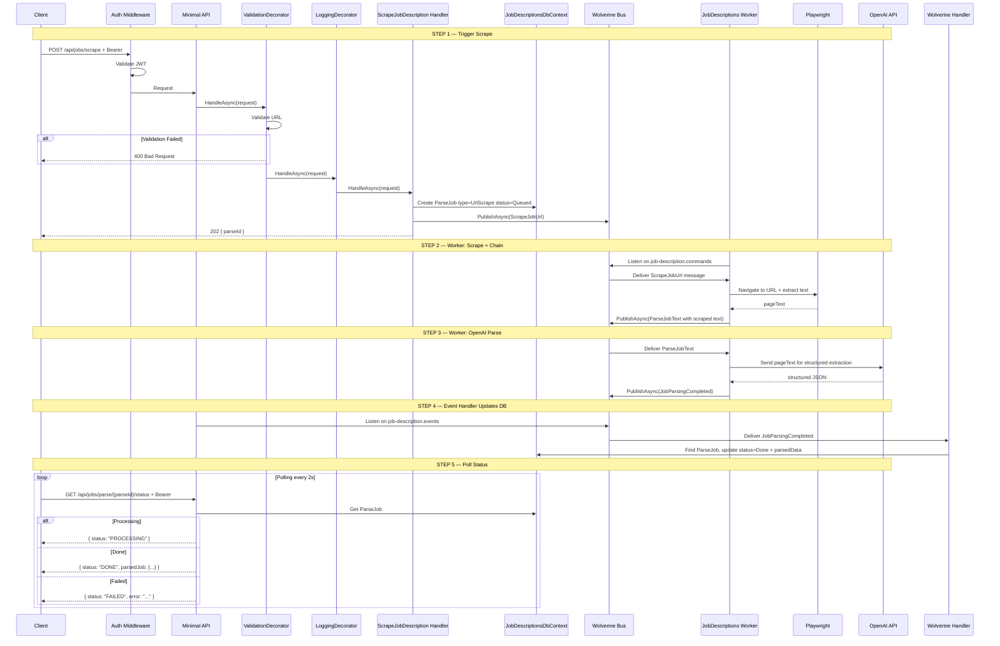
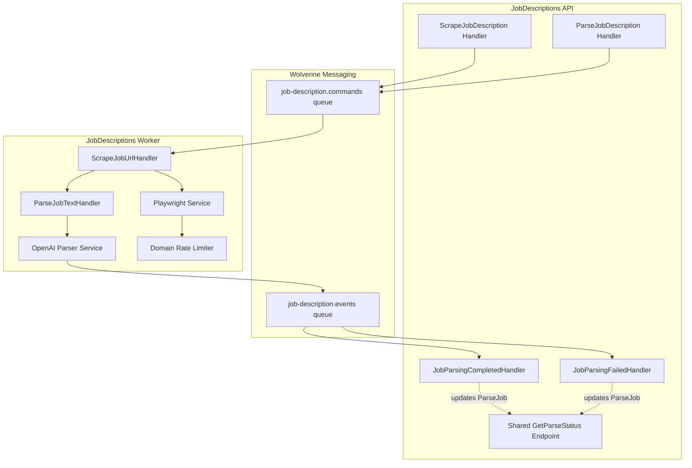

# ScrapeJobDescription

## Summary

User provides a job posting URL. Backend uses Playwright to scrape the page via the JobDescriptions Worker, then OpenAI to parse the JD. Same async polling pattern as ParseJobDescription — uses the same `parse_jobs` table and polling endpoint.

## Actor

Authenticated user

## Endpoints

### Trigger Scrape

```
POST /api/jobs/scrape
Authorization: Bearer {accessToken}
Content-Type: application/json

{
  "url": "https://linkedin.com/jobs/view/123456"
}
```

**202 Accepted**

```json
{
  "parseId": "guid"
}
```

Creates a `ParseJob` (type=UrlScrape, status=Queued) and publishes `ScrapeJobUrl` command via **Wolverine + RabbitMQ**. The JobDescriptions Worker picks it up, scrapes via Playwright, chains to OpenAI parsing, and publishes result back as an event.

### Poll Status

Same endpoint as ParseJobDescription:

```
GET /api/jobs/parse/{parseId}/status
Authorization: Bearer {accessToken}
```

**200 OK — Processing**

```json
{
  "status": "PROCESSING"
}
```

**200 OK — Done**

```json
{
  "status": "DONE",
  "parsedJob": {
    "title": "Senior Software Engineer",
    "company": "Google",
    "location": "Mountain View, CA",
    "requiredSkills": ["C#", "Azure", "SQL"],
    "responsibilities": ["Design and implement scalable systems", "Lead a team of engineers"],
    "qualifications": ["Bachelor's degree in CS", "5+ years experience"],
    "seniorityLevel": "Senior"
  }
}
```

**200 OK — Failed**

```json
{
  "status": "FAILED",
  "error": "Could not access the page. It may require authentication or be behind a paywall."
}
```

**404 Not Found**

```json
{
  "code": "NOT_FOUND",
  "message": "Parse job not found"
}
```

## Validation Rules

| Field | Rules |
|-------|-------|
| Url | Required, valid HTTP/HTTPS URL, max 2048 chars |

## Business Rules

- URL must be valid HTTP/HTTPS
- Playwright runs headless with 30-second page load timeout
- Falls back to raw page text if structured content extraction fails
- Supports major job boards (LinkedIn, Indeed, Glassdoor, etc.) but works with any URL
- Returns error if page is unreachable, blocked (403), or paywalled
- Per-domain rate limiting on scraping (TokenBucket — 2 requests per domain, 5s replenishment)
- Max 3 concurrent scraping operations
- Scraped text stored in `raw_text` field of `parse_jobs` table
- ParseJob stored with `type = UrlScrape`
- Only the owner can poll their parse jobs

## Flow

1. Client sends `POST /api/jobs/scrape` with URL
2. **Auth middleware** validates JWT
3. **ValidationDecorator** validates URL format
4. **Handler** creates `ParseJob` (type=UrlScrape, status=Queued) + publishes `ScrapeJobUrl` via Wolverine → returns parseId (202)
5. **JobDescriptions Worker** (separate process):
   - Consumes `ScrapeJobUrl` from `job-description.commands` queue
   - Playwright: navigate to URL, extract visible text (domain rate limited, 30s timeout)
   - On failure → publishes `JobParsingFailed`
   - On success → publishes `ParseJobText` command (internal chain)
   - `ParseJobText` is consumed → OpenAI structured extraction → `JobParsingCompleted` or `JobParsingFailed`
6. **API Wolverine handlers** (`JobParsingCompletedHandler` / `JobParsingFailedHandler`):
   - Receive event from `job-description.events` queue
   - Update `ParseJob` status in DB
7. Client polls `GET /api/jobs/parse/{parseId}/status` until DONE or FAILED
8. User reviews parsed data → saves via `SaveJobDescription`

## Inter-module Interactions

**None.** External dependencies: Playwright (headless browser) + OpenAI API, via Worker process.

## Diagrams

### Full Flow — Sequence Diagram



### Background Job — Flowchart

```mermaid
flowchart TD
    A[Wolverine delivers ScrapeJobUrl] --> B[Playwright: navigate to URL<br/>Domain rate limit, 30s timeout]
    B --> C{Page loaded?}
    C -->|No| D{Error type?}
    D -->|Timeout| E[Publish JobParsingFailed<br/>error: Page load timeout]
    D -->|403 or blocked| F[Publish JobParsingFailed<br/>error: Page blocked or requires auth]
    D -->|Network error| G[Publish JobParsingFailed<br/>error: Could not reach page]
    C -->|Yes| H[Extract visible text from page]
    H --> I[Publish ParseJobText command<br/>(internal chain)]
    I --> J[Wolverine delivers ParseJobText]
    J --> K[Send to OpenAI for parsing]
    K --> L{OpenAI success?}
    L -->|No| M[Publish JobParsingFailed<br/>error: AI parsing failed]
    L -->|Yes| N[Map to ParsedJobData]
    N --> O[Publish JobParsingCompleted<br/>with parsed data]
    O --> P[Wolverine delivers event to API]
    P --> Q[API updates ParseJob status in DB]
```

### Component Diagram



## Error Codes

| Code | HTTP Status | When |
|------|-------------|------|
| `VALIDATION` | 400 | Invalid URL format |
| `UNAUTHORIZED` | 401 | Missing or invalid JWT |
| `NOT_FOUND` | 404 | parseId not found |
| — | Polling | `FAILED` status with error from Worker |

## Security Considerations

- URL validation prevents internal network access (SSRF protection)
- Blocklist for internal IPs (127.0.0.1, 10.x, 172.x, 192.168.x)
- Rate limiting on scrape endpoint (prevent abuse)
- Playwright runs in sandboxed environment
- No cookies or auth forwarded to scraped pages
