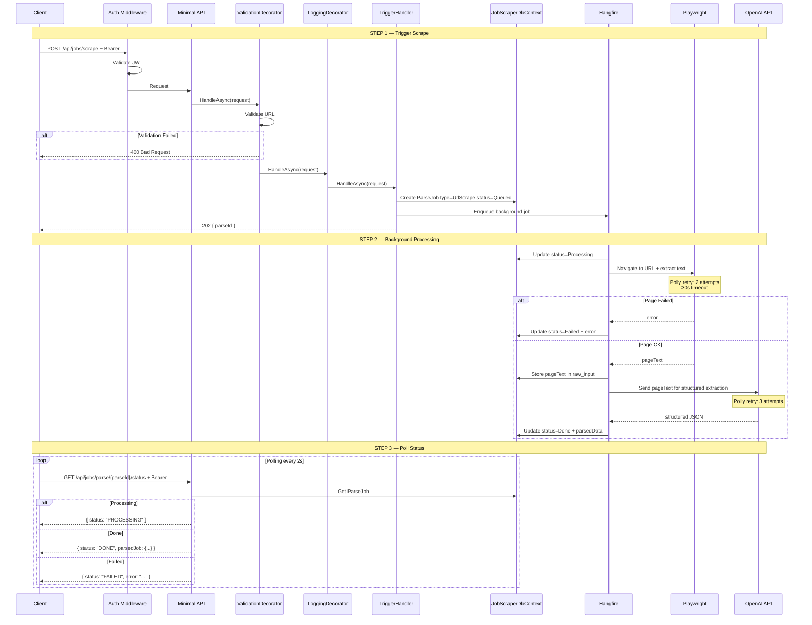
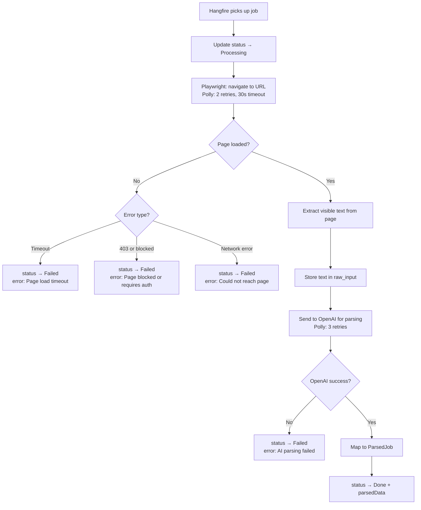
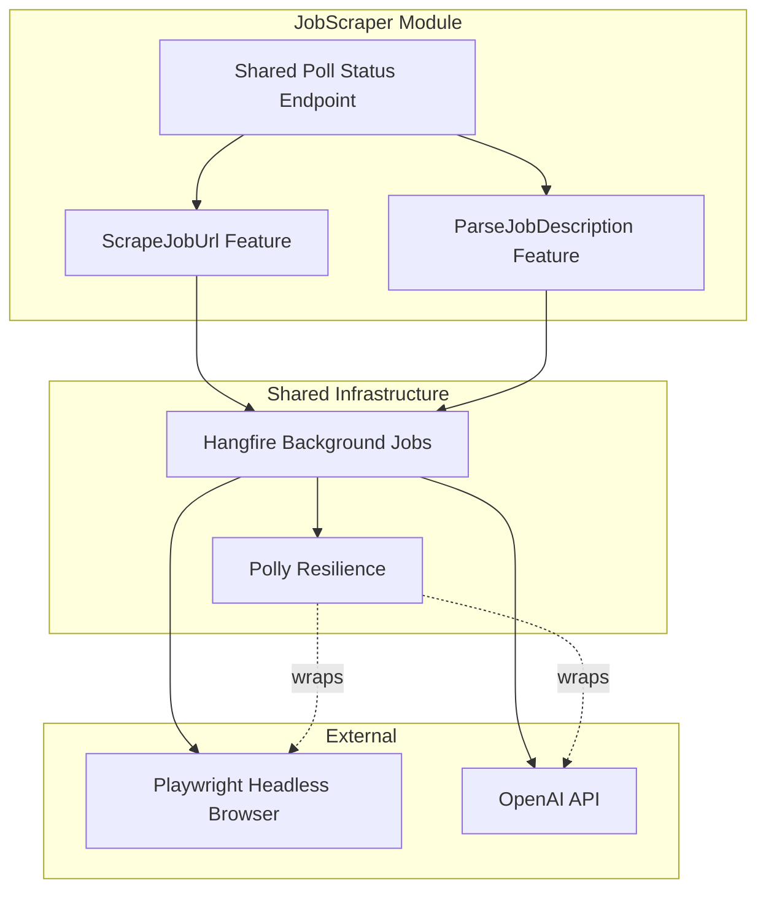

# ScrapeJobUrl

## Summary

User provides a job posting URL. Backend uses Playwright to scrape the page, then OpenAI to parse the JD. Same async polling pattern as ParseJobDescription — shares the `parse_jobs` table and polling endpoint.

## Actor

Authenticated user

## Endpoints

### Trigger Scrape

```
POST /api/jobs/scrape
Authorization: Bearer {accessToken}
Content-Type: application/json

{
  "url": "https://linkedin.com/jobs/view/123456"
}
```

**202 Accepted**

```json
{
  "parseId": "guid"
}
```

Enqueues a **Hangfire job** that:
1. Validates URL reachability
2. Uses Playwright to render the page and extract visible text
3. Sends extracted text to OpenAI for structured parsing
4. Stores result in `jobscraper.parse_jobs`

### Poll Status

Same endpoint as ParseJobDescription:

```
GET /api/jobs/parse/{parseId}/status
Authorization: Bearer {accessToken}
```

**200 OK — Processing**

```json
{
  "status": "PROCESSING"
}
```

**200 OK — Done**

```json
{
  "status": "DONE",
  "parsedJob": {
    "title": "Senior Software Engineer",
    "company": "Google",
    "location": "Mountain View, CA",
    "requiredSkills": ["C#", "Azure", "SQL"],
    "responsibilities": ["Design and implement scalable systems", "Lead a team of engineers"],
    "qualifications": ["Bachelor's degree in CS", "5+ years experience"],
    "seniorityLevel": "Senior"
  }
}
```

**200 OK — Failed**

```json
{
  "status": "FAILED",
  "error": "Could not access the page. It may require authentication or be behind a paywall."
}
```

**404 Not Found**

```json
{
  "code": "NOT_FOUND",
  "message": "Parse job not found"
}
```

## Validation Rules

| Field | Rules |
|-------|-------|
| Url | Required, valid HTTP/HTTPS URL, max 2048 chars |

## Business Rules

- URL must be valid HTTP/HTTPS
- Playwright runs headless with 30-second page load timeout
- Falls back to raw page text if structured content extraction fails
- Supports major job boards (LinkedIn, Indeed, Glassdoor, etc.) but works with any URL
- Returns error if page is unreachable, blocked (403), or paywalled
- Uses Polly retry for Playwright (2 retries) and OpenAI (3 retries)
- Scraped text stored in `raw_input` field of `parse_jobs` table (no S3 — just text)
- ParseJob stored with `type = UrlScrape`
- Parse job timeout: 3 minutes (Hangfire) — longer than manual parse due to scraping
- Only the owner can poll their parse jobs

## Flow

1. Client sends `POST /api/jobs/scrape` with URL
2. **Auth middleware** validates JWT
3. **ValidationDecorator** validates URL format
4. **Handler** creates `ParseJob` (type=UrlScrape, status=Queued) + enqueues Hangfire job → returns parseId (202)
5. **Hangfire background job:**
   - Update status → Processing
   - Playwright: navigate to URL, extract visible text (Polly retry, 30s timeout)
   - On failure → status=Failed with descriptive error
   - Store scraped text in `raw_input`
   - Send text to OpenAI for structured extraction (Polly retry)
   - Map result to `ParsedJob` structure
   - Update status → Done + parsedData (or Failed + error)
6. Client polls `GET /api/jobs/parse/{parseId}/status` until DONE or FAILED
7. User reviews parsed data → saves via `SaveJobDescription`

## Inter-module Interactions

**None.** External dependencies: Playwright (headless browser) + OpenAI API.

## Diagrams

### Full Flow — Sequence Diagram



### Background Job — Flowchart



### Component Diagram



## Error Codes

| Code | HTTP Status | When |
|------|-------------|------|
| `VALIDATION` | 400 | Invalid URL format |
| `UNAUTHORIZED` | 401 | Missing or invalid JWT |
| `NOT_FOUND` | 404 | parseId not found |
| — | Polling | `FAILED` status with error from background job |

## Security Considerations

- URL validation prevents internal network access (SSRF protection)
- Blocklist for internal IPs (127.0.0.1, 10.x, 172.x, 192.168.x)
- Rate limiting on scrape endpoint (prevent abuse)
- Playwright runs in sandboxed environment
- No cookies or auth forwarded to scraped pages
