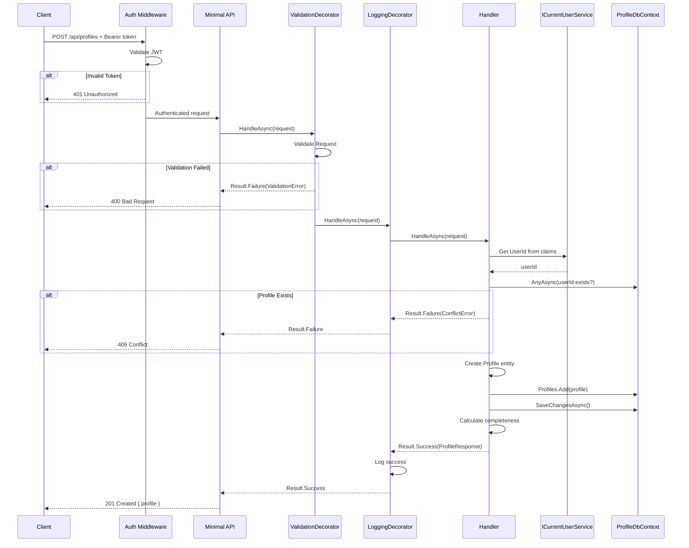
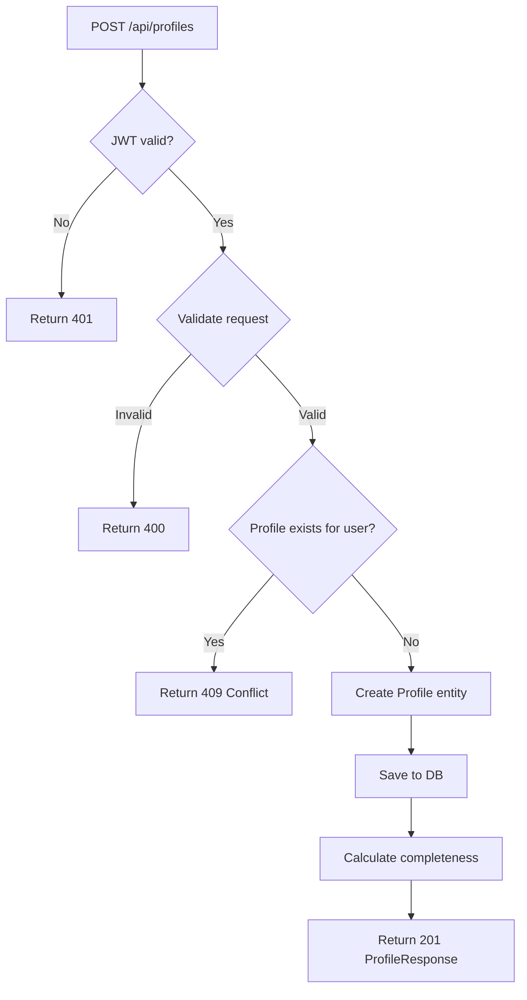
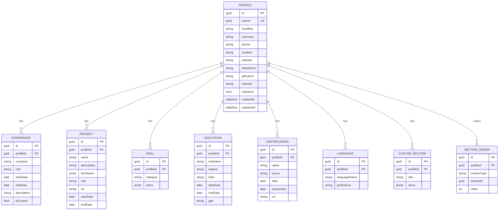

# CreateProfile

## Summary

Authenticated user creates their single professional profile. Sections (predefined + custom) are added separately via Section CRUD features.

## Actor

Authenticated user (no existing profile)

## Request

```
POST /api/profiles
Authorization: Bearer {accessToken}
Content-Type: application/json

{
  "headline": "string",
  "summary": "string",
  "phone": "string",
  "location": "string",
  "website": "string",
  "linkedinUrl": "string",
  "githubUrl": "string"
}
```

## Response

**201 Created**

```json
{
  "id": "guid",
  "headline": "string",
  "summary": "string",
  "phone": "string",
  "location": "string",
  "website": "string",
  "linkedinUrl": "string",
  "githubUrl": "string",
  "completeness": 10,
  "sections": [],
  "createdAt": "datetime"
}
```

**409 Conflict**

```json
{
  "code": "CONFLICT",
  "message": "Profile already exists for this user"
}
```

**401 Unauthorized**

```json
{
  "code": "UNAUTHORIZED",
  "message": "Not authenticated"
}
```

## Validation Rules

| Field | Rules |
|-------|-------|
| Headline | Optional, max 200 chars |
| Summary | Optional, max 2000 chars |
| Phone | Optional, valid phone format |
| Location | Optional, max 200 chars |
| Website | Optional, valid URL |
| LinkedinUrl | Optional, valid URL |
| GithubUrl | Optional, valid URL |

## Business Rules

- One profile per user — returns 409 if profile already exists
- Profile starts empty (sections added separately via Section CRUD features)
- `UserId` is extracted from JWT claims via `ICurrentUserService` (not from request body)
- Initial completeness is calculated based on provided fields (sections not counted yet)

## Flow

1. Client sends `POST /api/profiles`
2. **Auth middleware** validates JWT → 401 if invalid
3. **ValidationDecorator** runs FluentValidation rules
4. **Handler** executes:
   - Get `UserId` from `ICurrentUserService`
   - Check if profile already exists for this user → return 409
   - Create `Profile` entity with all provided fields
   - Save to `profile.profiles`
   - Calculate initial completeness
   - Return created profile with completeness
5. **LoggingDecorator** logs result

## Inter-module Interactions

**None.** Profile creation is self-contained.

**Future:** May publish `ProfileCreatedEvent` via Wolverine when other modules need to react (e.g., Dashboard pre-population).

## Diagrams

### Sequence Diagram



### Flowchart



### ER Diagram — Full Profile Module



## Error Codes

| Code | HTTP Status | When |
|------|-------------|------|
| `VALIDATION` | 400 | Invalid URL format, field too long |
| `UNAUTHORIZED` | 401 | Missing or invalid JWT |
| `CONFLICT` | 409 | User already has a profile |
