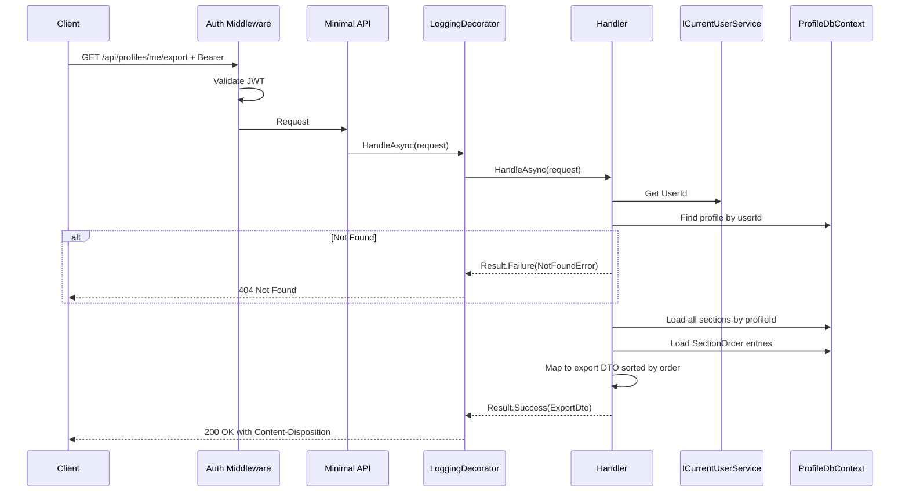

# ExportProfile

## Summary

User exports their full profile data as a downloadable JSON file. The export format matches the import confirm payload shape so exported data can be re-imported.

## Actor

Authenticated user (profile owner)

## Request

```
GET /api/profiles/me/export
Authorization: Bearer {accessToken}
```

## Response

**200 OK**

```
Content-Type: application/json
Content-Disposition: attachment; filename="profile_export_2026-04-17.json"
```

```json
{
  "headline": "Senior Software Engineer",
  "summary": "10 years of experience...",
  "phone": "+1234567890",
  "location": "San Francisco, CA",
  "website": "https://...",
  "linkedinUrl": "https://linkedin.com/in/...",
  "githubUrl": "https://github.com/...",
  "sections": [
    {
      "sectionType": "Experience",
      "data": {
        "company": "Google",
        "role": "Senior Engineer",
        "startDate": "2020-01-01",
        "endDate": null,
        "description": "...",
        "isCurrent": true
      }
    },
    {
      "sectionType": "Custom",
      "data": {
        "title": "Publications",
        "items": [
          { "title": "My Paper", "subtitle": "IEEE", "description": "..." }
        ]
      }
    }
  ],
  "exportedAt": "2026-04-17T10:00:00Z"
}
```

**404 Not Found**

```json
{
  "code": "NOT_FOUND",
  "message": "Profile not found"
}
```

**401 Unauthorized**

```json
{
  "code": "UNAUTHORIZED",
  "message": "Not authenticated"
}
```

## Business Rules

- Returns all profile data including all sections in `SectionOrder` order
- JSON shape matches the import confirm payload (exported data can be re-imported)
- File naming: `profile_export_{yyyy-MM-dd}.json`
- No sensitive data included (no internal IDs, no shareId)

## Flow

1. Client sends `GET /api/profiles/me/export`
2. **Auth middleware** validates JWT
3. **LoggingDecorator** logs entry
4. **Handler** executes:
   - Get `UserId` from `ICurrentUserService`
   - Find profile by userId → 404 if not found
   - Load all sections by profileId
   - Load `SectionOrder` entries
   - Map to export DTO (same shape as import confirm payload)
   - Return with `Content-Disposition` header
5. **LoggingDecorator** logs result

## Inter-module Interactions

**None.** Self-contained within Profile module.

## Diagrams

### Sequence Diagram



## Error Codes

| Code | HTTP Status | When |
|------|-------------|------|
| `UNAUTHORIZED` | 401 | Missing or invalid JWT |
| `NOT_FOUND` | 404 | User has no profile yet |
