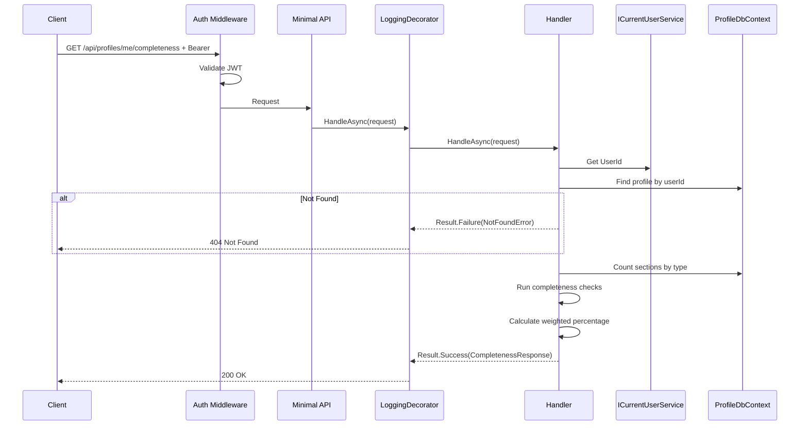
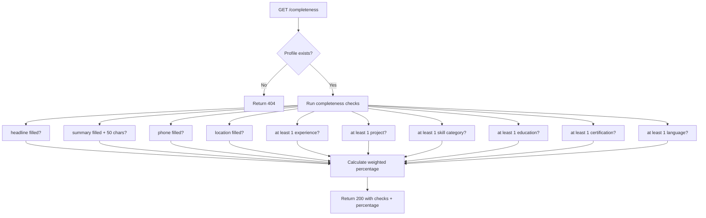

# GetCompleteness

## Summary

Returns the profile completeness percentage and a list of missing/weak areas with suggestions.

## Actor

Authenticated user (profile owner)

## Request

```
GET /api/profiles/me/completeness
Authorization: Bearer {accessToken}
```

## Response

**200 OK**

```json
{
  "percentage": 65,
  "hasProfile": true,
  "checks": [
    { "field": "headline", "passed": true, "suggestion": null },
    { "field": "summary", "passed": true, "suggestion": null },
    { "field": "phone", "passed": false, "suggestion": "Add a phone number" },
    { "field": "location", "passed": true, "suggestion": null },
    { "field": "experience", "passed": true, "suggestion": null, "count": 3 },
    { "field": "projects", "passed": true, "suggestion": null, "count": 2 },
    { "field": "skills", "passed": true, "suggestion": null, "count": 4 },
    { "field": "education", "passed": true, "suggestion": null, "count": 1 },
    { "field": "certifications", "passed": false, "suggestion": "Consider adding certifications" },
    { "field": "languages", "passed": false, "suggestion": "Add languages you speak" }
  ]
}
```

**404 Not Found**

```json
{
  "code": "NOT_FOUND",
  "message": "Profile not found"
}
```

**401 Unauthorized**

```json
{
  "code": "UNAUTHORIZED",
  "message": "Not authenticated"
}
```

## Completeness Rules

| Check | Weight | Passed When | Suggestion |
|-------|--------|-------------|------------|
| headline | 10% | Non-empty | "Add a professional headline" |
| summary | 10% | Non-empty and min 50 chars | "Write a summary about yourself" |
| phone | 5% | Non-empty | "Add a phone number" |
| location | 5% | Non-empty | "Add your location" |
| experience | 20% | At least 1 entry | "Add your work experience" |
| projects | 10% | At least 1 entry | "Showcase your projects" |
| skills | 15% | At least 1 skill category with items | "Add your skills" |
| education | 10% | At least 1 entry | "Add your education" |
| certifications | 5% | At least 1 entry | "Consider adding certifications" |
| languages | 10% | At least 1 entry | "Add languages you speak" |

## Business Rules

- Calculated on the fly (not stored)
- Sections are checked by counting entries in type-specific tables
- Each check contributes a weighted percentage to the total
- A check that passes contributes its full weight; a failed check contributes 0
- Total percentage is the sum of all passed weights (rounded to nearest integer)
- If profile doesn't exist → 404
- `count` field is included for section-type checks (shows number of entries)

## Flow

1. Client sends `GET /api/profiles/me/completeness`
2. **Auth middleware** validates JWT
3. **LoggingDecorator** logs entry
4. **Handler** executes:
   - Get `UserId` from `ICurrentUserService`
   - Find profile by userId → 404 if not found
   - Run each completeness check against profile data
   - Calculate weighted percentage
   - Build response with checks + suggestions
   - Return result
5. **LoggingDecorator** logs result

## Inter-module Interactions

**None.** Self-contained within Profile module.

## Diagrams

### Sequence Diagram



### Flowchart



## Error Codes

| Code | HTTP Status | When |
|------|-------------|------|
| `UNAUTHORIZED` | 401 | Missing or invalid JWT |
| `NOT_FOUND` | 404 | User has no profile yet |
