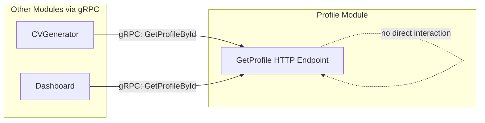
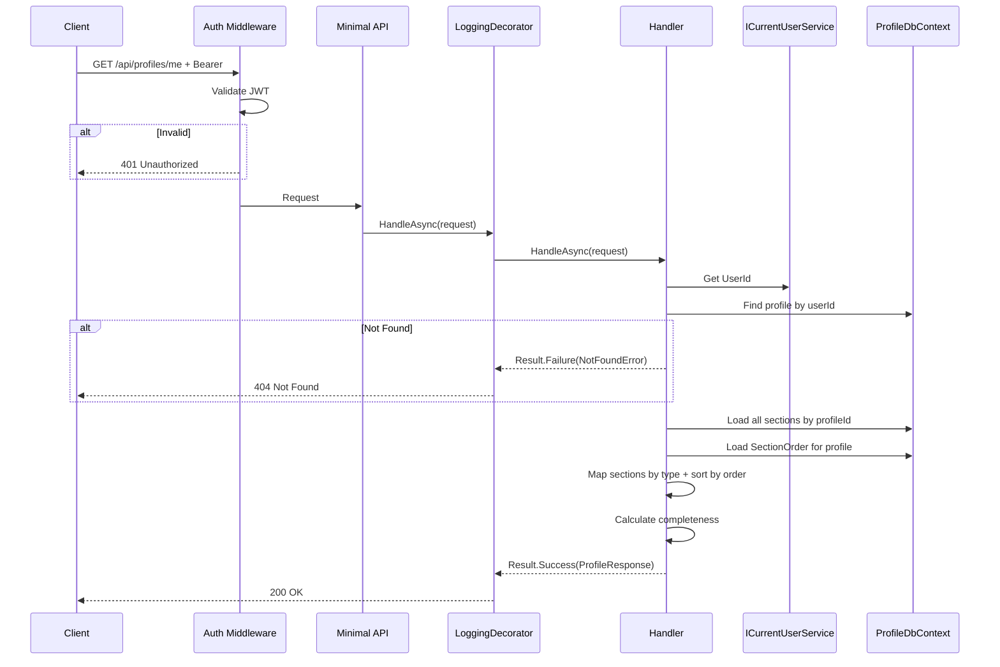
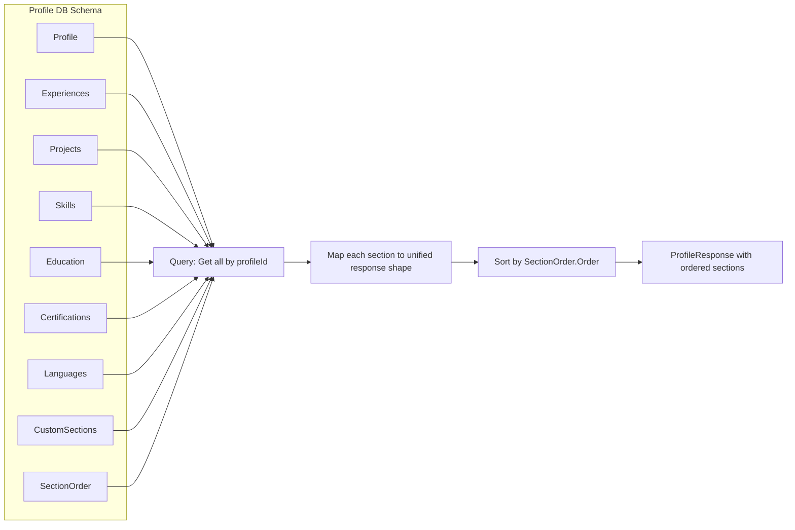

# GetProfile

## Summary

Authenticated user retrieves their full profile with all sections, ordered by `SectionOrder`.

## Actor

Authenticated user (profile owner)

## Request

```
GET /api/profiles/me
Authorization: Bearer {accessToken}
```

## Response

**200 OK**

```json
{
  "id": "guid",
  "headline": "string",
  "summary": "string",
  "phone": "string",
  "location": "string",
  "website": "string",
  "linkedinUrl": "string",
  "githubUrl": "string",
  "completeness": 65,
  "sections": [
    {
      "sectionType": "Experience",
      "sectionId": "guid",
      "order": 1,
      "data": { "company": "...", "role": "...", "startDate": "...", "endDate": "...", "description": "...", "isCurrent": true }
    },
    {
      "sectionType": "Custom",
      "sectionId": "guid",
      "order": 2,
      "data": { "title": "Publications", "items": [...] }
    },
    {
      "sectionType": "Skill",
      "sectionId": "guid",
      "order": 3,
      "data": { "category": "Languages", "items": ["C#", "Python"] }
    }
  ],
  "createdAt": "datetime",
  "updatedAt": "datetime"
}
```

**404 Not Found**

```json
{
  "code": "NOT_FOUND",
  "message": "Profile not found"
}
```

**401 Unauthorized**

```json
{
  "code": "UNAUTHORIZED",
  "message": "Not authenticated"
}
```

## Business Rules

- Returns all sections ordered by `SectionOrder.Order`
- Each section includes its `sectionType` discriminator so the frontend knows how to render it
- Only the profile owner can access this endpoint
- Completeness is recalculated on read

## Flow

1. Client sends `GET /api/profiles/me`
2. **Auth middleware** validates JWT → 401 if invalid
3. **LoggingDecorator** logs entry
4. **Handler** executes:
   - Get `UserId` from `ICurrentUserService`
   - Find profile by userId → 404 if not found
   - Load all sections (Experience, Project, Skill, Education, Certification, Language, CustomSection) by profileId
   - Load `SectionOrder` entries for this profile
   - Map each section to response with its type and order
   - Sort sections by `SectionOrder.Order`
   - Calculate completeness
   - Return full profile response
5. **LoggingDecorator** logs result

## Inter-module Interactions

**None directly from this endpoint.** Other modules access profile data via **gRPC** (`ProfileService.GetProfileById`).



## Diagrams

### Sequence Diagram



### Data Assembly Flowchart



## Error Codes

| Code | HTTP Status | When |
|------|-------------|------|
| `UNAUTHORIZED` | 401 | Missing or invalid JWT |
| `NOT_FOUND` | 404 | User has no profile yet |
