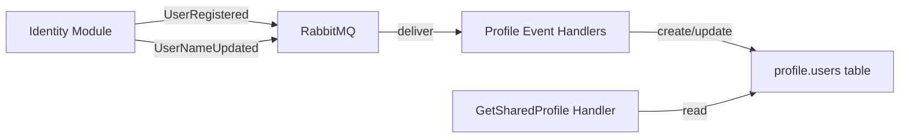
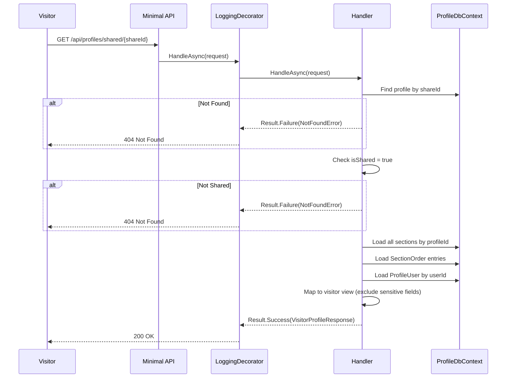

# GetSharedProfile

## Summary

Public endpoint (no auth) that returns a read-only visitor view of a shared profile.

## Actor

Anonymous visitor (no auth required)

## Request

```
GET /api/profiles/shared/{shareId}
```

## Response — 200 OK

```json
{
  "firstName": "John",
  "lastName": "Doe",
  "headline": "Senior Software Engineer",
  "summary": "10 years of experience in...",
  "location": "San Francisco, CA",
  "website": "https://...",
  "linkedinUrl": "https://linkedin.com/in/...",
  "githubUrl": "https://github.com/...",
  "sections": [
    {
      "sectionType": "Experience",
      "data": {
        "company": "Google",
        "role": "Senior Engineer",
        "startDate": "2020-01-01",
        "endDate": null,
        "description": "...",
        "isCurrent": true
      }
    },
    {
      "sectionType": "Skill",
      "data": {
        "category": "Languages",
        "items": ["C#", "Python", "TypeScript"]
      }
    }
  ]
}
```

**404 Not Found**

```json
{
  "code": "NOT_FOUND",
  "message": "Profile not found"
}
```

## Business Rules

- No auth required — fully public endpoint
- Only returns data if `isShared = true` on the profile
- If sharing is disabled or shareId doesn't exist → 404 (same response, no information leakage)
- **Excluded from visitor view:** phone, email, userId, internal IDs, shareId, completeness
- Sections ordered by `SectionOrder`
- Different response shape than owner's `GetProfile` (visitor view has less data, includes firstName/lastName instead of userId)
- First name and last name are read from the local `profile.users` table (populated asynchronously via events from Identity module)

## Flow

1. Visitor sends `GET /api/profiles/shared/{shareId}`
2. **LoggingDecorator** logs entry
3. **Handler** executes:
   - Find profile by `shareId` → 404 if not found
   - Check `isShared = true` → 404 if disabled
   - Load all sections by profileId
   - Load `SectionOrder` entries
   - Load ProfileUser for firstName and lastName from local `profile.users` table
   - Map to visitor response (exclude sensitive fields)
   - Return result
4. **LoggingDecorator** logs result

## Inter-module Interactions

**None directly.** The shared profile handler reads user name data from a local `users` table in the `profile` schema. This table is populated asynchronously via events from the Identity module.

### Event-Driven User Data

The Profile module maintains a lightweight `ProfileUser` record (userId, firstName, lastName) in its own schema, populated via Wolverine events:

| Event | Published By | Profile Module Reaction |
|-------|-------------|------------------------|
| `UserRegistered` | Identity module (on registration) | Create ProfileUser record |
| `UserNameUpdated` | Identity module (on name update) | Update ProfileUser record |



## Diagrams

### Sequence Diagram



### Flowchart

```mermaid
flowchart TD
    A[GET /api/profiles/shared/{shareId}] --> B{Profile found by shareId?}
    B -->|No| C[Return 404]
    B -->|Yes| D{isShared = true?}
    D -->|No| C
    D -->|Yes| E[Load all sections]
    E --> F[Load ProfileUser for firstName + lastName]
    F --> G[Map to visitor view<br/>exclude phone, email, IDs]
    G --> H[Return 200]
```

## Error Codes

| Code | HTTP Status | When |
|------|-------------|------|
| `NOT_FOUND` | 404 | shareId not found or sharing disabled |

## Security Considerations

- Same 404 response for both "not found" and "sharing disabled" (no information leakage)
- Rate limiting on this endpoint (prevent scraping of public profiles)
- No internal IDs exposed to visitors
- No phone or email exposed to visitors
