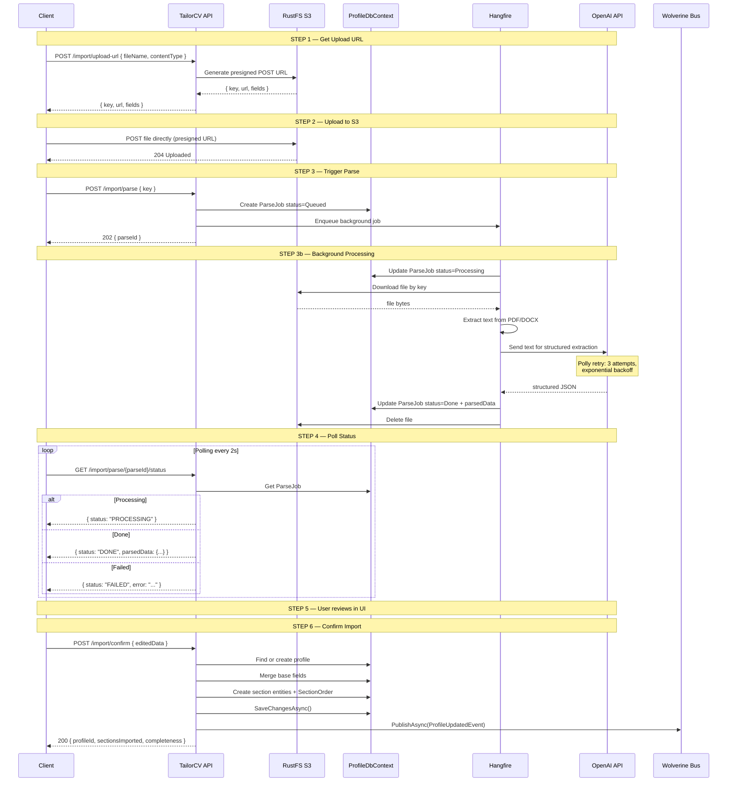
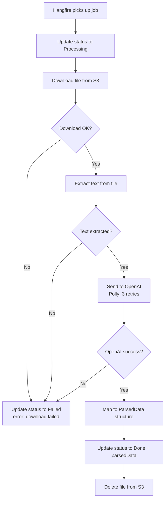
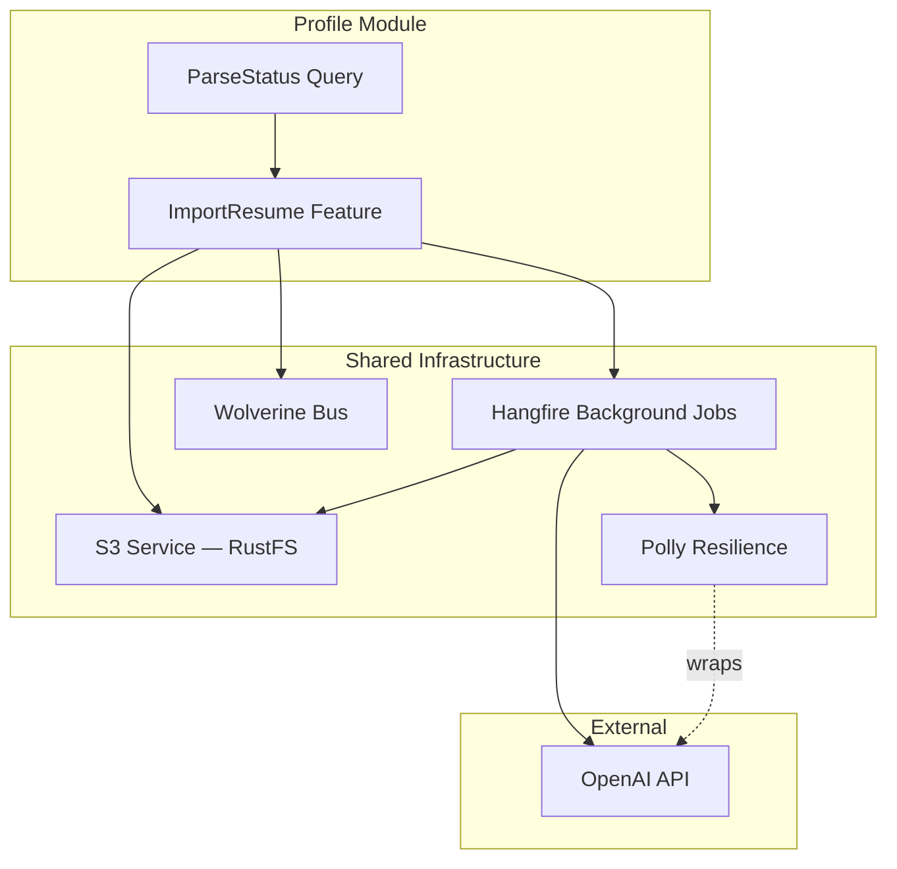

# ImportResume

## Summary

User uploads a resume to S3 (RustFS), triggers async AI parsing, polls for status, reviews parsed data, then confirms to save to profile.

## Actor

Authenticated user (profile owner)

## Infrastructure

- **RustFS** — S3-compatible object storage (Docker Compose)
- **Hangfire** — background job for AI parsing
- **OpenAI API** — resume text extraction + structuring
- **Polly** — retry resilience for OpenAI calls

## Endpoints

### Step 1: Get Upload URL

```
POST /api/profiles/me/import/upload-url
Authorization: Bearer {accessToken}
Content-Type: application/json

{
  "fileName": "my-resume.pdf",
  "contentType": "application/pdf"
}
```

**200 OK**

```json
{
  "key": "resumes/{userId}/{guid}.pdf",
  "url": "https://rustfs:9000/tailorcv-uploads",
  "fields": {
    "key": "resumes/{userId}/{guid}.pdf",
    "policy": "...",
    "signature": "..."
  }
}
```

### Step 2: Client Uploads to S3

Client uploads file directly to RustFS via S3 POST presigned URL. No API server involvement.

### Step 3: Trigger Parse

```
POST /api/profiles/me/import/parse
Authorization: Bearer {accessToken}
Content-Type: application/json

{
  "key": "resumes/{userId}/{guid}.pdf"
}
```

**202 Accepted**

```json
{
  "parseId": "guid"
}
```

Enqueues a **Hangfire job** that:
1. Downloads file from S3
2. Extracts text (PDF/DOCX)
3. Sends to OpenAI for structured extraction
4. Stores result in `profile.parse_jobs` table
5. Deletes S3 file on success (retention handles failures)

### Step 4: Poll Status

```
GET /api/profiles/me/import/parse/{parseId}/status
Authorization: Bearer {accessToken}
```

**200 OK — Processing**

```json
{
  "status": "PROCESSING"
}
```

**200 OK — Done**

```json
{
  "status": "DONE",
  "parsedData": {
    "headline": "Senior Software Engineer",
    "summary": "10 years of experience in...",
    "phone": "+1234567890",
    "location": "San Francisco, CA",
    "website": "https://...",
    "linkedinUrl": "https://linkedin.com/in/...",
    "githubUrl": "https://github.com/...",
    "sections": [
      {
        "sectionType": "Experience",
        "data": {
          "company": "Google",
          "role": "Senior Engineer",
          "startDate": "2020-01-01",
          "endDate": null,
          "description": "...",
          "isCurrent": true
        }
      },
      {
        "sectionType": "Skill",
        "data": {
          "category": "Languages",
          "items": ["C#", "Python", "TypeScript"]
        }
      },
      {
        "sectionType": "Custom",
        "data": {
          "title": "Publications",
          "items": [
            { "title": "My Paper", "subtitle": "IEEE", "description": "..." }
          ]
        }
      }
    ]
  }
}
```

**200 OK — Failed**

```json
{
  "status": "FAILED",
  "error": "Could not extract text from file. Ensure the file is not corrupted."
}
```

### Step 5: Confirm Import

```
POST /api/profiles/me/import/confirm
Authorization: Bearer {accessToken}
Content-Type: application/json

{
  "headline": "Senior Software Engineer",
  "summary": "10 years of experience...",
  "phone": "+1234567890",
  "location": "San Francisco, CA",
  "website": "https://...",
  "linkedinUrl": "https://linkedin.com/in/...",
  "githubUrl": "https://github.com/...",
  "sections": [
    {
      "sectionType": "Experience",
      "data": { "company": "Google", "role": "Senior Engineer", ... }
    },
    {
      "sectionType": "Custom",
      "data": { "title": "Publications", "items": [...] }
    }
  ]
}
```

User can modify the parsed data before confirming (edit fields, remove bad sections, fix errors).

**200 OK**

```json
{
  "profileId": "guid",
  "sectionsImported": 8,
  "completeness": 72
}
```

## Validation Rules

### Upload URL

| Field | Rules |
|-------|-------|
| FileName | Required, must end with `.pdf` or `.docx` |
| ContentType | Required, must be `application/pdf` or `application/vnd.openxmlformats-officedocument.wordprocessingml.document` |

### Trigger Parse

| Field | Rules |
|-------|-------|
| Key | Required, must start with `resumes/{userId}/` (ownership check) |

### Confirm Import

Same validation rules as SectionCRUD for each section type.

## Business Rules

- Supported formats: PDF, DOCX only
- File size limit: 5MB (enforced via S3 POST policy)
- Presigned URL expiry: 5 minutes
- Parse job timeout: 2 minutes (Hangfire)
- S3 file deleted after successful parse (retention policy handles failures)
- Parse is idempotent — user can trigger multiple parses (each gets new parseId)
- On confirm: if profile doesn't exist → create it; if exists → merge base fields (non-empty parsed values overwrite) and append sections
- Custom sections can be extracted by AI (e.g., "Publications", "Volunteering", "Awards")
- All parsed sections get `SectionOrder` entries appended at the end
- Uses Polly retry policy for OpenAI API calls (3 retries, exponential backoff)

## Flow

1. Client requests presigned S3 POST URL → gets `{ key, url, fields }`
2. Client uploads file directly to RustFS via presigned URL
3. Client triggers parse with `key` → gets `parseId` (202 Accepted)
4. Hangfire background job processes: download from S3 → extract text → OpenAI parse → store result → delete S3 file
5. Client polls `GET /parse/{parseId}/status` until `DONE` or `FAILED`
6. User reviews and edits parsed data in UI
7. Client confirms import → profile created/updated + sections appended

## Inter-module Interactions

### Async Event Published (on confirm)

```csharp
public record ProfileUpdatedEvent(Guid UserId, Guid ProfileId, DateTime UpdatedAt);
```

Published via **Wolverine + RabbitMQ** after successful confirm.

### Subscribers

| Module | Reaction |
|--------|----------|
| CVGenerator | Invalidate cached profile data |

### External Dependencies

| Service | Purpose | Resilience |
|---------|---------|------------|
| RustFS (S3) | File upload/download/delete | Presigned URL with policy |
| OpenAI API | Resume text extraction + structuring | Polly: 3 retries, exponential backoff |
| Hangfire | Background job processing | Built-in retry |

## Diagrams

### Full Flow — Sequence Diagram



### Background Job — Flowchart



### Component Diagram



## Error Codes

| Code | HTTP Status | When |
|------|-------------|------|
| `VALIDATION` | 400 | Invalid file type, invalid key, invalid section data on confirm |
| `UNAUTHORIZED` | 401 | Missing or invalid JWT |
| `NOT_FOUND` | 404 | ParseJob not found during polling |
| — | 202 | Parse triggered successfully (not an error) |
| — | Polling | `FAILED` status returned with error message from background job |

## Security Considerations

- File type validated by extension AND content type
- S3 key prefixed with userId — ownership check on parse trigger
- Presigned URL has 5-minute expiry + 5MB size limit (S3 POST policy)
- OpenAI API key stored in secrets, never logged
- Parsed data sanitized before storage
- S3 file deleted after successful parse (retention policy handles orphaned files)

## Database Table

### ParseJob (in profile schema)

```
parse_jobs
├── id (guid, PK)
├── user_id (guid, FK → users)
├── s3_key (string)
├── status (enum: Queued, Processing, Done, Failed)
├── parsed_data (JSONB, null until Done)
├── error (string, null unless Failed)
├── created_at (datetime)
├── completed_at (datetime, null until Done/Failed)
```
