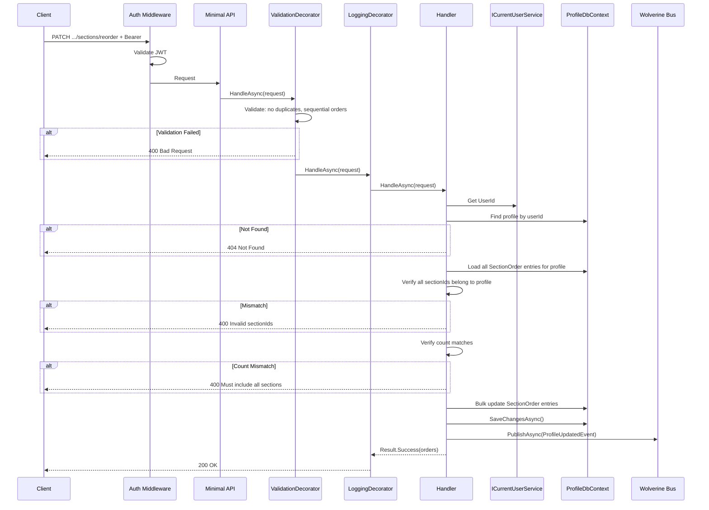
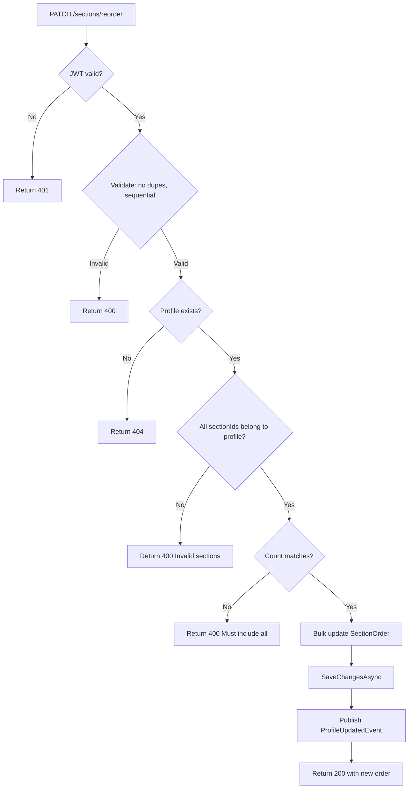

# ReorderSections

## Summary

User reorders their profile sections globally (across all types — predefined + custom) via a drag-and-drop style update.

## Actor

Authenticated user (profile owner)

## Request

```
PATCH /api/profiles/me/sections/reorder
Authorization: Bearer {accessToken}
Content-Type: application/json

{
  "orders": [
    { "sectionId": "guid-1", "order": 1 },
    { "sectionId": "guid-2", "order": 2 },
    { "sectionId": "guid-3", "order": 3 }
  ]
}
```

Client sends the **full desired order** — not a partial update. This makes drag-and-drop simple: frontend sends the complete new arrangement.

## Response

**200 OK**

```json
{
  "orders": [
    { "sectionType": "Experience", "sectionId": "guid-1", "order": 1 },
    { "sectionType": "Custom", "sectionId": "guid-2", "order": 2 },
    { "sectionType": "Skill", "sectionId": "guid-3", "order": 3 }
  ]
}
```

**404 Not Found**

```json
{
  "code": "NOT_FOUND",
  "message": "Profile not found"
}
```

**400 Bad Request**

```json
{
  "code": "VALIDATION",
  "message": "Must include all sections"
}
```

## Validation Rules

| Rule | Description |
|------|-------------|
| All sectionIds present | Must send every sectionId that belongs to the profile |
| Sequential orders | Orders must start from 1 with no gaps |
| No duplicate sectionIds | Each sectionId appears exactly once |
| No duplicate orders | Each order value appears exactly once |
| Non-empty | `orders` array must have at least 1 item |

## Business Rules

- Must send **all** section IDs for the profile (cannot reorder a subset)
- Orders must be sequential starting from 1 (no gaps)
- All sectionIds must belong to the current user's profile
- No duplicate sectionIds or duplicate order values allowed
- This is a single atomic update — all or nothing

## Flow

1. Client sends `PATCH /api/profiles/me/sections/reorder`
2. **Auth middleware** validates JWT
3. **ValidationDecorator** validates: no duplicates, sequential orders, non-empty
4. **Handler** executes:
   - Get `UserId` from `ICurrentUserService`
   - Find profile by userId → 404 if not found
   - Load all `SectionOrder` entries for this profile
   - Verify all requested sectionIds belong to this profile → 400 if mismatch
   - Verify count matches (all sections included) → 400 if missing some
   - Bulk update all `SectionOrder` entries with new order values
   - Save to DB
   - Publish `ProfileUpdatedEvent`
   - Return updated order list
5. **LoggingDecorator** logs result

## Inter-module Interactions

### Async Event Published

```csharp
public record ProfileUpdatedEvent(Guid UserId, Guid ProfileId, DateTime UpdatedAt);
```

Published via **Wolverine + RabbitMQ** after successful reorder.

### Subscribers

| Module | Reaction |
|--------|----------|
| CVGenerator | Invalidate cached profile data |

## Diagrams

### Sequence Diagram



### Flowchart



## Error Codes

| Code | HTTP Status | When |
|------|-------------|------|
| `VALIDATION` | 400 | Duplicate IDs/orders, non-sequential, missing sections |
| `UNAUTHORIZED` | 401 | Missing or invalid JWT |
| `NOT_FOUND` | 404 | Profile not found |
