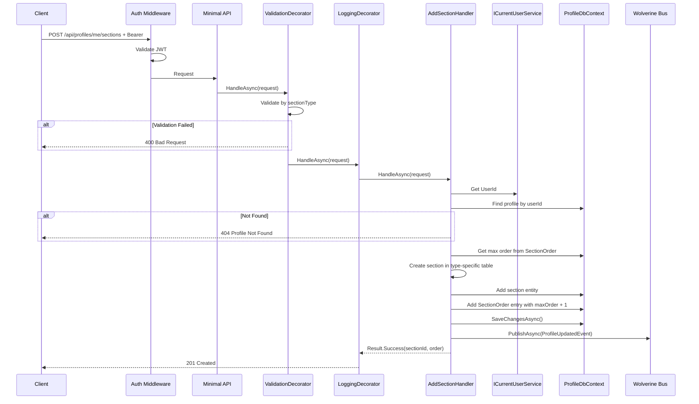
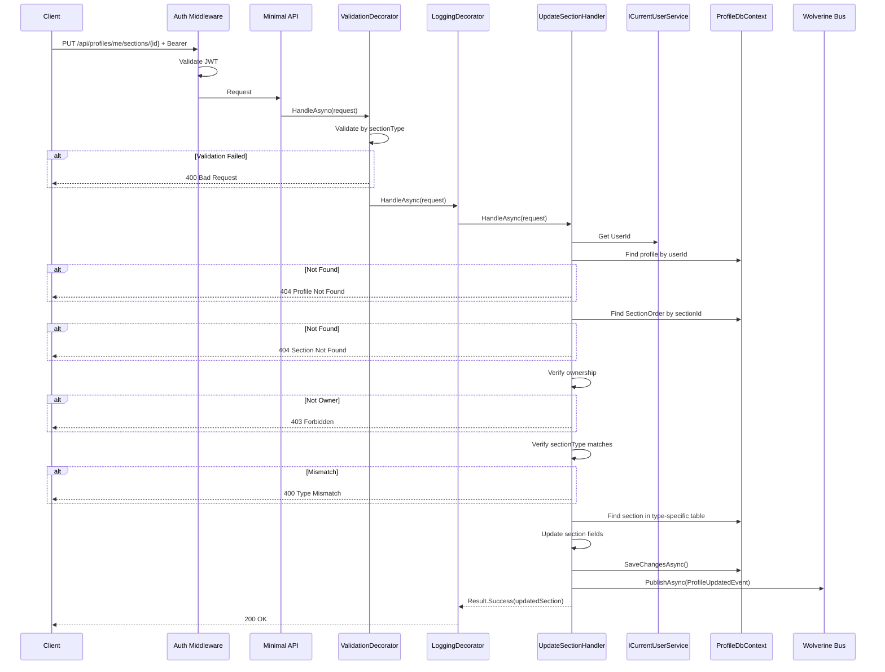
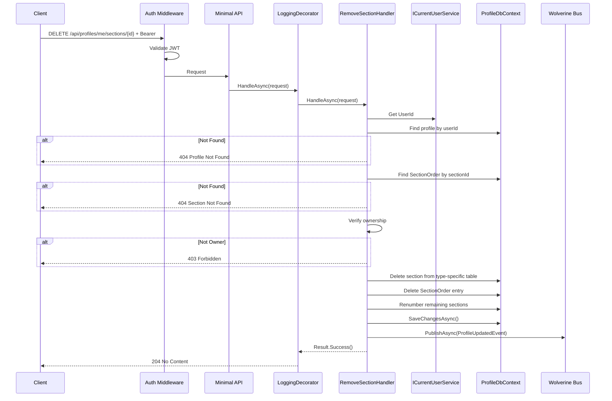
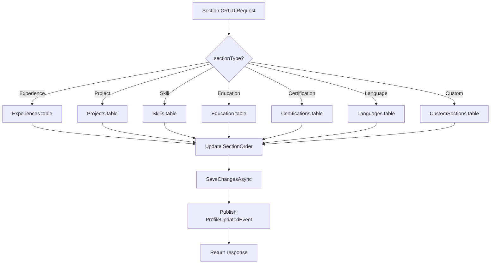

# SectionCRUD

## Summary

Add, update, and remove profile sections. Covers all predefined types (Experience, Project, Skill, Education, Certification, Language) and custom sections. Every section operation also manages the `SectionOrder` table for global ordering.

## Actor

Authenticated user (profile owner)

## Endpoints

### Add Section

```
POST /api/profiles/me/sections
Authorization: Bearer {accessToken}
Content-Type: application/json

{
  "sectionType": "Experience",
  "data": {
    "company": "Google",
    "role": "Senior Engineer",
    "startDate": "2022-01-01",
    "endDate": null,
    "description": "...",
    "isCurrent": true
  }
}
```

For custom sections:

```json
{
  "sectionType": "Custom",
  "data": {
    "title": "Publications",
    "items": [
      { "title": "My Paper", "subtitle": "IEEE", "description": "...", "url": "..." }
    ]
  }
}
```

**201 Created**

```json
{
  "sectionId": "guid",
  "sectionType": "Experience",
  "order": 4
}
```

New section is appended to the end of `SectionOrder` (highest order value + 1).

### Update Section

```
PUT /api/profiles/me/sections/{sectionId}
Authorization: Bearer {accessToken}
Content-Type: application/json

{
  "sectionType": "Experience",
  "data": {
    "company": "Google",
    "role": "Staff Engineer",
    "startDate": "2022-01-01",
    "endDate": null,
    "description": "Updated description",
    "isCurrent": true
  }
}
```

**200 OK** — returns updated section. `sectionType` cannot be changed.

### Remove Section

```
DELETE /api/profiles/me/sections/{sectionId}
Authorization: Bearer {accessToken}
```

**204 No Content** — deletes section from type-specific table + removes `SectionOrder` entry. Remaining sections are renumbered.

## Common Error Responses

**404 Not Found**

```json
{
  "code": "NOT_FOUND",
  "message": "Profile not found" | "Section not found"
}
```

**400 Bad Request**

```json
{
  "code": "VALIDATION",
  "message": "..."
}
```

**403 Forbidden**

```json
{
  "code": "FORBIDDEN",
  "message": "You do not own this section"
}
```

**401 Unauthorized**

```json
{
  "code": "UNAUTHORIZED",
  "message": "Not authenticated"
}
```

## Section Data Schemas

| SectionType | Fields |
|-------------|--------|
| **Experience** | company\*, role\*, startDate\*, endDate, description, isCurrent |
| **Project** | name\*, description, techStack[], role, url, startDate, endDate |
| **Skill** | category\*, items[] |
| **Education** | institution\*, degree\*, field\*, startDate\*, endDate, gpa |
| **Certification** | name\*, issuer\*, date\*, expiryDate, url |
| **Language** | languageName\*, proficiency\* (Beginner/Intermediate/Advanced/Native) |
| **Custom** | title\*, items[] where each item: { title, subtitle, description, startDate?, endDate?, url? } |

\* = required

## Validation Rules (per section type)

### Experience

| Field | Rules |
|-------|-------|
| Company | Required, max 200 chars |
| Role | Required, max 200 chars |
| StartDate | Required, valid date |
| EndDate | Optional, must be after StartDate |
| Description | Optional, max 2000 chars |
| IsCurrent | Optional, defaults to false |

### Project

| Field | Rules |
|-------|-------|
| Name | Required, max 200 chars |
| Description | Optional, max 2000 chars |
| TechStack | Optional, array of strings, max 20 items |
| Role | Optional, max 200 chars |
| Url | Optional, valid URL |
| StartDate | Optional, valid date |
| EndDate | Optional, must be after StartDate |

### Skill

| Field | Rules |
|-------|-------|
| Category | Required, max 100 chars |
| Items | Required, array of strings, min 1, max 50 items |

### Education

| Field | Rules |
|-------|-------|
| Institution | Required, max 200 chars |
| Degree | Required, max 200 chars |
| Field | Required, max 200 chars |
| StartDate | Required, valid date |
| EndDate | Optional, must be after StartDate |
| Gpa | Optional, max 20 chars |

### Certification

| Field | Rules |
|-------|-------|
| Name | Required, max 200 chars |
| Issuer | Required, max 200 chars |
| Date | Required, valid date |
| ExpiryDate | Optional, must be after Date |
| Url | Optional, valid URL |

### Language

| Field | Rules |
|-------|-------|
| LanguageName | Required, max 100 chars |
| Proficiency | Required, one of: Beginner, Intermediate, Advanced, Native |

### Custom

| Field | Rules |
|-------|-------|
| Title | Required, max 200 chars |
| Items | Required, array of objects, min 1, max 50 items |
| Items[].Title | Required, max 200 chars |
| Items[].Subtitle | Optional, max 200 chars |
| Items[].Description | Optional, max 1000 chars |
| Items[].Url | Optional, valid URL |

## Business Rules

- `sectionId` must belong to the current user's profile (ownership check via profileId match)
- On **Add**: create entry in type-specific table + insert into `SectionOrder` at the end (max order + 1)
- On **Update**: validate `sectionType` matches the existing section's type → 400 if mismatch
- On **Remove**: delete from type-specific table + delete from `SectionOrder` + renumber remaining orders (sequential, no gaps)
- All operations require a valid profile to exist → 404 if no profile
- Cannot change `sectionType` on update — if you need a different type, remove and re-add

## Flow

### Add Section

1. Client sends `POST /api/profiles/me/sections`
2. **Auth middleware** validates JWT
3. **ValidationDecorator** validates based on `sectionType` discriminator
4. **Handler** executes:
   - Get `UserId` from `ICurrentUserService`
   - Find profile by userId → 404 if not found
   - Get max order from `SectionOrder` for this profile
   - Create section entity in the correct type-specific table
   - Create `SectionOrder` entry (sectionType, sectionId, order = max + 1)
   - Save to DB
   - Publish `ProfileUpdatedEvent`
   - Return sectionId + order

### Update Section

1. Client sends `PUT /api/profiles/me/sections/{sectionId}`
2. **Auth middleware** validates JWT
3. **ValidationDecorator** validates based on `sectionType`
4. **Handler** executes:
   - Get `UserId` → find profile
   - Find `SectionOrder` entry by sectionId → 404 if not found
   - Verify ownership (profileId matches) → 403 if not owner
   - Verify `sectionType` matches → 400 if mismatch
   - Find section in type-specific table
   - Update section fields
   - Save to DB
   - Publish `ProfileUpdatedEvent`
   - Return updated section

### Remove Section

1. Client sends `DELETE /api/profiles/me/sections/{sectionId}`
2. **Auth middleware** validates JWT
3. **Handler** executes:
   - Get `UserId` → find profile
   - Find `SectionOrder` entry by sectionId → 404 if not found
   - Verify ownership → 403 if not owner
   - Delete section from type-specific table
   - Delete `SectionOrder` entry
   - Renumber remaining `SectionOrder` entries (no gaps)
   - Save to DB
   - Publish `ProfileUpdatedEvent`
   - Return 204

## Inter-module Interactions

### Async Event Published

```csharp
public record ProfileUpdatedEvent(Guid UserId, Guid ProfileId, DateTime UpdatedAt);
```

Published via **Wolverine + RabbitMQ** after any section add/update/remove.

### Subscribers

| Module | Reaction |
|--------|----------|
| CVGenerator | Invalidate cached profile data if match scoring was computed |

## Diagrams

### Add Section — Sequence Diagram



### Update Section — Sequence Diagram



### Remove Section — Sequence Diagram



### Section Type Routing — Flowchart



## Error Codes

| Code | HTTP Status | When |
|------|-------------|------|
| `VALIDATION` | 400 | Invalid data, sectionType mismatch on update |
| `UNAUTHORIZED` | 401 | Missing or invalid JWT |
| `FORBIDDEN` | 403 | Section does not belong to user's profile |
| `NOT_FOUND` | 404 | Profile or section not found |
