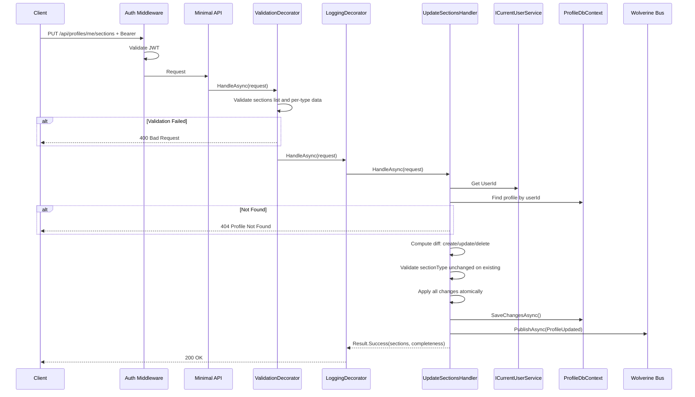
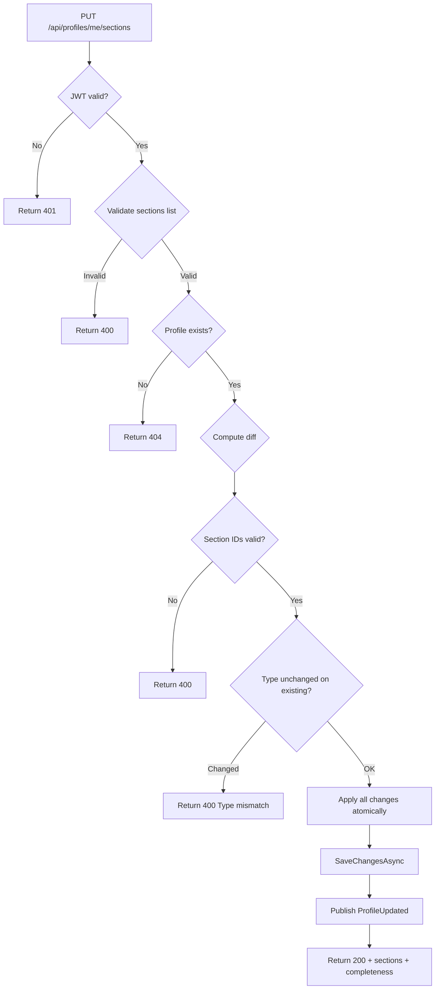

# UpdateSections

## Summary

Bulk upsert all profile sections in a single request. Frontend sends the complete desired state — full replacement, not delta. Handles add, update, remove, and reorder in one atomic operation.

## Actor

Authenticated user (profile owner)

## Request

```
PUT /api/profiles/me/sections
Authorization: Bearer {accessToken}
Content-Type: application/json

{
  "sections": [
    {
      "id": null,
      "sectionType": "Experience",
      "order": 1,
      "data": {
        "company": "Google",
        "role": "Senior Engineer",
        "startDate": "2022-01-01",
        "endDate": null,
        "description": "...",
        "isCurrent": true
      }
    },
    {
      "id": "existing-guid",
      "sectionType": "Project",
      "order": 2,
      "data": {
        "name": "Open Source Tool",
        "description": "...",
        "techStack": ["C#", ".NET"],
        "role": "Maintainer",
        "url": "https://github.com/...",
        "startDate": "2023-01-01",
        "endDate": null
      }
    }
  ]
}
```

- `id: null` — creates a new section
- `id: "guid"` — updates an existing section (must belong to the user)
- Sections with IDs not in the request are **deleted**
- `order` values determine display order (must be sequential 1..N)
- `sectionType` cannot be changed on existing sections

## Response

**200 OK**

```json
{
  "sections": [
    {
      "id": "new-guid",
      "sectionType": "Experience",
      "order": 1,
      "data": { ... }
    },
    {
      "id": "existing-guid",
      "sectionType": "Project",
      "order": 2,
      "data": { ... }
    }
  ],
  "completeness": 65
}
```

**401 Unauthorized**

```json
{
  "code": "UNAUTHORIZED",
  "message": "Not authenticated"
}
```

**404 Not Found**

```json
{
  "code": "NOT_FOUND",
  "message": "Profile not found"
}
```

**400 Bad Request**

```json
{
  "code": "VALIDATION",
  "message": "..."
}
```

## Section Data Schemas

| SectionType | Fields |
|-------------|--------|
| **Experience** | company\*, role\*, startDate\*, endDate, description, isCurrent |
| **Project** | name\*, description, techStack[], role, url, startDate, endDate |
| **Skill** | category\*, items[] |
| **Education** | institution\*, degree\*, field\*, startDate\*, endDate, gpa |
| **Certification** | name\*, issuer\*, date\*, expiryDate, url |
| **Language** | languageName\*, proficiency\* (Beginner/Intermediate/Advanced/Native) |
| **Custom** | title\*, items[] where each item: { title, subtitle, description, startDate?, endDate?, url? } |

\* = required

## Validation Rules

| Field | Rules |
|-------|-------|
| Sections | Required, non-null list |
| Order | Must be sequential 1..N with no gaps |
| SectionType | Required, must be valid enum value |
| Data | Validated per sectionType (see below) |

### Experience

| Field | Rules |
|-------|-------|
| Company | Required, max 200 chars |
| Role | Required, max 200 chars |
| StartDate | Required, valid date |
| EndDate | Optional, must be after StartDate |
| Description | Optional, max 2000 chars |
| IsCurrent | Optional, defaults to false |

### Project

| Field | Rules |
|-------|-------|
| Name | Required, max 200 chars |
| Description | Optional, max 2000 chars |
| TechStack | Optional, array of strings, max 20 items |
| Role | Optional, max 200 chars |
| Url | Optional, valid URL |
| StartDate | Optional, valid date |
| EndDate | Optional, must be after StartDate |

### Skill

| Field | Rules |
|-------|-------|
| Category | Required, max 100 chars |
| Items | Required, array of strings, min 1, max 50 items |

### Education

| Field | Rules |
|-------|-------|
| Institution | Required, max 200 chars |
| Degree | Required, max 200 chars |
| Field | Required, max 200 chars |
| StartDate | Required, valid date |
| EndDate | Optional, must be after StartDate |
| Gpa | Optional, max 20 chars |

### Certification

| Field | Rules |
|-------|-------|
| Name | Required, max 200 chars |
| Issuer | Required, max 200 chars |
| Date | Required, valid date |
| ExpiryDate | Optional, must be after Date |
| Url | Optional, valid URL |

### Language

| Field | Rules |
|-------|-------|
| LanguageName | Required, max 100 chars |
| Proficiency | Required, one of: Beginner, Intermediate, Advanced, Native |

### Custom

| Field | Rules |
|-------|-------|
| Title | Required, max 200 chars |
| Items | Required, array of objects, min 1, max 50 items |
| Items[].Title | Required, max 200 chars |
| Items[].Subtitle | Optional, max 200 chars |
| Items[].Description | Optional, max 1000 chars |
| Items[].Url | Optional, valid URL |

## Business Rules

- This is a **full state replacement** — client sends the complete desired state of all sections
- Sections with IDs not in the request are deleted (front-end must include all sections it wants to keep)
- `id: null` creates a new section; `id: "guid"` updates an existing section
- `sectionType` cannot be changed on existing sections — to change type, delete and re-create
- Orders must be sequential starting from 1 (no gaps)
- All sections must belong to the current user's profile (ownership verified)
- This is a single atomic transaction — all or nothing
- `completeness` is computed server-side based on profile content

## Flow

1. Client sends `PUT /api/profiles/me/sections` with full section list
2. **Auth middleware** validates JWT
3. **ValidationDecorator** validates section list and per-type data
4. **Handler** executes:
   - Get `UserId` from `ICurrentUserService`
   - Find profile by userId → 404 if not found
   - Compute diff: sections to create, update, delete based on IDs
   - Validate `sectionType` not changed on existing sections
   - Apply changes to profile (all in one transaction)
   - Save to DB
   - Publish `ProfileUpdated` event
   - Return updated sections + completeness
5. **LoggingDecorator** logs result

## Inter-module Interactions

### Async Event Published

```csharp
public record ProfileUpdated(Guid UserId, Guid ProfileId, DateTimeOffset UpdatedAt);
```

Published via **Wolverine + RabbitMQ** after successful update.

### Subscribers

| Module | Reaction |
|--------|----------|
| CVGenerator | Invalidate cached profile data if match scoring was computed |

## Diagrams

### Sequence Diagram



### Flowchart



## Error Codes

| Code | HTTP Status | When |
|------|-------------|------|
| `VALIDATION` | 400 | Invalid section data, duplicate IDs, non-sequential orders, type mismatch |
| `UNAUTHORIZED` | 401 | Missing or invalid JWT |
| `NOT_FOUND` | 404 | Profile not found |
