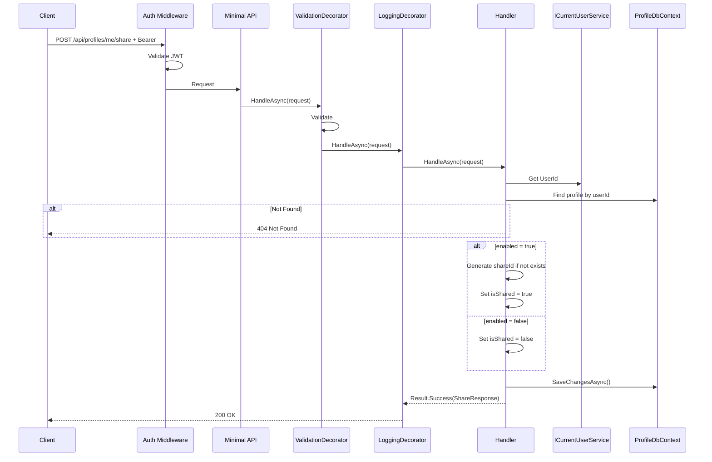
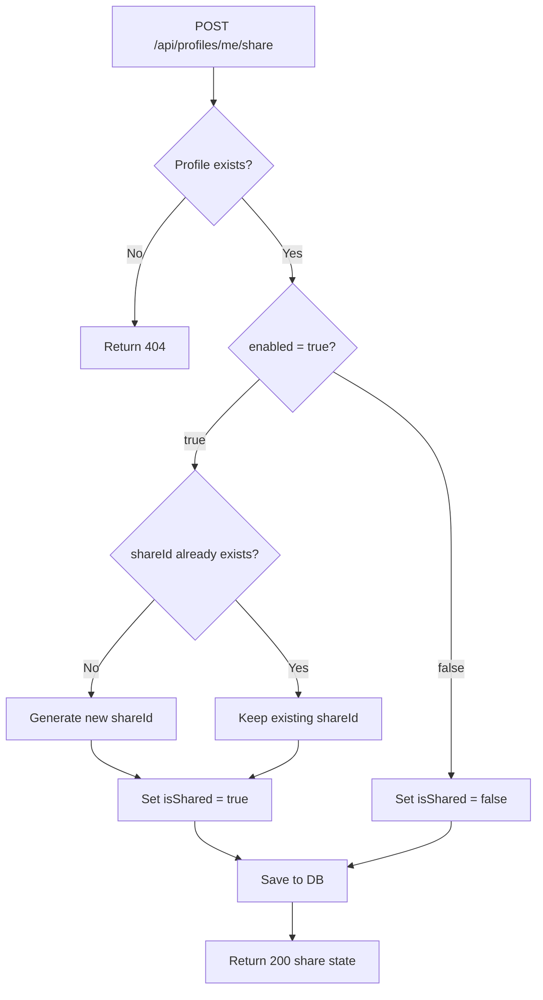

# ShareProfile

## Summary

User enables/disables profile sharing. Generates a unique public URL that visitors can use to view the profile in a read-only mode.

## Actor

Authenticated user (profile owner)

## Request

```
POST /api/profiles/me/share
Authorization: Bearer {accessToken}
Content-Type: application/json

{
  "enabled": true
}
```

## Response — Enable Sharing

**200 OK**

```json
{
  "isShared": true,
  "shareUrl": "/api/profiles/shared/abc123def456ghi789",
  "shareId": "abc123def456ghi789"
}
```

## Response — Disable Sharing

**200 OK**

```json
{
  "isShared": false,
  "shareUrl": null,
  "shareId": null
}
```

**404 Not Found**

```json
{
  "code": "NOT_FOUND",
  "message": "Profile not found"
}
```

**401 Unauthorized**

```json
{
  "code": "UNAUTHORIZED",
  "message": "Not authenticated"
}
```

## Validation Rules

| Field | Rules |
|-------|-------|
| Enabled | Required, boolean |

## Business Rules

- `shareId` is generated on first enable (random URL-safe string, ~20 chars, using cryptographic RNG)
- Disabling sharing keeps the `shareId` in DB but sets `isShared = false`
- Re-enabling uses the same `shareId` (stable URL)
- Only the owner can toggle sharing (enforced by `ICurrentUserService`)
- If profile doesn't exist → 404

## Flow

1. Client sends `POST /api/profiles/me/share`
2. **Auth middleware** validates JWT
3. **ValidationDecorator** runs FluentValidation
4. **Handler** executes:
   - Get `UserId` from `ICurrentUserService`
   - Find profile by userId → 404 if not found
   - If `enabled = true` and no `shareId` exists → generate new one
   - Update `isShared` on profile entity
   - Save to DB
   - Return share state
5. **LoggingDecorator** logs result

## Inter-module Interactions

**None.** Self-contained within Profile module.

## Diagrams

### Sequence Diagram



### Flowchart



## Error Codes

| Code | HTTP Status | When |
|------|-------------|------|
| `VALIDATION` | 400 | Missing or invalid enabled field |
| `UNAUTHORIZED` | 401 | Missing or invalid JWT |
| `NOT_FOUND` | 404 | User has no profile yet |
