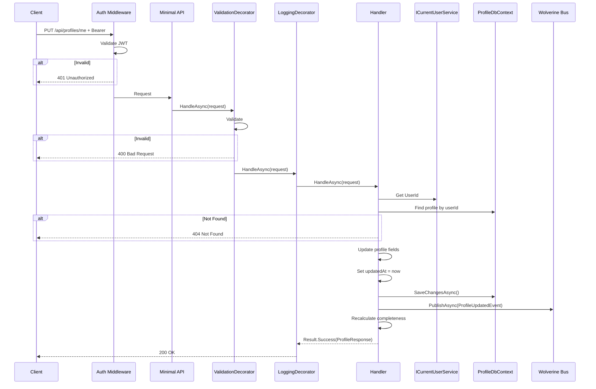
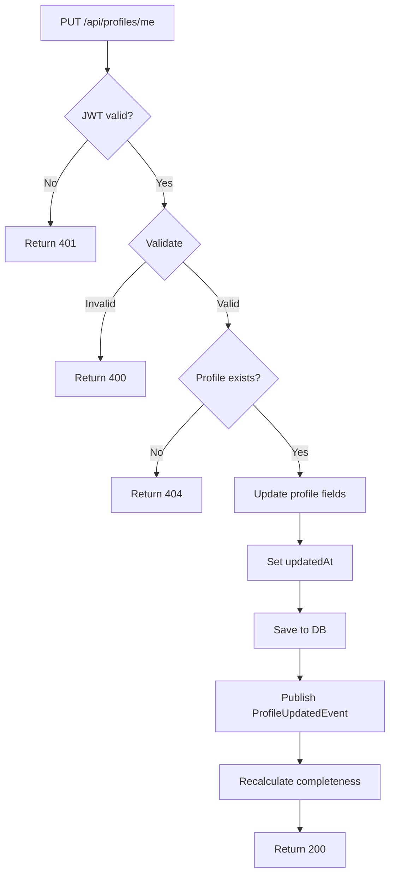

# UpdateProfile

## Summary

Authenticated user updates their profile's base fields (headline, summary, contact info, URLs). Section content is updated via separate Section CRUD features.

## Actor

Authenticated user (profile owner)

## Request

```
PUT /api/profiles/me
Authorization: Bearer {accessToken}
Content-Type: application/json

{
  "headline": "string",
  "summary": "string",
  "phone": "string",
  "location": "string",
  "website": "string",
  "linkedinUrl": "string",
  "githubUrl": "string"
}
```

## Response

**200 OK**

```json
{
  "id": "guid",
  "headline": "string",
  "summary": "string",
  "phone": "string",
  "location": "string",
  "website": "string",
  "linkedinUrl": "string",
  "githubUrl": "string",
  "completeness": 45,
  "updatedAt": "datetime"
}
```

**404 Not Found**

```json
{
  "code": "NOT_FOUND",
  "message": "Profile not found"
}
```

**401 Unauthorized**

```json
{
  "code": "UNAUTHORIZED",
  "message": "Not authenticated"
}
```

## Validation Rules

| Field | Rules |
|-------|-------|
| Headline | Optional, max 200 chars |
| Summary | Optional, max 2000 chars |
| Phone | Optional, valid phone format |
| Location | Optional, max 200 chars |
| Website | Optional, valid URL |
| LinkedinUrl | Optional, valid URL |
| GithubUrl | Optional, valid URL |

## Business Rules

- Full replace of profile base fields (PUT semantics)
- Only the profile owner can update (enforced by `ICurrentUserService`)
- `updatedAt` is set automatically via `TimeProvider`
- Completeness is recalculated after update
- If profile doesn't exist → 404 (user must create first)

## Flow

1. Client sends `PUT /api/profiles/me`
2. **Auth middleware** validates JWT → 401 if invalid
3. **ValidationDecorator** runs FluentValidation rules
4. **Handler** executes:
   - Get `UserId` from `ICurrentUserService`
   - Find profile by userId → 404 if not found
   - Update all profile fields from request
   - Set `updatedAt` via `TimeProvider`
   - Save to `profile.profiles`
   - Publish `ProfileUpdatedEvent` via Wolverine
   - Recalculate completeness
   - Return updated profile
5. **LoggingDecorator** logs result

## Inter-module Interactions

### Async Event Published

```csharp
public record ProfileUpdatedEvent(Guid UserId, Guid ProfileId, DateTime UpdatedAt);
```

Published via **Wolverine + RabbitMQ** after successful update.

### Subscribers

| Module | Reaction |
|--------|----------|
| CVGenerator | Invalidate cached profile data if match scoring was computed |

## Diagrams

### Sequence Diagram



### Flowchart



## Error Codes

| Code | HTTP Status | When |
|------|-------------|------|
| `VALIDATION` | 400 | Invalid URL format, field too long |
| `UNAUTHORIZED` | 401 | Missing or invalid JWT |
| `NOT_FOUND` | 404 | User has no profile yet |
