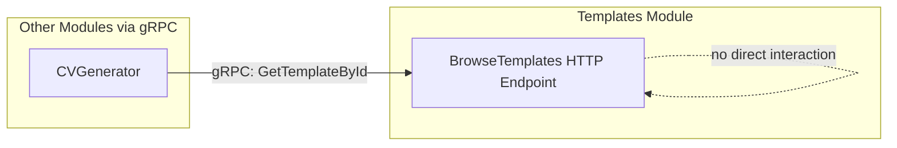
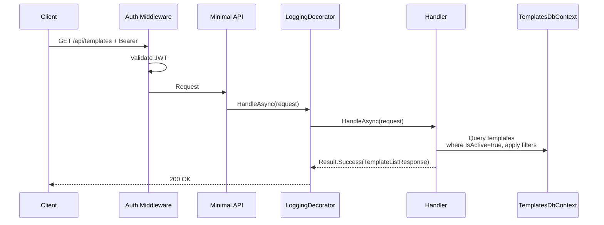
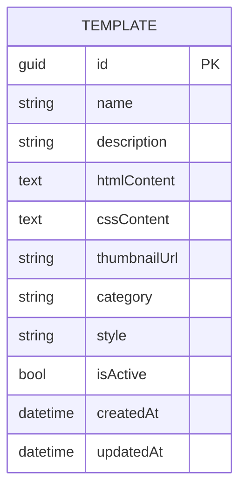

# BrowseTemplates

## Summary

Authenticated user browses available CV templates. Returns only active templates, filterable by category and style.

## Actor

Authenticated user

## Request

```
GET /api/templates?category=string&style=string
Authorization: Bearer {accessToken}
```

## Response

**200 OK**

```json
[
  {
    "id": "guid",
    "name": "Clean Minimal",
    "description": "A clean, minimalist template with excellent readability",
    "thumbnailUrl": "https://storage.example.com/thumbnails/clean-minimal.png",
    "category": "minimal",
    "style": "modern",
    "createdAt": "2026-01-01T00:00:00Z"
  }
]
```

**401 Unauthorized**

```json
{
  "code": "UNAUTHORIZED",
  "message": "Not authenticated"
}
```

## Query Parameters

| Parameter | Default | Options |
|-----------|---------|---------|
| category | null (all) | minimal, professional, creative |
| style | null (all) | modern, classic, bold |

## Business Rules

- Only templates with `IsActive = true` are returned
- No pagination — template count is small (3-5 seeded, admin-managed)
- Filterable by `category` and `style` (both optional, AND-combined when both present)
- Returns summary fields only (no `htmlContent` or `cssContent` in list)

## Flow

1. Client sends `GET /api/templates` with optional filters
2. **Auth middleware** validates JWT
3. **LoggingDecorator** logs entry
4. **Handler** executes:
   - Query `templates.templates` where `IsActive = true`
   - Apply category filter if provided
   - Apply style filter if provided
   - Return list of template summaries
5. **LoggingDecorator** logs result

## Inter-module Interactions

**None.** Self-contained within Templates module.

Other modules access template data via **gRPC** (`TemplatesService.GetTemplateById`).



## Diagrams

### Sequence Diagram



### ER Diagram — Templates Module



## Error Codes

| Code | HTTP Status | When |
|------|-------------|------|
| `UNAUTHORIZED` | 401 | Missing or invalid JWT |

## Database Table

### templates (in templates schema)

```
templates
├── id (guid, PK)
├── name (string, required, max 200 chars)
├── description (string, required, max 1000 chars)
├── html_content (text, required)
├── css_content (text, required)
├── thumbnail_url (string, nullable)
├── category (string, required)
├── style (string, required)
├── is_active (bool, default true)
├── created_at (datetime)
├── updated_at (datetime)
```
