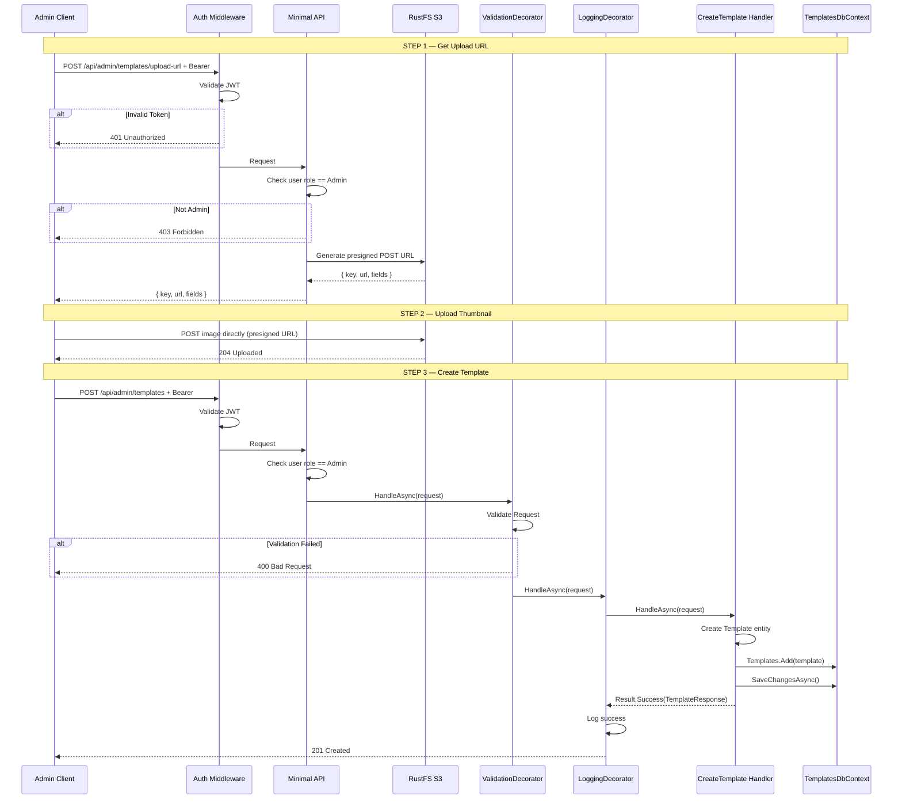
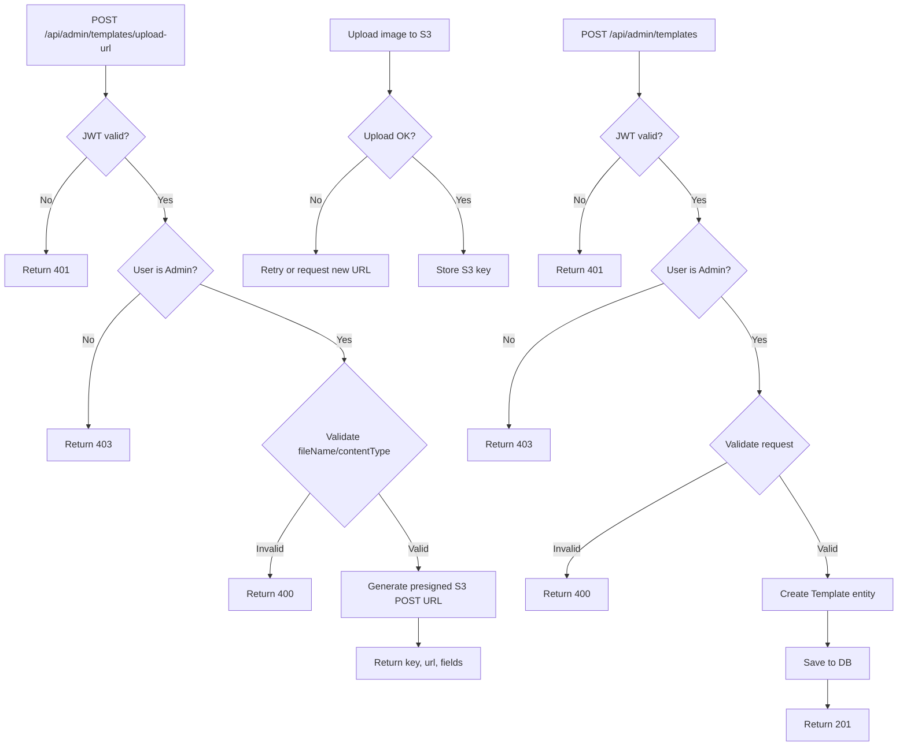
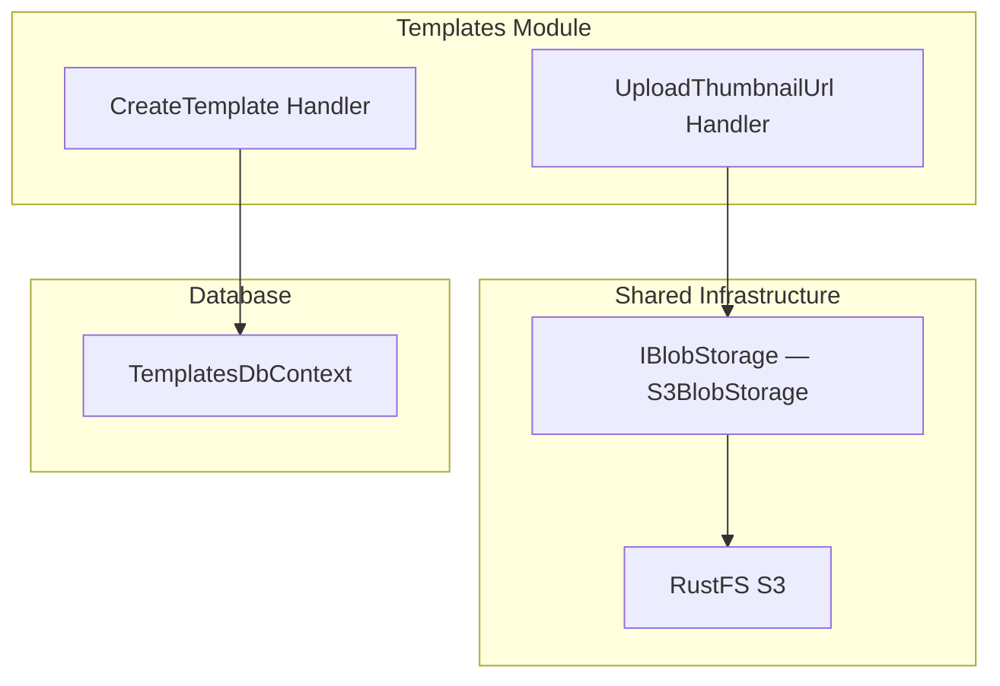

# CreateTemplate

## Summary

Admin creates a new CV template with HTML/CSS content, metadata, and a thumbnail image. Thumbnail is uploaded via a presigned S3 URL flow before creating the template.

## Actor

Admin user (role = `Admin`)

## Infrastructure

- **RustFS** — S3-compatible object storage (Docker Compose)

## Endpoints

### Step 1: Get Thumbnail Upload URL

```
POST /api/admin/templates/upload-url
Authorization: Bearer {accessToken}
Content-Type: application/json

{
  "fileName": "clean-minimal.png",
  "contentType": "image/png"
}
```

**200 OK**

```json
{
  "key": "thumbnails/templates/2026/05/03/{guid}.png",
  "url": "https://rustfs:9000/tailorcv-uploads",
  "fields": {
    "key": "thumbnails/templates/2026/05/03/{guid}.png",
    "policy": "...",
    "signature": "..."
  }
}
```

**400 Bad Request**

```json
{
  "code": "VALIDATION",
  "message": "Only PNG, JPEG, and WebP images are supported"
}
```

**401 Unauthorized**

```json
{
  "code": "UNAUTHORIZED",
  "message": "Not authenticated"
}
```

**403 Forbidden**

```json
{
  "code": "FORBIDDEN",
  "message": "Admin access required"
}
```

### Step 2: Client Uploads Thumbnail to S3

Client uploads image directly to RustFS via S3 POST presigned URL. No API server involvement.

### Step 3: Create Template

```
POST /api/admin/templates
Authorization: Bearer {accessToken}
Content-Type: application/json

{
  "name": "Clean Minimal",
  "description": "A clean, minimalist template with excellent readability",
  "htmlContent": "<div class=\"resume\">...</div>",
  "cssContent": ".resume { font-family: 'Inter', sans-serif; ... }",
  "thumbnailUrl": "thumbnails/templates/2026/05/03/{guid}.png",
  "category": "minimal",
  "style": "modern"
}
```

**201 Created**

```json
{
  "id": "guid",
  "name": "Clean Minimal",
  "description": "A clean, minimalist template with excellent readability",
  "thumbnailUrl": "thumbnails/templates/2026/05/03/{guid}.png",
  "category": "minimal",
  "style": "modern",
  "isActive": true,
  "createdAt": "2026-05-03T10:00:00Z",
  "updatedAt": "2026-05-03T10:00:00Z"
}
```

**400 Bad Request**

```json
{
  "code": "VALIDATION",
  "message": "Name is required; HtmlContent is required; ThumbnailUrl is required"
}
```

**401 Unauthorized**

```json
{
  "code": "UNAUTHORIZED",
  "message": "Not authenticated"
}
```

**403 Forbidden**

```json
{
  "code": "FORBIDDEN",
  "message": "Admin access required"
}
```

## Validation Rules

### Upload URL

| Field | Rules |
|-------|-------|
| FileName | Required, must end with `.png`, `.jpg`, `.jpeg`, or `.webp` |
| ContentType | Required, must be `image/png`, `image/jpeg`, or `image/webp` |

### Create Template

| Field | Rules |
|-------|-------|
| Name | Required, max 200 chars |
| Description | Required, max 1000 chars |
| HtmlContent | Required, min 50 chars |
| CssContent | Required, min 10 chars |
| ThumbnailUrl | Required, the S3 key returned from Step 1, max 2048 chars |
| Category | Required, one of: minimal, professional, creative |
| Style | Required, one of: modern, classic, bold |

## Business Rules

### Thumbnail Upload

- Supported formats: PNG, JPEG, WebP only
- File size limit: 2 MB (enforced via S3 POST policy)
- Presigned URL expiry: 5 minutes
- S3 key format: `thumbnails/templates/{yyyy}/{MM}/{dd}/{guid}.{extension}`
- No `userId` prefix in key — templates are global, admin-managed

### Template Creation

- Only admin users can create templates
- `thumbnailUrl` is the S3 `key` returned from the upload-url endpoint (not a full public URL)
- New templates are created with `IsActive = true` by default
- `Id` is generated server-side via `Guid.CreateVersion7()`
- `CreatedAt` and `UpdatedAt` are set server-side

## Flow

1. Client requests presigned S3 POST URL via `POST /api/admin/templates/upload-url`
2. API generates presigned URL with 2 MB size limit and 5-minute expiry
3. Client uploads thumbnail image directly to RustFS via presigned URL
4. Client sends `POST /api/admin/templates` with `thumbnailUrl` = S3 key from Step 1
5. **Auth middleware** validates JWT → 401 if invalid
6. **Authorization** checks user role is `Admin` → 403 if not
7. **ValidationDecorator** runs FluentValidation rules
8. **Handler** executes:
   - Get `DateTimeOffset now` from `IDateTimeProvider`
   - Create `Template` entity with all fields, `IsActive = true`
   - Save to `templates.templates`
   - Return created template response
9. **LoggingDecorator** logs result

## Inter-module Interactions

**None.** Self-contained within Templates module.

Thumbnail storage uses `IBlobStorage` from Shared Infrastructure (registered at API level via `Infrastructure.AddBlobStorage()`).

## Diagrams

### Full Flow — Sequence Diagram



### Flowchart



### Component Diagram



## Error Codes

| Code | HTTP Status | When |
|------|-------------|------|
| `VALIDATION` | 400 | Upload: invalid file type; Create: missing required fields, invalid category/style |
| `UNAUTHORIZED` | 401 | Missing or invalid JWT |
| `FORBIDDEN` | 403 | User is not an admin |

## Security Considerations

- File type validated by extension AND content type
- S3 POST policy enforces 2 MB max size
- Presigned URL expires after 5 minutes
- Admin-only access on both endpoints
- No sensitive data in uploaded images

## Database Table

### templates (in templates schema)

```
templates
├── id (guid, PK)
├── name (string, required, max 200 chars)
├── description (string, required, max 1000 chars)
├── html_content (text, required)
├── css_content (text, required)
├── thumbnail_url (string, required — S3 key)
├── category (string, required)
├── style (string, required)
├── is_active (bool, default true)
├── created_at (datetime)
├── updated_at (datetime)
```
