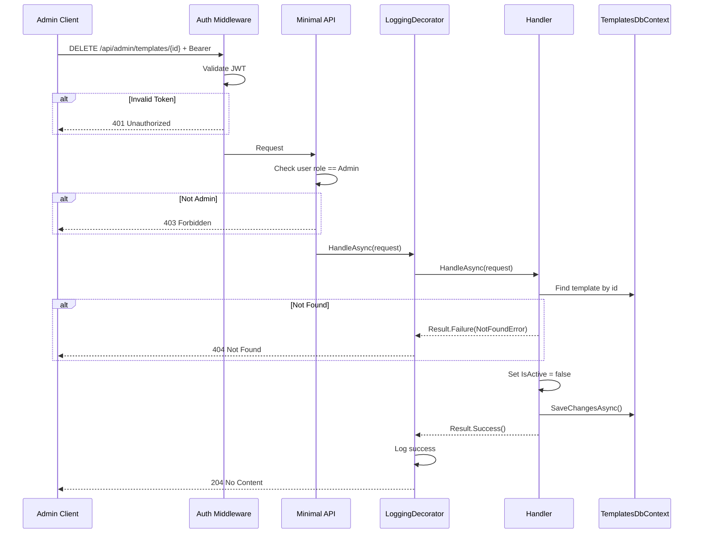
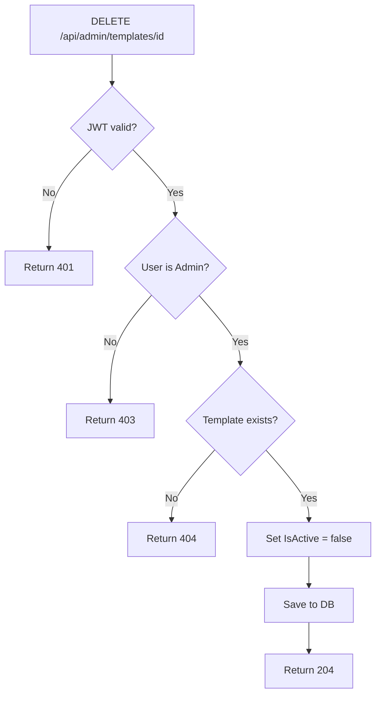

# DisableTemplate

## Summary

Admin disables a template by setting `IsActive = false`. Disabled templates are hidden from users but not deleted — they can be reactivated via UpdateTemplate.

## Actor

Admin user (role = `Admin`)

## Request

```
DELETE /api/admin/templates/{id}
Authorization: Bearer {accessToken}
```

## Response

**204 No Content**

(no body)

**401 Unauthorized**

```json
{
  "code": "UNAUTHORIZED",
  "message": "Not authenticated"
}
```

**403 Forbidden**

```json
{
  "code": "FORBIDDEN",
  "message": "Admin access required"
}
```

**404 Not Found**

```json
{
  "code": "NOT_FOUND",
  "message": "Template not found"
}
```

## Business Rules

- Only admin users can disable templates
- Sets `IsActive = false` and updates `UpdatedAt` — does not delete the row
- Disabled templates are hidden from BrowseTemplates and GetTemplate (for non-admin)
- Already-disabled templates return 204 (idempotent)
- Can be reactivated via UpdateTemplate (set `isActive: true`)

## Flow

1. Client sends `DELETE /api/admin/templates/{id}`
2. **Auth middleware** validates JWT → 401 if invalid
3. **Authorization** checks user role is `Admin` → 403 if not
4. **Handler** executes:
   - Find template by id → 404 if not found
   - Set `IsActive = false`
   - Update `UpdatedAt` to current time
   - Save to `templates.templates`
   - Return 204 No Content
5. **LoggingDecorator** logs result

## Inter-module Interactions

**None.** Self-contained within Templates module.

## Diagrams

### Sequence Diagram



### Flowchart



## Error Codes

| Code | HTTP Status | When |
|------|-------------|------|
| `UNAUTHORIZED` | 401 | Missing or invalid JWT |
| `FORBIDDEN` | 403 | User is not an admin |
| `NOT_FOUND` | 404 | Template not found |
