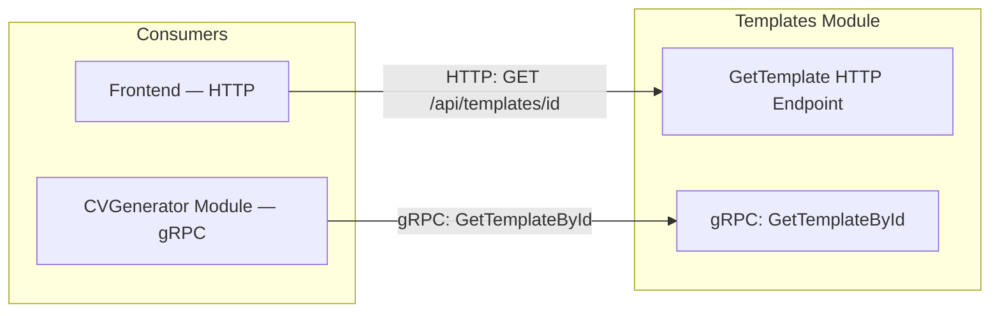
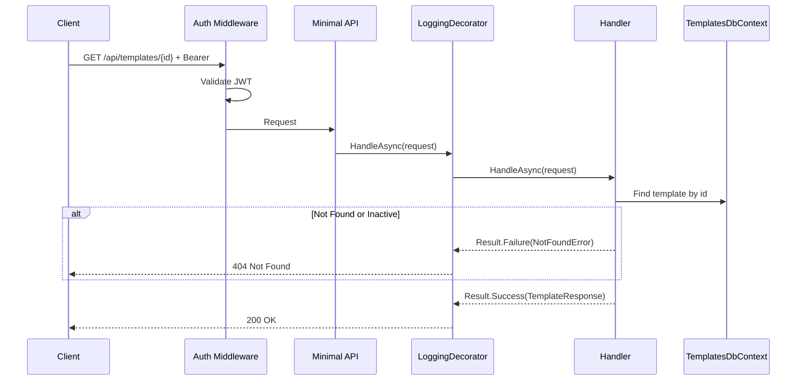

# GetTemplate

## Summary

Get full details of a single template by ID, including HTML/CSS content. The HTML/CSS is needed by the frontend for client-side CV preview rendering (combined with CV content from `GET /api/cv/{id}`).

## Actor

Authenticated user

## Request

```
GET /api/templates/{id}
Authorization: Bearer {accessToken}
```

## Response

**200 OK**

```json
{
  "id": "guid",
  "name": "Clean Minimal",
  "description": "A clean, minimalist template with excellent readability",
  "thumbnailUrl": "thumbnails/templates/2026/01/01/{guid}.png",
  "htmlContent": "<div class=\"resume\"><header>...</header><section data-slot=\"summary\">...</section>...</div>",
  "cssContent": ".resume { font-family: 'Inter', sans-serif; ... }",
  "category": "minimal",
  "style": "modern",
  "isActive": true,
  "createdAt": "2026-01-01T00:00:00Z",
  "updatedAt": "2026-01-01T00:00:00Z"
}
```

**404 Not Found**

```json
{
  "code": "NOT_FOUND",
  "message": "Template not found"
}
```

**401 Unauthorized**

```json
{
  "code": "UNAUTHORIZED",
  "message": "Not authenticated"
}
```

## Business Rules

- Returns full template including `htmlContent` and `cssContent`
- Non-admin users can only see active templates — returns 404 for inactive
- Template HTML contains placeholder slots (e.g., `data-slot="summary"`, `data-slot="experience"`) that the frontend fills with CV content
- Admin users can see inactive templates (future enhancement, not in MVP)

## Client-Side Preview Rendering

The frontend uses template HTML/CSS from this endpoint to render CV previews:

1. Fetch template via `GET /api/templates/{id}` → get `htmlContent` + `cssContent`
2. Fetch CV content via `GET /api/cv/{id}` → get content JSON (summary, sections, etc.)
3. Frontend injects CV content into the template's placeholder slots
4. Render in sandboxed iframe using `srcdoc` attribute

See [get-generated-cv.md](../cv-generator/get-generated-cv.md#client-side-preview) for the full preview flow.

## Flow

1. Client sends `GET /api/templates/{id}`
2. **Auth middleware** validates JWT
3. **LoggingDecorator** logs entry
4. **Handler** executes:
   - Find template by id → 404 if not found
   - If template is inactive → 404 (for non-admin users)
   - Return full template including HTML/CSS
5. **LoggingDecorator** logs result

## Inter-module Interactions

**None.** Self-contained within Templates module.

Other modules access template data via **gRPC** (`TemplatesService.GetTemplateById`).



## Diagrams

### Sequence Diagram



## Error Codes

| Code | HTTP Status | When |
|------|-------------|------|
| `UNAUTHORIZED` | 401 | Missing or invalid JWT |
| `NOT_FOUND` | 404 | Template not found or inactive |
