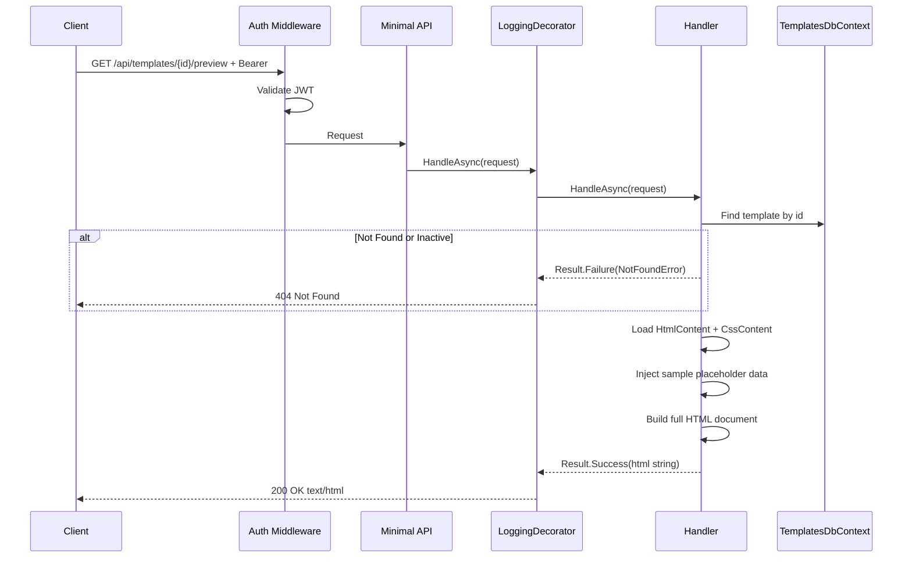
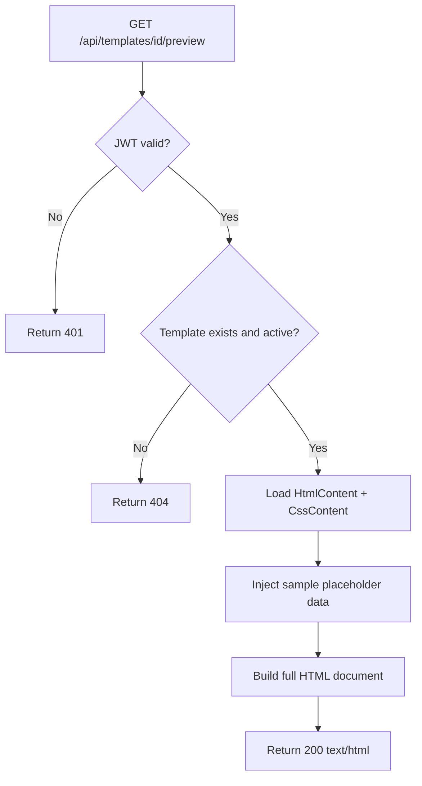

# PreviewTemplate

## Summary

Renders a template with sample/placeholder data so the user can see how it looks before choosing. Returns HTML content combining the template's HTML + CSS with placeholder profile data.

## Actor

Authenticated user

## Request

```
GET /api/templates/{id}/preview
Authorization: Bearer {accessToken}
```

## Response

**200 OK**

```
Content-Type: text/html
```

```html
<!DOCTYPE html>
<html>
<head>
  <style>
    /* Template CSS content */
  </style>
</head>
<body>
  <!-- Rendered template with placeholder data -->
  <h1>John Doe</h1>
  <p>Senior Software Engineer</p>
  <!-- ... -->
</body>
</html>
```

**404 Not Found**

```json
{
  "code": "NOT_FOUND",
  "message": "Template not found"
}
```

**401 Unauthorized**

```json
{
  "code": "UNAUTHORIZED",
  "message": "Not authenticated"
}
```

## Business Rules

- Only active templates can be previewed — returns 404 for inactive
- Placeholder data includes: sample name, headline, experience, skills, education
- Returns full HTML document (CSS inline in `<style>` tag) ready for browser rendering
- No database writes — read-only preview generation

## Sample Placeholder Data

The preview uses static sample data that demonstrates the template's layout:

```json
{
  "name": "Jane Smith",
  "headline": "Senior Software Engineer",
  "summary": "Passionate software engineer with 8+ years of experience...",
  "location": "San Francisco, CA",
  "sections": [
    {
      "type": "Experience",
      "items": [
        {
          "company": "Tech Corp",
          "role": "Senior Engineer",
          "startDate": "2020-01",
          "endDate": "Present",
          "description": "Led development of microservices architecture..."
        }
      ]
    },
    {
      "type": "Skill",
      "items": ["C#", "Azure", "Docker", "Kubernetes", "SQL"]
    },
    {
      "type": "Education",
      "items": [
        {
          "institution": "University of Technology",
          "degree": "B.Sc. Computer Science",
          "year": "2016"
        }
      ]
    }
  ]
}
```

## Flow

1. Client sends `GET /api/templates/{id}/preview`
2. **Auth middleware** validates JWT
3. **LoggingDecorator** logs entry
4. **Handler** executes:
   - Find template by id → 404 if not found or inactive
   - Load `HtmlContent` and `CssContent` from template
   - Inject sample placeholder data into template HTML
   - Return rendered HTML document
5. **LoggingDecorator** logs result

## Inter-module Interactions

**None.** Self-contained within Templates module.

## Diagrams

### Sequence Diagram



### Flowchart



## Error Codes

| Code | HTTP Status | When |
|------|-------------|------|
| `UNAUTHORIZED` | 401 | Missing or invalid JWT |
| `NOT_FOUND` | 404 | Template not found or inactive |
