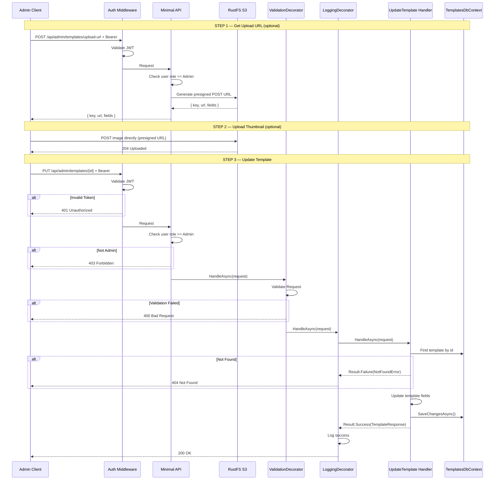
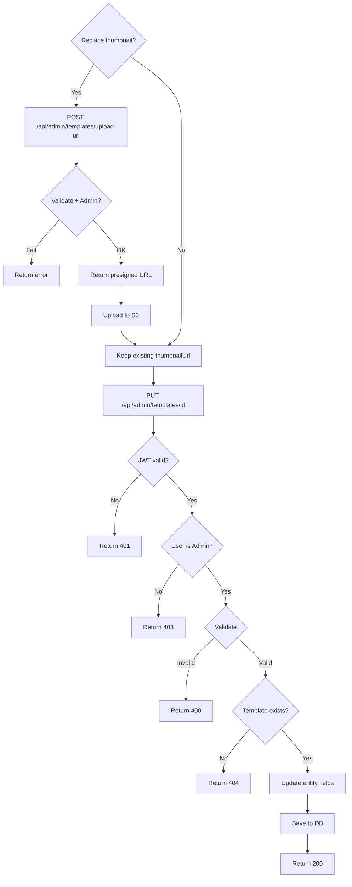

# UpdateTemplate

## Summary

Admin updates an existing template's content, metadata, active status, and optionally replaces the thumbnail image. Thumbnail replacement follows the same presigned S3 URL flow as creation.

## Actor

Admin user (role = `Admin`)

## Infrastructure

- **RustFS** — S3-compatible object storage (Docker Compose)

## Endpoints

### Step 1 (Optional): Get New Thumbnail Upload URL

Only needed if the admin wants to replace the template's thumbnail. If the thumbnail is unchanged, skip to Step 3 with the existing `thumbnailUrl` value.

```
POST /api/admin/templates/upload-url
Authorization: Bearer {accessToken}
Content-Type: application/json

{
  "fileName": "clean-minimal-v2.png",
  "contentType": "image/png"
}
```

**200 OK**

```json
{
  "key": "thumbnails/templates/2026/05/03/{guid}.png",
  "url": "https://rustfs:9000/tailorcv-uploads",
  "fields": {
    "key": "thumbnails/templates/2026/05/03/{guid}.png",
    "policy": "...",
    "signature": "..."
  }
}
```

**400 Bad Request**

```json
{
  "code": "VALIDATION",
  "message": "Only PNG, JPEG, and WebP images are supported"
}
```

**401 Unauthorized**

```json
{
  "code": "UNAUTHORIZED",
  "message": "Not authenticated"
}
```

**403 Forbidden**

```json
{
  "code": "FORBIDDEN",
  "message": "Admin access required"
}
```

### Step 2 (Optional): Client Uploads New Thumbnail to S3

Client uploads image directly to RustFS via S3 POST presigned URL. No API server involvement.

### Step 3: Update Template

```
PUT /api/admin/templates/{id}
Authorization: Bearer {accessToken}
Content-Type: application/json

{
  "name": "Clean Minimal v2",
  "description": "Updated description",
  "htmlContent": "<div class=\"resume\">...</div>",
  "cssContent": ".resume { font-family: 'Inter', sans-serif; ... }",
  "thumbnailUrl": "thumbnails/templates/2026/05/03/{guid}.png",
  "category": "minimal",
  "style": "modern",
  "isActive": true
}
```

**200 OK**

```json
{
  "id": "guid",
  "name": "Clean Minimal v2",
  "description": "Updated description",
  "thumbnailUrl": "thumbnails/templates/2026/05/03/{guid}.png",
  "category": "minimal",
  "style": "modern",
  "isActive": true,
  "createdAt": "2026-01-01T00:00:00Z",
  "updatedAt": "2026-05-03T10:00:00Z"
}
```

**400 Bad Request**

```json
{
  "code": "VALIDATION",
  "message": "Name is required; ThumbnailUrl is required"
}
```

**401 Unauthorized**

```json
{
  "code": "UNAUTHORIZED",
  "message": "Not authenticated"
}
```

**403 Forbidden**

```json
{
  "code": "FORBIDDEN",
  "message": "Admin access required"
}
```

**404 Not Found**

```json
{
  "code": "NOT_FOUND",
  "message": "Template not found"
}
```

## Validation Rules

### Upload URL

| Field | Rules |
|-------|-------|
| FileName | Required, must end with `.png`, `.jpg`, `.jpeg`, or `.webp` |
| ContentType | Required, must be `image/png`, `image/jpeg`, or `image/webp` |

### Update Template

| Field | Rules |
|-------|-------|
| Name | Required, max 200 chars |
| Description | Required, max 1000 chars |
| HtmlContent | Required, min 50 chars |
| CssContent | Required, min 10 chars |
| ThumbnailUrl | Required, the S3 key from a previous upload (new or existing), max 2048 chars |
| Category | Required, one of: minimal, professional, creative |
| Style | Required, one of: modern, classic, bold |
| IsActive | Required, boolean |

## Business Rules

### Thumbnail Update

- Thumbnail replacement is optional — if unchanged, pass the existing `thumbnailUrl` value
- If replacing: follow the same presigned upload flow as CreateTemplate (Step 1 + Step 2)
- Old thumbnail S3 object is **not** automatically deleted (retention policy handles cleanup)
- Supported formats: PNG, JPEG, WebP only
- File size limit: 2 MB (enforced via S3 POST policy)
- Presigned URL expiry: 5 minutes

### Template Update

- Only admin users can update templates
- All fields are replaced (full update, not partial)
- `thumbnailUrl` is required — either new S3 key from upload or existing value
- `UpdatedAt` is set server-side to current time
- `CreatedAt` is not modified
- Inactive templates remain accessible to admin for reactivation

## Flow

1. **(Optional)** Client requests presigned S3 POST URL via `POST /api/admin/templates/upload-url`
2. **(Optional)** API generates presigned URL with 2 MB size limit and 5-minute expiry
3. **(Optional)** Client uploads new thumbnail image directly to RustFS via presigned URL
4. Client sends `PUT /api/admin/templates/{id}` with `thumbnailUrl` (new or existing)
5. **Auth middleware** validates JWT → 401 if invalid
6. **Authorization** checks user role is `Admin` → 403 if not
7. **ValidationDecorator** runs FluentValidation rules
8. **Handler** executes:
   - Find template by id → 404 if not found
   - Update all mutable fields on entity
   - Save to `templates.templates`
   - Return updated template response
9. **LoggingDecorator** logs result

## Inter-module Interactions

**None.** Self-contained within Templates module.

Thumbnail storage uses `IBlobStorage` from Shared Infrastructure (registered at API level via `Infrastructure.AddBlobStorage()`).

## Diagrams

### Full Flow — Sequence Diagram



### Flowchart



## Error Codes

| Code | HTTP Status | When |
|------|-------------|------|
| `VALIDATION` | 400 | Upload: invalid file type; Update: missing required fields, invalid category/style |
| `UNAUTHORIZED` | 401 | Missing or invalid JWT |
| `FORBIDDEN` | 403 | User is not an admin |
| `NOT_FOUND` | 404 | Template not found |

## Security Considerations

- File type validated by extension AND content type
- S3 POST policy enforces 2 MB max size
- Presigned URL expires after 5 minutes
- Admin-only access on both endpoints
- Old thumbnails cleaned up via retention policy (not immediate delete)
